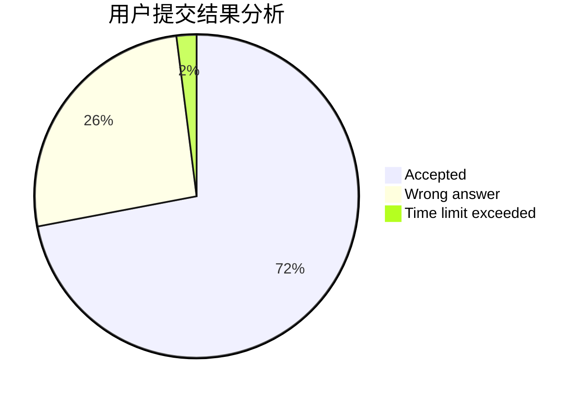
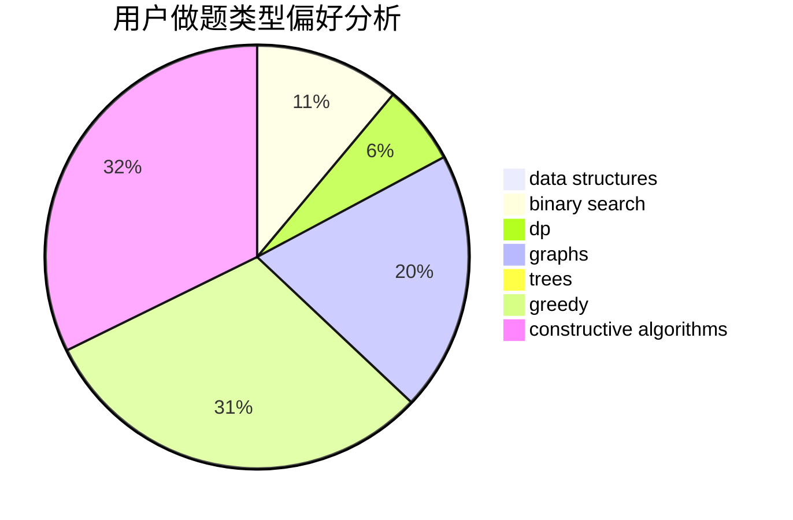
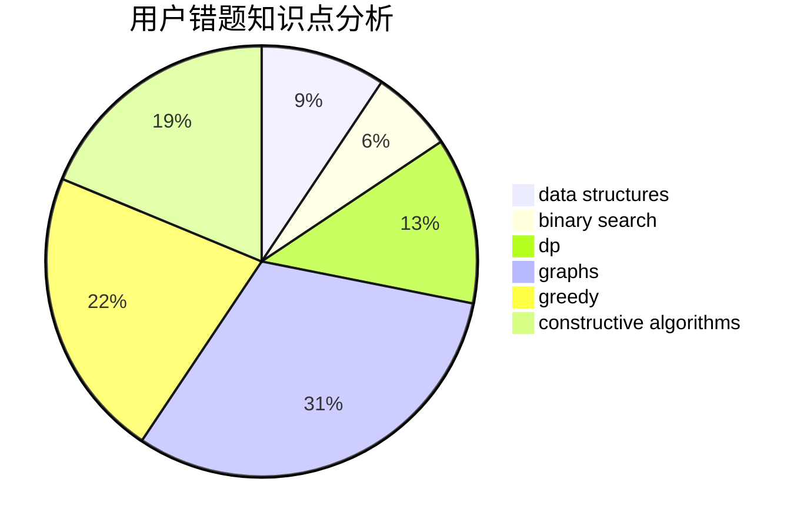

# ETK.
<!-- tabs:start -->
#### **用户提交结果分析**

#### **用户做题类型偏好分析**

#### **用户错题知识点分析**

<!-- tabs:end -->
# 推荐题目
[Multiplication Table](http://codeforces.com/problemset/problem/1220/B)		math,
                        number theory		  
[Lala Land and Apple Trees](http://codeforces.com/problemset/problem/558/A)		brute force,
                        implementation,
                        sortings		  
[Megacity](http://codeforces.com/problemset/problem/424/B)		binary search,
                        greedy,
                        implementation,
                        sortings		  
[Maximal Independent Set](https://codeforces.com/contest/1376/problem/B2)		nan		  
[Lucky Segments](http://codeforces.com/problemset/problem/121/D)		binary search,
                        implementation,
                        two pointers		  
[Neko Rules the Catniverse (Large Version)](http://codeforces.com/problemset/problem/1152/F2)		bitmasks,
                        dp,
                        matrices		  
[Hard problem](http://codeforces.com/problemset/problem/706/C)		dp,
                        strings		  
[The Unbearable Lightness of Weights](https://codeforces.com/contest/1078/problem/B)		dp,
                        math		  
[Chamber of Secrets](http://codeforces.com/problemset/problem/173/B)		dfs and similar,
                        shortest paths		  
[Au Pont Rouge](https://codeforces.com/contest/1314/problem/C)		binary search,
                        dp,
                        strings		  
<!-- tabs:start -->
#### **data structures**
[Periodic RMQ Problem](http://codeforces.com/problemset/problem/803/G)		data structures		  
[A and B and Lecture Rooms](http://codeforces.com/problemset/problem/519/E)		binary search,
                        data structures,
                        dfs and similar,
                        dp,
                        trees		  
[Culture Code](http://codeforces.com/problemset/problem/1197/E)		binary search,
                        combinatorics,
                        data structures,
                        dp,
                        shortest paths,
                        sortings		  
[Accidental Victory](http://codeforces.com/problemset/problem/1490/E)		binary search,
                        data structures,
                        greedy		  
[Rating Compression](http://codeforces.com/problemset/problem/1450/D)		binary search,
                        data structures,
                        greedy,
                        implementation,
                        two pointers		  
[Maximum width](http://codeforces.com/problemset/problem/1492/C)		binary search,
                        data structures,
                        dp,
                        greedy,
                        two pointers		  
[Old Floppy Drive](http://codeforces.com/problemset/problem/1490/G)		binary search,
                        data structures,
                        math		  
[Odd Mineral Resource](http://codeforces.com/problemset/problem/1479/D)		binary search,
                        bitmasks,
                        brute force,
                        data structures,
                        probabilities,
                        trees		  
[Meximization](http://codeforces.com/problemset/problem/1497/A)		brute force,
                        data structures,
                        greedy,
                        sortings		  
[Pekora and Trampoline](http://codeforces.com/problemset/problem/1491/C)		brute force,
                        data structures,
                        dp,
                        greedy,
                        implementation		  
#### **binary search**
[Megacity](http://codeforces.com/problemset/problem/424/B)		binary search,
                        greedy,
                        implementation,
                        sortings		  
[Lucky Segments](http://codeforces.com/problemset/problem/121/D)		binary search,
                        implementation,
                        two pointers		  
[Au Pont Rouge](https://codeforces.com/contest/1314/problem/C)		binary search,
                        dp,
                        strings		  
[Fedya the Potter](http://codeforces.com/problemset/problem/1098/E)		binary search,
                        implementation,
                        math,
                        number theory		  
[A and B and Lecture Rooms](http://codeforces.com/problemset/problem/519/E)		binary search,
                        data structures,
                        dfs and similar,
                        dp,
                        trees		  
[Culture Code](http://codeforces.com/problemset/problem/1197/E)		binary search,
                        combinatorics,
                        data structures,
                        dp,
                        shortest paths,
                        sortings		  
[Strange Birthday Party](https://codeforces.com/contest/1471/problem/C)		binary search,
                        dp,
                        greedy,
                        sortings,
                        two pointers		  
[Accidental Victory](http://codeforces.com/problemset/problem/1490/E)		binary search,
                        data structures,
                        greedy		  
[Rating Compression](http://codeforces.com/problemset/problem/1450/D)		binary search,
                        data structures,
                        greedy,
                        implementation,
                        two pointers		  
[Maximum width](http://codeforces.com/problemset/problem/1492/C)		binary search,
                        data structures,
                        dp,
                        greedy,
                        two pointers		  
#### **dp**
[Neko Rules the Catniverse (Large Version)](http://codeforces.com/problemset/problem/1152/F2)		bitmasks,
                        dp,
                        matrices		  
[Hard problem](http://codeforces.com/problemset/problem/706/C)		dp,
                        strings		  
[The Unbearable Lightness of Weights](https://codeforces.com/contest/1078/problem/B)		dp,
                        math		  
[Au Pont Rouge](https://codeforces.com/contest/1314/problem/C)		binary search,
                        dp,
                        strings		  
[Dreamoon and Strings](https://codeforces.com/contest/477/problem/C)		dp,
                        strings		  
[Communism](http://codeforces.com/problemset/problem/1450/G)		bitmasks,
                        dp,
                        trees		  
[A and B and Lecture Rooms](http://codeforces.com/problemset/problem/519/E)		binary search,
                        data structures,
                        dfs and similar,
                        dp,
                        trees		  
[Culture Code](http://codeforces.com/problemset/problem/1197/E)		binary search,
                        combinatorics,
                        data structures,
                        dp,
                        shortest paths,
                        sortings		  
[Strange Birthday Party](https://codeforces.com/contest/1471/problem/C)		binary search,
                        dp,
                        greedy,
                        sortings,
                        two pointers		  
[Hard Optimization](http://codeforces.com/problemset/problem/1510/H)		dp		  
#### **graph**
[Minimum Ties](http://codeforces.com/problemset/problem/1487/C)		brute force,
                        constructive algorithms,
                        dfs and similar,
                        graphs,
                        greedy,
                        implementation,
                        math		  
[Chef Monocarp](http://codeforces.com/problemset/problem/1437/C)		dp,
                        flows,
                        graph matchings,
                        greedy,
                        math,
                        sortings		  
[Strange Housing](http://codeforces.com/problemset/problem/1470/D)		constructive algorithms,
                        dfs and similar,
                        graph matchings,
                        graphs,
                        greedy		  
[Longest Simple Cycle](http://codeforces.com/problemset/problem/1476/C)		dp,
                        graphs,
                        greedy		  
[Shortest and Longest LIS](http://codeforces.com/problemset/problem/1304/D)		constructive algorithms,
                        graphs,
                        greedy,
                        two pointers		  
[Ball in Berland](http://codeforces.com/problemset/problem/1475/C)		combinatorics,
                        graphs,
                        math		  
[Kyoya and Train](http://codeforces.com/problemset/problem/553/E)		dp,
                        fft,
                        graphs,
                        math,
                        probabilities		  
[Garden of the Sun](http://codeforces.com/problemset/problem/1495/C)		constructive algorithms,
                        graphs		  
[King's Task](http://codeforces.com/problemset/problem/1510/K)		brute force,
                        graphs,
                        implementation		  
[Min Cost String](http://codeforces.com/problemset/problem/1511/D)		brute force,
                        constructive algorithms,
                        graphs,
                        greedy,
                        strings		  
#### **trees**
[Communism](http://codeforces.com/problemset/problem/1450/G)		bitmasks,
                        dp,
                        trees		  
[A and B and Lecture Rooms](http://codeforces.com/problemset/problem/519/E)		binary search,
                        data structures,
                        dfs and similar,
                        dp,
                        trees		  
[Odd Mineral Resource](http://codeforces.com/problemset/problem/1479/D)		binary search,
                        bitmasks,
                        brute force,
                        data structures,
                        probabilities,
                        trees		  
[Yet Another Card Deck](http://codeforces.com/problemset/problem/1511/C)		brute force,
                        data structures,
                        implementation,
                        trees		  
[Diameter Cuts](http://codeforces.com/problemset/problem/1499/F)		combinatorics,
                        dfs and similar,
                        dp,
                        trees		  
[Fib-tree](http://codeforces.com/problemset/problem/1491/E)		brute force,
                        dfs and similar,
                        divide and conquer,
                        number theory,
                        trees		  
[13th Labour of Heracles](http://codeforces.com/problemset/problem/1466/D)		data structures,
                        greedy,
                        sortings,
                        trees		  
[BFS Trees](http://codeforces.com/problemset/problem/1495/D)		combinatorics,
                        dfs and similar,
                        graphs,
                        math,
                        shortest paths,
                        trees		  
[Sum of Prefix Sums](http://codeforces.com/problemset/problem/1303/G)		data structures,
                        divide and conquer,
                        geometry,
                        trees		  
[Number of Simple Paths](http://codeforces.com/problemset/problem/1454/E)		combinatorics,
                        dfs and similar,
                        graphs,
                        trees		  
#### **divide and conquer**
[Divide and Summarize](http://codeforces.com/problemset/problem/1461/D)		binary search,
                        brute force,
                        data structures,
                        divide and conquer,
                        implementation,
                        sortings		  
[Song of the Sirens](http://codeforces.com/problemset/problem/1466/G)		combinatorics,
                        divide and conquer,
                        hashing,
                        math,
                        string suffix structures,
                        strings		  
[Permutation Transformation](http://codeforces.com/problemset/problem/1490/D)		dfs and similar,
                        divide and conquer,
                        implementation		  
[Skyline Photo](https://codeforces.com/contest/1483/problem/C)		data structures,
                        divide and conquer,
                        dp		  
[Fib-tree](http://codeforces.com/problemset/problem/1491/E)		brute force,
                        dfs and similar,
                        divide and conquer,
                        number theory,
                        trees		  
[Sum of Prefix Sums](http://codeforces.com/problemset/problem/1303/G)		data structures,
                        divide and conquer,
                        geometry,
                        trees		  
[Dogeforces](http://codeforces.com/problemset/problem/1494/D)		constructive algorithms,
                        data structures,
                        dfs and similar,
                        divide and conquer,
                        dsu,
                        greedy,
                        sortings,
                        trees		  
[Logistical Questions](http://codeforces.com/problemset/problem/566/C)		dfs and similar,
                        divide and conquer,
                        trees		  
[Fruit Sequences](http://codeforces.com/problemset/problem/1428/F)		binary search,
                        data structures,
                        divide and conquer,
                        dp,
                        two pointers		  
[Dr. Evil Underscores](http://codeforces.com/problemset/problem/1285/D)		bitmasks,
                        brute force,
                        dfs and similar,
                        divide and conquer,
                        dp,
                        greedy,
                        strings,
                        trees		  
#### **greedy**
[Megacity](http://codeforces.com/problemset/problem/424/B)		binary search,
                        greedy,
                        implementation,
                        sortings		  
[Decrease the Sum of Digits](http://codeforces.com/problemset/problem/1409/D)		greedy,
                        math		  
[Almost Equal](http://codeforces.com/problemset/problem/1205/A)		constructive algorithms,
                        greedy,
                        math		  
[Find Amir](http://codeforces.com/problemset/problem/804/A)		constructive algorithms,
                        greedy,
                        math		  
[Strange Birthday Party](https://codeforces.com/contest/1471/problem/C)		binary search,
                        dp,
                        greedy,
                        sortings,
                        two pointers		  
[Accidental Victory](http://codeforces.com/problemset/problem/1490/E)		binary search,
                        data structures,
                        greedy		  
[Dreamoon Likes Coloring](https://codeforces.com/contest/1330/problem/C)		constructive algorithms,
                        greedy,
                        implementation,
                        math		  
[Rating Compression](http://codeforces.com/problemset/problem/1450/D)		binary search,
                        data structures,
                        greedy,
                        implementation,
                        two pointers		  
[Bouncing Boomerangs](http://codeforces.com/problemset/problem/1428/D)		constructive algorithms,
                        greedy,
                        implementation		  
[Maximum width](http://codeforces.com/problemset/problem/1492/C)		binary search,
                        data structures,
                        dp,
                        greedy,
                        two pointers		  
#### **constructive algorithms**
[Almost Equal](http://codeforces.com/problemset/problem/1205/A)		constructive algorithms,
                        greedy,
                        math		  
[Ahahahahahahahaha](http://codeforces.com/problemset/problem/1407/A)		constructive algorithms,
                        math		  
[Find Amir](http://codeforces.com/problemset/problem/804/A)		constructive algorithms,
                        greedy,
                        math		  
[Nullify The Matrix](http://codeforces.com/problemset/problem/1451/F)		constructive algorithms,
                        games		  
[Dreamoon Likes Coloring](https://codeforces.com/contest/1330/problem/C)		constructive algorithms,
                        greedy,
                        implementation,
                        math		  
[Bouncing Boomerangs](http://codeforces.com/problemset/problem/1428/D)		constructive algorithms,
                        greedy,
                        implementation		  
[Anti-knapsack](http://codeforces.com/problemset/problem/1493/A)		constructive algorithms,
                        greedy		  
[Pairs](http://codeforces.com/problemset/problem/1463/D)		binary search,
                        constructive algorithms,
                        greedy,
                        two pointers		  
[XOR-gun](https://codeforces.com/contest/1456/problem/B)		bitmasks,
                        brute force,
                        constructive algorithms		  
[Genius's Gambit](http://codeforces.com/problemset/problem/1492/D)		bitmasks,
                        constructive algorithms,
                        greedy,
                        math		  
#### **sortings**
[Lala Land and Apple Trees](http://codeforces.com/problemset/problem/558/A)		brute force,
                        implementation,
                        sortings		  
[Megacity](http://codeforces.com/problemset/problem/424/B)		binary search,
                        greedy,
                        implementation,
                        sortings		  
[Culture Code](http://codeforces.com/problemset/problem/1197/E)		binary search,
                        combinatorics,
                        data structures,
                        dp,
                        shortest paths,
                        sortings		  
[Strange Birthday Party](https://codeforces.com/contest/1471/problem/C)		binary search,
                        dp,
                        greedy,
                        sortings,
                        two pointers		  
[Diamond Miner](https://codeforces.com/contest/1496/problem/C)		geometry,
                        greedy,
                        math,
                        sortings		  
[Meximization](http://codeforces.com/problemset/problem/1497/A)		brute force,
                        data structures,
                        greedy,
                        sortings		  
[Avoiding Zero](http://codeforces.com/problemset/problem/1427/A)		math,
                        sortings		  
[Divide and Summarize](http://codeforces.com/problemset/problem/1461/D)		binary search,
                        brute force,
                        data structures,
                        divide and conquer,
                        implementation,
                        sortings		  
[Chef Monocarp](http://codeforces.com/problemset/problem/1437/C)		dp,
                        flows,
                        graph matchings,
                        greedy,
                        math,
                        sortings		  
[Replacing Elements](http://codeforces.com/problemset/problem/1473/A)		greedy,
                        implementation,
                        math,
                        sortings		  
<!-- tabs:end -->
