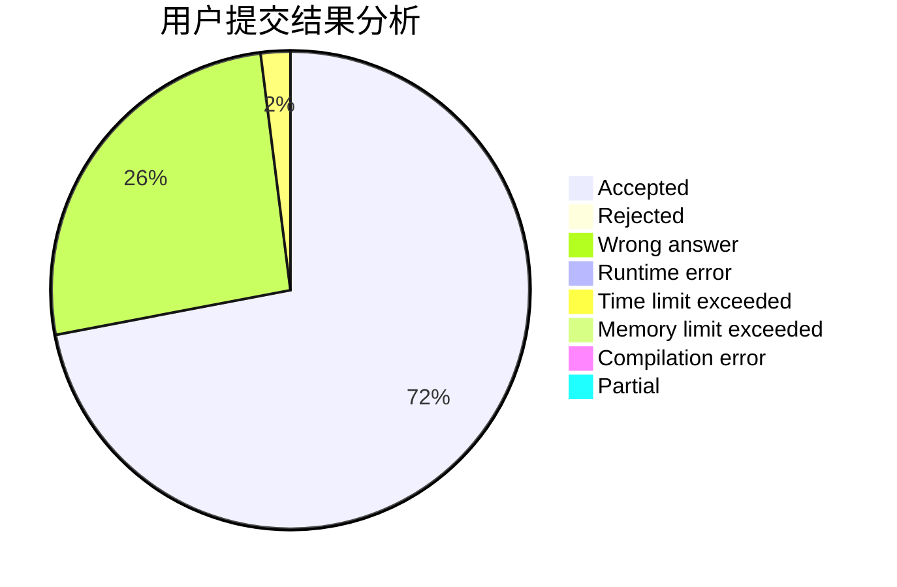
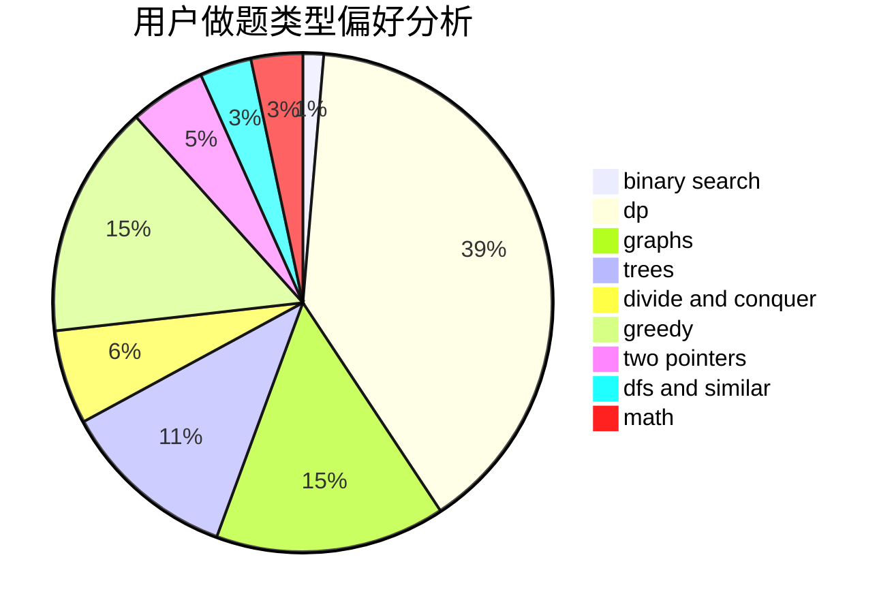

# ETK.

<!-- tabs:start -->

#### **用户提交结果分析**

#### **用户做题类型偏好分析**

<!-- tabs:end -->
# 推荐题目
[1154G](https://codeforces.com/contest/1154/problem/G)
[1228B](https://codeforces.com/contest/1228/problem/B)
[447A](https://codeforces.com/contest/447/problem/A)
[1385F](https://codeforces.com/contest/1385/problem/F)
[581A](https://codeforces.com/contest/581/problem/A)
[724G](https://codeforces.com/contest/724/problem/G)
[1227B](https://codeforces.com/contest/1227/problem/B)
[81C](https://codeforces.com/contest/81/problem/C)
[1078E](https://codeforces.com/contest/1078/problem/E)
[598B](https://codeforces.com/contest/598/problem/B)
