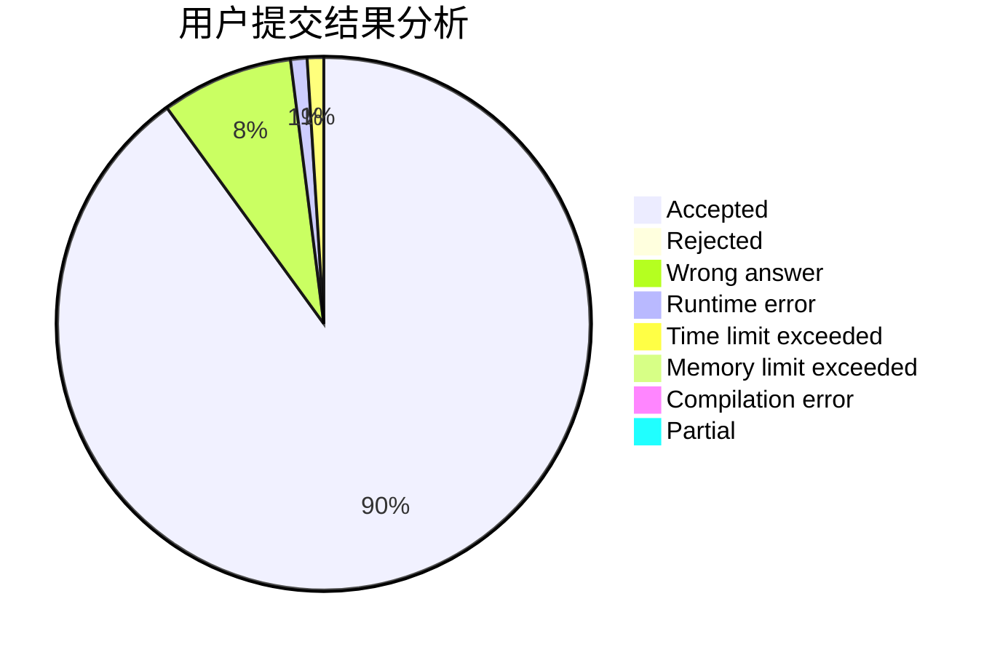
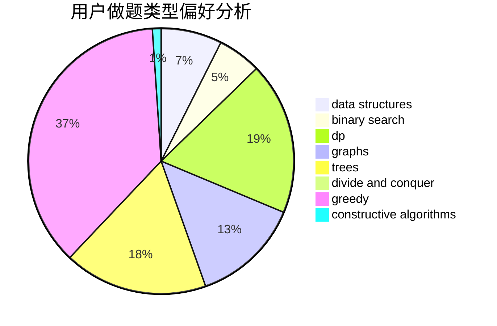

# ET_

<!-- tabs:start -->

#### **用户提交结果分析**

#### **用户做题类型偏好分析**

#### **用户错题知识点分析**

<!-- tabs:end -->
# 推荐题目
[793F](https://codeforces.com/contest/793/problem/F)		data structures,
                        divide and conquer,
                        dp		  
[260B](https://codeforces.com/contest/260/problem/B)		brute force,
                        implementation,
                        strings		  
[1033A](https://codeforces.com/contest/1033/problem/A)		dfs and similar,
                        graphs,
                        implementation		  
[1132E](https://codeforces.com/contest/1132/problem/E)		dfs and similar,
                        dp,
                        greedy		  
[1147E](https://codeforces.com/contest/1147/problem/E)		interactive		  
[820C](https://codeforces.com/contest/820/problem/C)		dsu,graphs,sortings,trees		  
[820A](https://codeforces.com/contest/820/problem/A)		implementation		  
[808B](https://codeforces.com/contest/808/problem/B)		data structures,
                        implementation,
                        math		  
[1006A](https://codeforces.com/contest/1006/problem/A)		implementation		  
[1327A](https://codeforces.com/contest/1327/problem/A)		math		  
