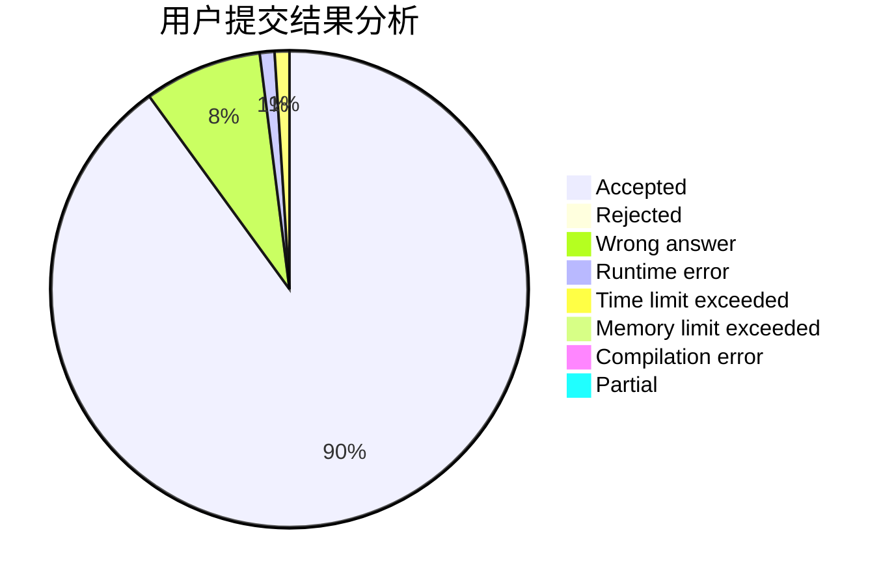
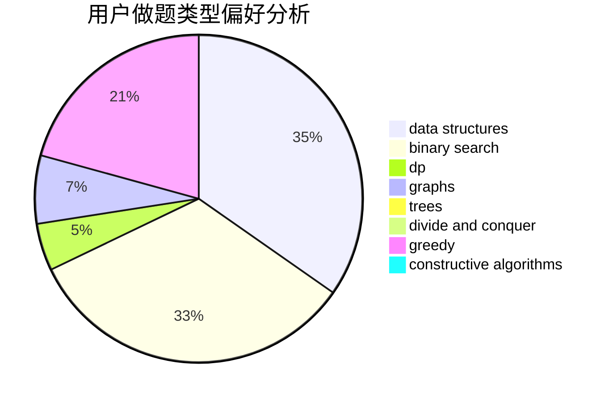

# ET_

<!-- tabs:start -->

#### **用户提交结果分析**

#### **用户做题类型偏好分析**

#### **用户错题知识点分析**

<!-- tabs:end -->
# 推荐题目
[774G](https://codeforces.com/contest/774/problem/G)		*special problem,
                        number theory		  
[238E](https://codeforces.com/contest/238/problem/E)		dp,
                        graphs,
                        shortest paths		  
[1032D](https://codeforces.com/contest/1032/problem/D)		geometry,
                        implementation		  
[1130D2](https://codeforces.com/contest/1130D/problem/2)		dsu,graphs,sortings,trees		  
[1145D](https://codeforces.com/contest/1145/problem/D)		implementation		  
[804D](https://codeforces.com/contest/804/problem/D)		binary search,
                        brute force,
                        dfs and similar,
                        dp,
                        sortings,
                        trees		  
[804B](https://codeforces.com/contest/804/problem/B)		combinatorics,
                        greedy,
                        implementation,
                        math		  
[792C](https://codeforces.com/contest/792/problem/C)		dp,
                        greedy,
                        math,
                        number theory		  
[1005E1](https://codeforces.com/contest/1005E/problem/1)		sortings		  
[1320A](https://codeforces.com/contest/1320/problem/A)		data structures,
                        dp,
                        greedy,
                        math,
                        sortings		  
