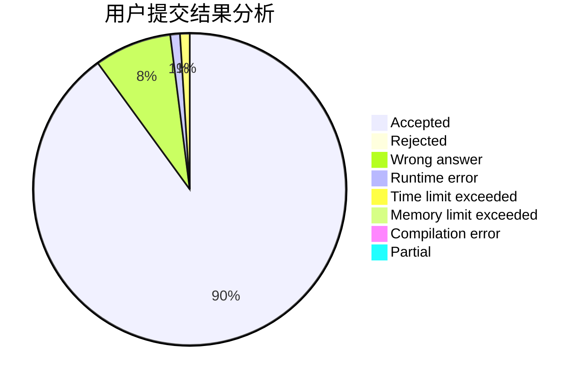
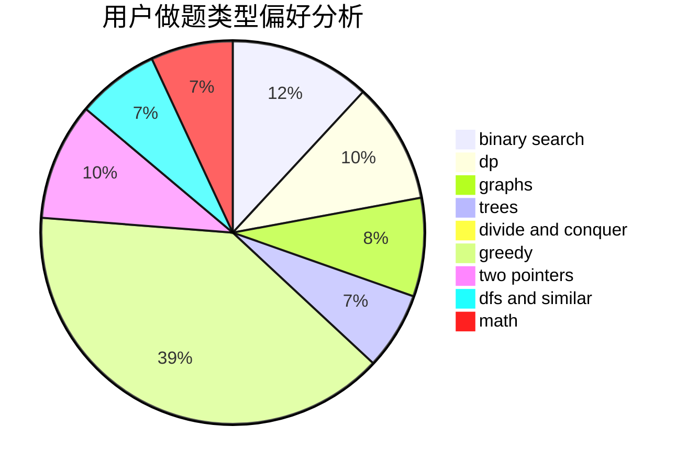

# ET_

<!-- tabs:start -->

#### **用户提交结果分析**

#### **用户做题类型偏好分析**

<!-- tabs:end -->
# 推荐题目
[793F](https://codeforces.com/contest/793/problem/F)
[260B](https://codeforces.com/contest/260/problem/B)
[1033A](https://codeforces.com/contest/1033/problem/A)
[1132E](https://codeforces.com/contest/1132/problem/E)
[1147E](https://codeforces.com/contest/1147/problem/E)
[820C](https://codeforces.com/contest/820/problem/C)
[820A](https://codeforces.com/contest/820/problem/A)
[808B](https://codeforces.com/contest/808/problem/B)
[1006A](https://codeforces.com/contest/1006/problem/A)
[1327A](https://codeforces.com/contest/1327/problem/A)
