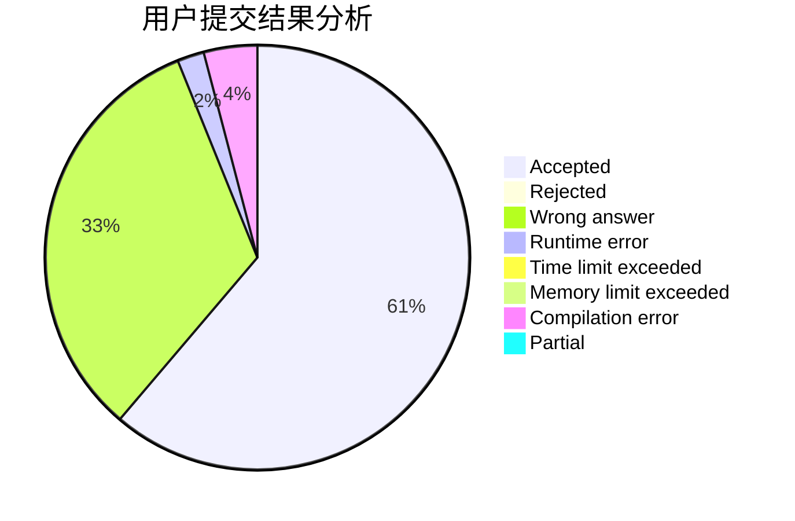
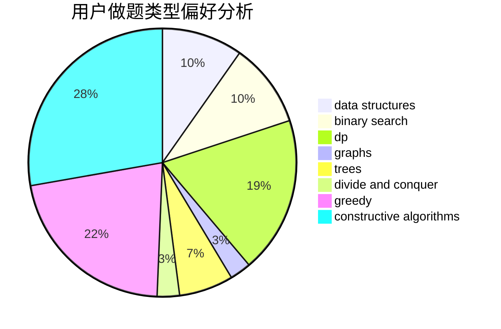

# EagleEyeKestrel
<!-- tabs:start -->
#### **用户提交结果分析**

#### **用户做题类型偏好分析**

#### **用户错题知识点分析**

<!-- tabs:end -->
# 推荐题目
[Ostap and Tree](http://codeforces.com/problemset/problem/735/E)		dp,
                        trees		  
[Magic Gems](http://codeforces.com/problemset/problem/1117/D)		dp,
                        math,
                        matrices		  
[Even Substrings](http://codeforces.com/problemset/problem/1139/A)		implementation,
                        strings		  
[Vanya and Fence](http://codeforces.com/problemset/problem/677/A)		implementation		  
[Appleman and Easy Task](http://codeforces.com/problemset/problem/462/A)		brute force,
                        implementation		  
[Captains Mode](http://codeforces.com/problemset/problem/377/C)		bitmasks,
                        dp,
                        games		  
[Jumping Ball](http://codeforces.com/problemset/problem/725/A)		implementation		  
[Xenia and Bit Operations](http://codeforces.com/problemset/problem/339/D)		data structures,
                        trees		  
[Lucky Conversion](http://codeforces.com/problemset/problem/145/A)		greedy,
                        implementation		  
[Restaurant](http://codeforces.com/problemset/problem/597/B)		dp,
                        greedy,
                        sortings		  
<!-- tabs:start -->
#### **data structures**
[Ostap and Tree](http://codeforces.com/problemset/problem/339/D)		data structures,
                        trees		  
[Magic Gems](http://codeforces.com/problemset/problem/1500/D)		data structures,
                        sortings,
                        two pointers		  
[Even Substrings](http://codeforces.com/problemset/problem/1200/A)		brute force,
                        data structures,
                        implementation		  
[Vanya and Fence](http://codeforces.com/problemset/problem/1492/C)		binary search,
                        data structures,
                        dp,
                        greedy,
                        two pointers		  
[Appleman and Easy Task](http://codeforces.com/problemset/problem/1490/G)		binary search,
                        data structures,
                        math		  
[Captains Mode](http://codeforces.com/problemset/problem/1479/D)		binary search,
                        bitmasks,
                        brute force,
                        data structures,
                        probabilities,
                        trees		  
[Jumping Ball](http://codeforces.com/problemset/problem/1497/A)		brute force,
                        data structures,
                        greedy,
                        sortings		  
[Xenia and Bit Operations](http://codeforces.com/problemset/problem/1491/C)		brute force,
                        data structures,
                        dp,
                        greedy,
                        implementation		  
[Lucky Conversion](http://codeforces.com/problemset/problem/1492/B)		data structures,
                        greedy,
                        math		  
[Restaurant](http://codeforces.com/problemset/problem/1436/E)		binary search,
                        data structures,
                        two pointers		  
#### **binary search**
[Ostap and Tree](http://codeforces.com/problemset/problem/518/F)		binary search,
                        brute force,
                        combinatorics,
                        dp,
                        implementation		  
[Magic Gems](http://codeforces.com/problemset/problem/1468/L)		binary search,
                        greedy,
                        math,
                        number theory		  
[Even Substrings](http://codeforces.com/problemset/problem/1494/C)		binary search,
                        dp,
                        greedy,
                        implementation,
                        two pointers		  
[Vanya and Fence](http://codeforces.com/problemset/problem/1492/C)		binary search,
                        data structures,
                        dp,
                        greedy,
                        two pointers		  
[Appleman and Easy Task](http://codeforces.com/problemset/problem/1463/D)		binary search,
                        constructive algorithms,
                        greedy,
                        two pointers		  
[Captains Mode](http://codeforces.com/problemset/problem/1490/G)		binary search,
                        data structures,
                        math		  
[Jumping Ball](http://codeforces.com/problemset/problem/1479/D)		binary search,
                        bitmasks,
                        brute force,
                        data structures,
                        probabilities,
                        trees		  
[Xenia and Bit Operations](http://codeforces.com/problemset/problem/1436/E)		binary search,
                        data structures,
                        two pointers		  
[Lucky Conversion](http://codeforces.com/problemset/problem/1461/D)		binary search,
                        brute force,
                        data structures,
                        divide and conquer,
                        implementation,
                        sortings		  
[Restaurant](http://codeforces.com/problemset/problem/1493/C)		binary search,
                        brute force,
                        constructive algorithms,
                        greedy,
                        strings		  
#### **dp**
[Ostap and Tree](http://codeforces.com/problemset/problem/735/E)		dp,
                        trees		  
[Magic Gems](http://codeforces.com/problemset/problem/1117/D)		dp,
                        math,
                        matrices		  
[Even Substrings](http://codeforces.com/problemset/problem/377/C)		bitmasks,
                        dp,
                        games		  
[Vanya and Fence](http://codeforces.com/problemset/problem/597/B)		dp,
                        greedy,
                        sortings		  
[Appleman and Easy Task](http://codeforces.com/problemset/problem/518/F)		binary search,
                        brute force,
                        combinatorics,
                        dp,
                        implementation		  
[Captains Mode](http://codeforces.com/problemset/problem/1425/D)		combinatorics,
                        dp,
                        math		  
[Jumping Ball](https://codeforces.com/contest/1293/problem/E)		combinatorics,
                        dfs and similar,
                        dp,
                        greedy,
                        trees		  
[Xenia and Bit Operations](http://codeforces.com/problemset/problem/804/F)		combinatorics,
                        dfs and similar,
                        dp,
                        graphs,
                        number theory		  
[Lucky Conversion](http://codeforces.com/problemset/problem/1283/E)		dp,
                        greedy		  
[Restaurant](http://codeforces.com/problemset/problem/1494/C)		binary search,
                        dp,
                        greedy,
                        implementation,
                        two pointers		  
#### **graph**
[Ostap and Tree](http://codeforces.com/problemset/problem/804/F)		combinatorics,
                        dfs and similar,
                        dp,
                        graphs,
                        number theory		  
[Magic Gems](http://codeforces.com/problemset/problem/228/E)		2-sat,
                        dfs and similar,
                        dsu,
                        graphs		  
[Even Substrings](http://codeforces.com/problemset/problem/1263/D)		dfs and similar,
                        dsu,
                        graphs		  
[Vanya and Fence](http://codeforces.com/problemset/problem/1487/C)		brute force,
                        constructive algorithms,
                        dfs and similar,
                        graphs,
                        greedy,
                        implementation,
                        math		  
[Appleman and Easy Task](http://codeforces.com/problemset/problem/1437/C)		dp,
                        flows,
                        graph matchings,
                        greedy,
                        math,
                        sortings		  
[Captains Mode](http://codeforces.com/problemset/problem/1470/D)		constructive algorithms,
                        dfs and similar,
                        graph matchings,
                        graphs,
                        greedy		  
[Jumping Ball](http://codeforces.com/problemset/problem/1476/C)		dp,
                        graphs,
                        greedy		  
[Xenia and Bit Operations](http://codeforces.com/problemset/problem/1304/D)		constructive algorithms,
                        graphs,
                        greedy,
                        two pointers		  
[Lucky Conversion](http://codeforces.com/problemset/problem/1475/C)		combinatorics,
                        graphs,
                        math		  
[Restaurant](http://codeforces.com/problemset/problem/553/E)		dp,
                        fft,
                        graphs,
                        math,
                        probabilities		  
#### **trees**
[Ostap and Tree](http://codeforces.com/problemset/problem/735/E)		dp,
                        trees		  
[Magic Gems](http://codeforces.com/problemset/problem/339/D)		data structures,
                        trees		  
[Even Substrings](https://codeforces.com/contest/1293/problem/E)		combinatorics,
                        dfs and similar,
                        dp,
                        greedy,
                        trees		  
[Vanya and Fence](http://codeforces.com/problemset/problem/724/F)		combinatorics,
                        dp,
                        trees		  
[Appleman and Easy Task](http://codeforces.com/problemset/problem/1479/D)		binary search,
                        bitmasks,
                        brute force,
                        data structures,
                        probabilities,
                        trees		  
[Captains Mode](http://codeforces.com/problemset/problem/1511/C)		brute force,
                        data structures,
                        implementation,
                        trees		  
[Jumping Ball](http://codeforces.com/problemset/problem/1499/F)		combinatorics,
                        dfs and similar,
                        dp,
                        trees		  
[Xenia and Bit Operations](http://codeforces.com/problemset/problem/1491/E)		brute force,
                        dfs and similar,
                        divide and conquer,
                        number theory,
                        trees		  
[Lucky Conversion](http://codeforces.com/problemset/problem/1466/D)		data structures,
                        greedy,
                        sortings,
                        trees		  
[Restaurant](http://codeforces.com/problemset/problem/1495/D)		combinatorics,
                        dfs and similar,
                        graphs,
                        math,
                        shortest paths,
                        trees		  
#### **divide and conquer**
[Ostap and Tree](http://codeforces.com/problemset/problem/1461/D)		binary search,
                        brute force,
                        data structures,
                        divide and conquer,
                        implementation,
                        sortings		  
[Magic Gems](http://codeforces.com/problemset/problem/1466/G)		combinatorics,
                        divide and conquer,
                        hashing,
                        math,
                        string suffix structures,
                        strings		  
[Even Substrings](http://codeforces.com/problemset/problem/1490/D)		dfs and similar,
                        divide and conquer,
                        implementation		  
[Vanya and Fence](https://codeforces.com/contest/1483/problem/C)		data structures,
                        divide and conquer,
                        dp		  
[Appleman and Easy Task](http://codeforces.com/problemset/problem/1491/E)		brute force,
                        dfs and similar,
                        divide and conquer,
                        number theory,
                        trees		  
[Captains Mode](http://codeforces.com/problemset/problem/1303/G)		data structures,
                        divide and conquer,
                        geometry,
                        trees		  
[Jumping Ball](http://codeforces.com/problemset/problem/1494/D)		constructive algorithms,
                        data structures,
                        dfs and similar,
                        divide and conquer,
                        dsu,
                        greedy,
                        sortings,
                        trees		  
[Xenia and Bit Operations](http://codeforces.com/problemset/problem/1482/E)		data structures,
                        divide and conquer,
                        dp		  
[Lucky Conversion](http://codeforces.com/problemset/problem/566/C)		dfs and similar,
                        divide and conquer,
                        trees		  
[Restaurant](http://codeforces.com/problemset/problem/1428/F)		binary search,
                        data structures,
                        divide and conquer,
                        dp,
                        two pointers		  
#### **greedy**
[Ostap and Tree](http://codeforces.com/problemset/problem/145/A)		greedy,
                        implementation		  
[Magic Gems](http://codeforces.com/problemset/problem/597/B)		dp,
                        greedy,
                        sortings		  
[Even Substrings](http://codeforces.com/problemset/problem/1328/F)		greedy		  
[Vanya and Fence](http://codeforces.com/problemset/problem/1388/A)		brute force,
                        greedy,
                        math,
                        number theory		  
[Appleman and Easy Task](http://codeforces.com/problemset/problem/1468/L)		binary search,
                        greedy,
                        math,
                        number theory		  
[Captains Mode](https://codeforces.com/contest/1293/problem/E)		combinatorics,
                        dfs and similar,
                        dp,
                        greedy,
                        trees		  
[Jumping Ball](http://codeforces.com/problemset/problem/1455/E)		brute force,
                        constructive algorithms,
                        flows,
                        geometry,
                        greedy,
                        implementation,
                        math,
                        ternary search		  
[Xenia and Bit Operations](http://codeforces.com/problemset/problem/1265/A)		constructive algorithms,
                        greedy		  
[Lucky Conversion](http://codeforces.com/problemset/problem/1132/B)		greedy,
                        sortings		  
[Restaurant](http://codeforces.com/problemset/problem/1283/E)		dp,
                        greedy		  
#### **constructive algorithms**
[Ostap and Tree](https://codeforces.com/contest/287/problem/C)		constructive algorithms,
                        math		  
[Magic Gems](http://codeforces.com/problemset/problem/804/E)		constructive algorithms		  
[Even Substrings](http://codeforces.com/problemset/problem/1355/D)		constructive algorithms,
                        math		  
[Vanya and Fence](https://codeforces.com/contest/1435/problem/A)		constructive algorithms,
                        math		  
[Appleman and Easy Task](https://codeforces.com/contest/1457/problem/D)		bitmasks,
                        brute force,
                        constructive algorithms		  
[Captains Mode](http://codeforces.com/problemset/problem/1455/E)		brute force,
                        constructive algorithms,
                        flows,
                        geometry,
                        greedy,
                        implementation,
                        math,
                        ternary search		  
[Jumping Ball](http://codeforces.com/problemset/problem/1265/A)		constructive algorithms,
                        greedy		  
[Xenia and Bit Operations](http://codeforces.com/problemset/problem/1413/A)		constructive algorithms,
                        math		  
[Lucky Conversion](http://codeforces.com/problemset/problem/1493/A)		constructive algorithms,
                        greedy		  
[Restaurant](http://codeforces.com/problemset/problem/1463/D)		binary search,
                        constructive algorithms,
                        greedy,
                        two pointers		  
#### **sortings**
[Ostap and Tree](http://codeforces.com/problemset/problem/597/B)		dp,
                        greedy,
                        sortings		  
[Magic Gems](http://codeforces.com/problemset/problem/1500/D)		data structures,
                        sortings,
                        two pointers		  
[Even Substrings](http://codeforces.com/problemset/problem/1132/B)		greedy,
                        sortings		  
[Vanya and Fence](https://codeforces.com/contest/1496/problem/C)		geometry,
                        greedy,
                        math,
                        sortings		  
[Appleman and Easy Task](http://codeforces.com/problemset/problem/1495/A)		geometry,
                        greedy,
                        math,
                        sortings		  
[Captains Mode](http://codeforces.com/problemset/problem/1497/A)		brute force,
                        data structures,
                        greedy,
                        sortings		  
[Jumping Ball](http://codeforces.com/problemset/problem/1427/A)		math,
                        sortings		  
[Xenia and Bit Operations](http://codeforces.com/problemset/problem/1461/D)		binary search,
                        brute force,
                        data structures,
                        divide and conquer,
                        implementation,
                        sortings		  
[Lucky Conversion](http://codeforces.com/problemset/problem/1437/C)		dp,
                        flows,
                        graph matchings,
                        greedy,
                        math,
                        sortings		  
[Restaurant](http://codeforces.com/problemset/problem/1473/A)		greedy,
                        implementation,
                        math,
                        sortings		  
<!-- tabs:end -->
