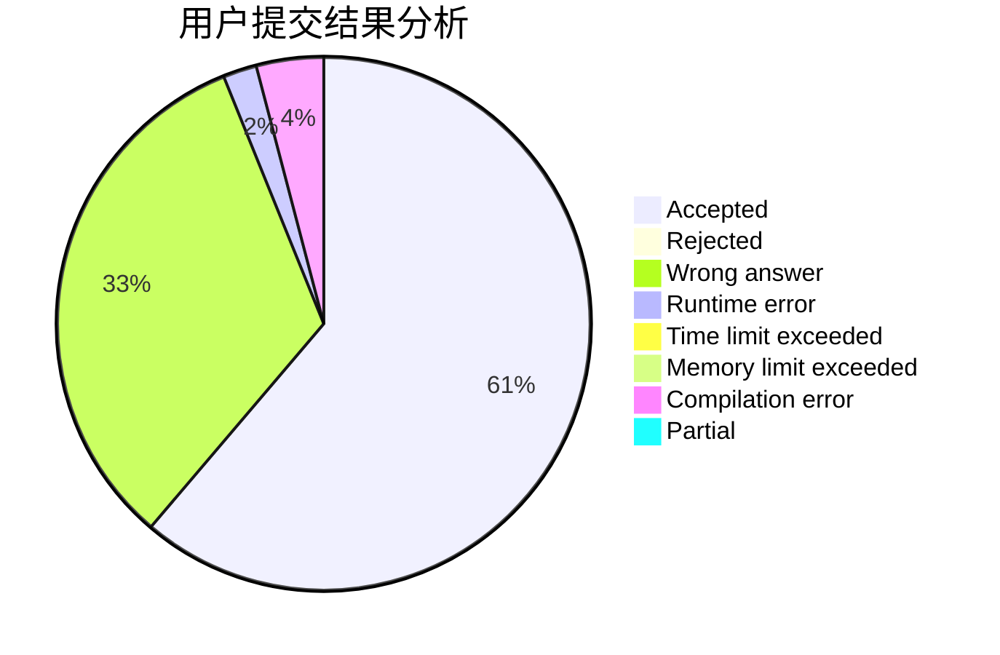
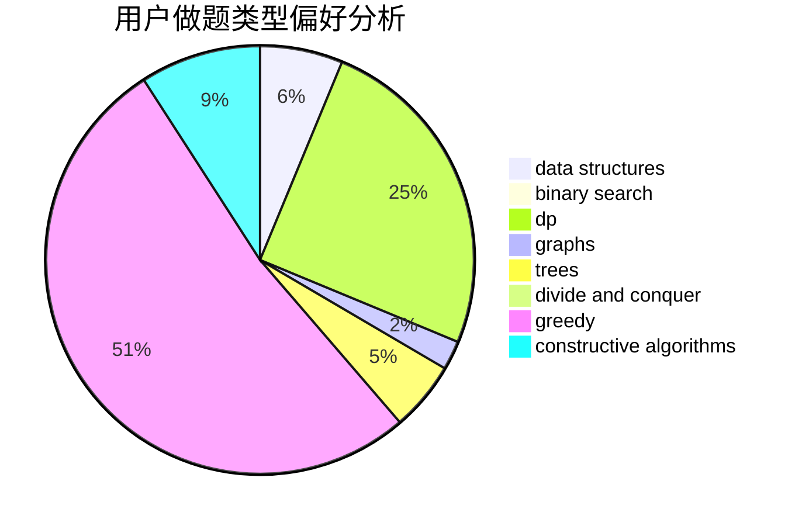

# EagleEyeKestrel

<!-- tabs:start -->

#### **用户提交结果分析**

#### **用户做题类型偏好分析**

#### **用户错题知识点分析**

<!-- tabs:end -->
# 推荐题目
[1119C](https://codeforces.com/contest/1119/problem/C)		constructive algorithms,
                        greedy,
                        implementation,
                        math		  
[1140E](https://codeforces.com/contest/1140/problem/E)		combinatorics,
                        divide and conquer,
                        dp		  
[701A](https://codeforces.com/contest/701/problem/A)		greedy,
                        implementation		  
[1269B](https://codeforces.com/contest/1269/problem/B)		brute force,
                        sortings		  
[1195A](https://codeforces.com/contest/1195/problem/A)		greedy,
                        math		  
[1476F](https://codeforces.com/contest/1476/problem/F)		binary search,
                        data structures,
                        dp		  
[611C](https://codeforces.com/contest/611/problem/C)		dp,
                        implementation		  
[1246D](https://codeforces.com/contest/1246/problem/D)		dsu,graphs,sortings,trees		  
[482A](https://codeforces.com/contest/482/problem/A)		constructive algorithms,
                        greedy		  
[742E](https://codeforces.com/contest/742/problem/E)		dsu,graphs,sortings,trees		  
