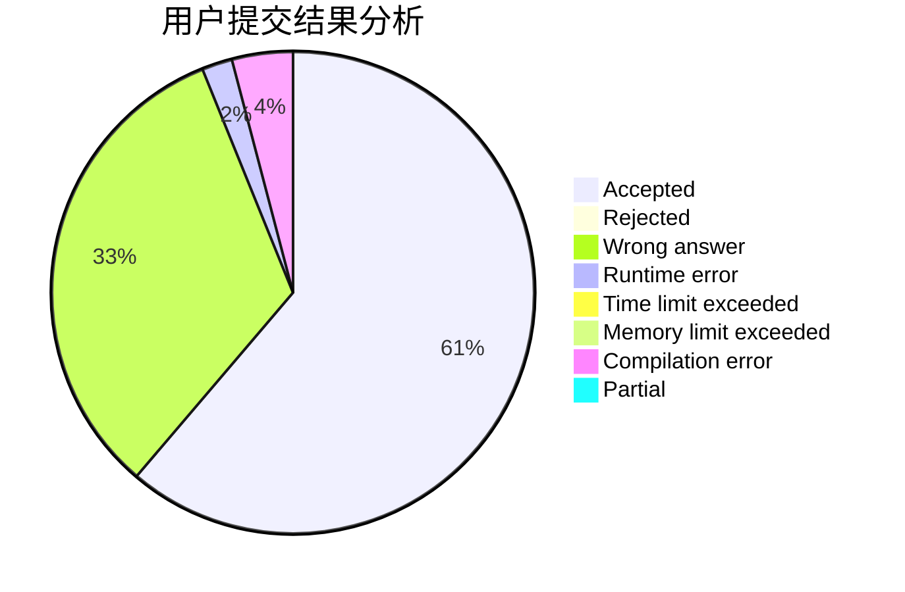
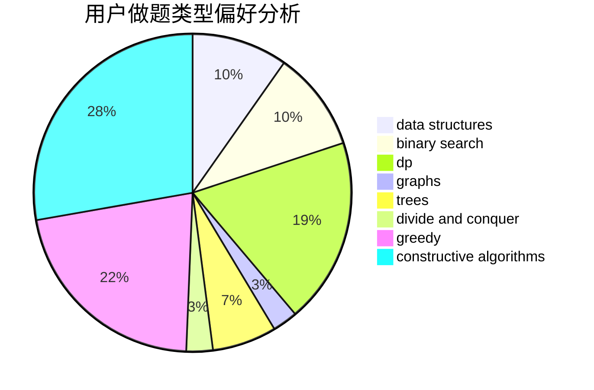

# EagleEyeKestrel

<!-- tabs:start -->

#### **用户提交结果分析**

#### **用户做题类型偏好分析**

#### **用户错题知识点分析**

<!-- tabs:end -->
# 推荐题目
[1117D](https://codeforces.com/contest/1117/problem/D)		dp,
                        math,
                        matrices		  
[1139A](https://codeforces.com/contest/1139/problem/A)		implementation,
                        strings		  
[677A](https://codeforces.com/contest/677/problem/A)		implementation		  
[1263D](https://codeforces.com/contest/1263/problem/D)		dfs and similar,
                        dsu,
                        graphs		  
[118A](https://codeforces.com/contest/118/problem/A)		implementation,
                        strings		  
[1468L](https://codeforces.com/contest/1468/problem/L)		binary search,
                        greedy,
                        math,
                        number theory		  
[592A](https://codeforces.com/contest/592/problem/A)		implementation		  
[1241A](https://codeforces.com/contest/1241/problem/A)		dsu,graphs,sortings,trees		  
[462A](https://codeforces.com/contest/462/problem/A)		brute force,
                        implementation		  
[725A](https://codeforces.com/contest/725/problem/A)		implementation		  
