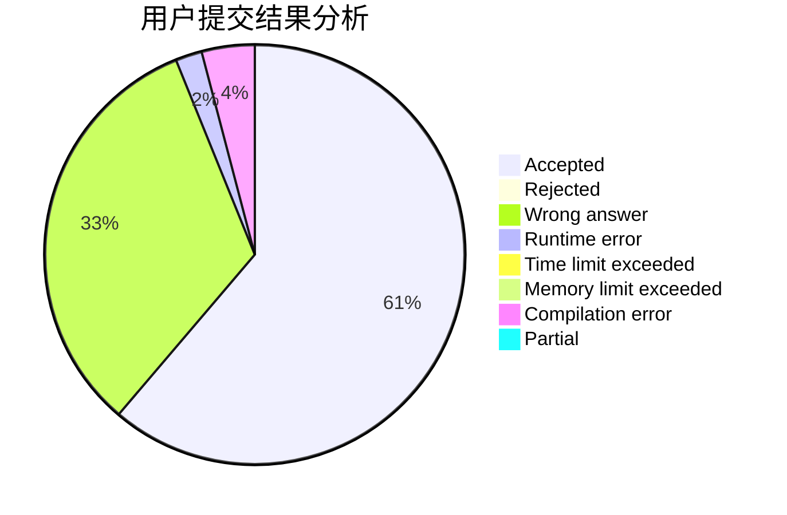
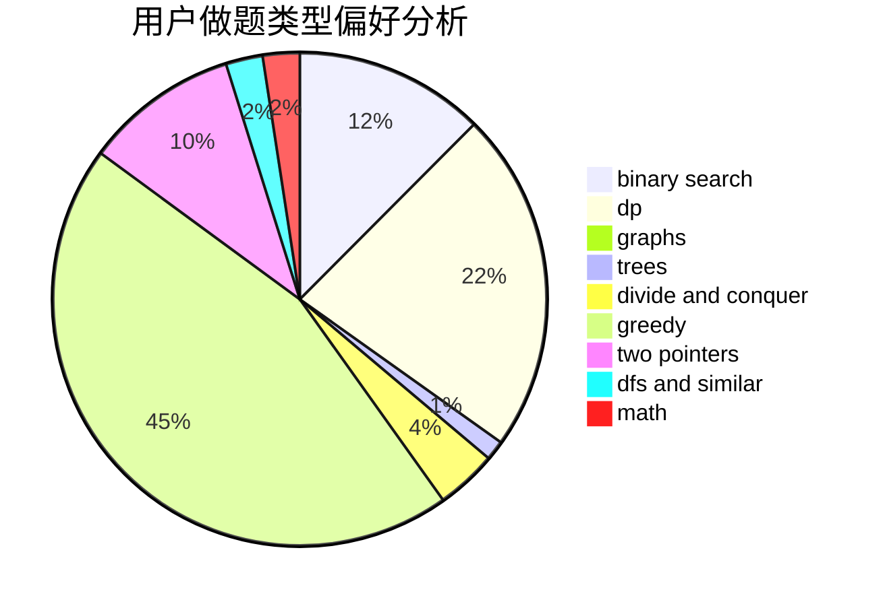

# EagleEyeKestrel

<!-- tabs:start -->

#### **用户提交结果分析**

#### **用户做题类型偏好分析**

<!-- tabs:end -->
# 推荐题目
[1119C](https://codeforces.com/contest/1119/problem/C)
[1140E](https://codeforces.com/contest/1140/problem/E)
[701A](https://codeforces.com/contest/701/problem/A)
[1269B](https://codeforces.com/contest/1269/problem/B)
[1195A](https://codeforces.com/contest/1195/problem/A)
[1476F](https://codeforces.com/contest/1476/problem/F)
[611C](https://codeforces.com/contest/611/problem/C)
[1246D](https://codeforces.com/contest/1246/problem/D)
[482A](https://codeforces.com/contest/482/problem/A)
[742E](https://codeforces.com/contest/742/problem/E)
