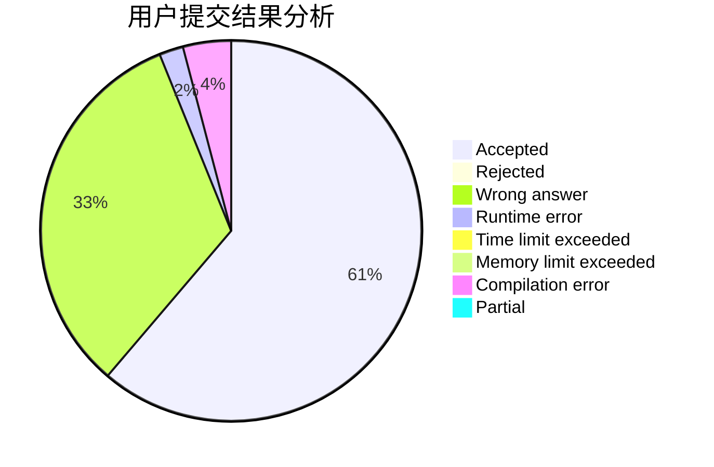
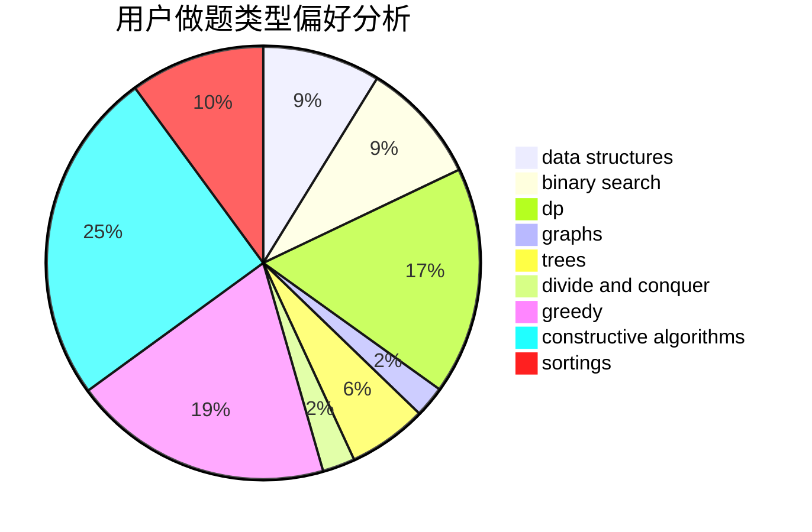

# EagleEyeKestrel
<!-- tabs:start -->
#### **用户提交结果分析**

#### **用户做题类型偏好分析**

#### **用户错题知识点分析**

<!-- tabs:end -->
# 推荐题目
[735E](http://codeforces.com/problemset/problem/735/E)		dp,
                        trees		  
[1117D](http://codeforces.com/problemset/problem/1117/D)		dp,
                        math,
                        matrices		  
[1139A](http://codeforces.com/problemset/problem/1139/A)		implementation,
                        strings		  
[677A](http://codeforces.com/problemset/problem/677/A)		implementation		  
[462A](http://codeforces.com/problemset/problem/462/A)		brute force,
                        implementation		  
[377C](http://codeforces.com/problemset/problem/377/C)		bitmasks,
                        dp,
                        games		  
[725A](http://codeforces.com/problemset/problem/725/A)		implementation		  
[339D](http://codeforces.com/problemset/problem/339/D)		data structures,
                        trees		  
[145A](http://codeforces.com/problemset/problem/145/A)		greedy,
                        implementation		  
[597B](http://codeforces.com/problemset/problem/597/B)		dp,
                        greedy,
                        sortings		  
<!-- tabs:start -->
#### **data structures**
[339D](http://codeforces.com/problemset/problem/339/D)		data structures,
                        trees		  
[1500D](http://codeforces.com/problemset/problem/1500/D)		data structures,
                        sortings,
                        two pointers		  
[1200A](http://codeforces.com/problemset/problem/1200/A)		brute force,
                        data structures,
                        implementation		  
[1492C](http://codeforces.com/problemset/problem/1492/C)		binary search,
                        data structures,
                        dp,
                        greedy,
                        two pointers		  
[1490G](http://codeforces.com/problemset/problem/1490/G)		binary search,
                        data structures,
                        math		  
[1479D](http://codeforces.com/problemset/problem/1479/D)		binary search,
                        bitmasks,
                        brute force,
                        data structures,
                        probabilities,
                        trees		  
[1497A](http://codeforces.com/problemset/problem/1497/A)		brute force,
                        data structures,
                        greedy,
                        sortings		  
[1491C](http://codeforces.com/problemset/problem/1491/C)		brute force,
                        data structures,
                        dp,
                        greedy,
                        implementation		  
[1492B](http://codeforces.com/problemset/problem/1492/B)		data structures,
                        greedy,
                        math		  
[1436E](http://codeforces.com/problemset/problem/1436/E)		binary search,
                        data structures,
                        two pointers		  
#### **binary search**
[518F](http://codeforces.com/problemset/problem/518/F)		binary search,
                        brute force,
                        combinatorics,
                        dp,
                        implementation		  
[1468L](http://codeforces.com/problemset/problem/1468/L)		binary search,
                        greedy,
                        math,
                        number theory		  
[1494C](http://codeforces.com/problemset/problem/1494/C)		binary search,
                        dp,
                        greedy,
                        implementation,
                        two pointers		  
[1492C](http://codeforces.com/problemset/problem/1492/C)		binary search,
                        data structures,
                        dp,
                        greedy,
                        two pointers		  
[1463D](http://codeforces.com/problemset/problem/1463/D)		binary search,
                        constructive algorithms,
                        greedy,
                        two pointers		  
[1490G](http://codeforces.com/problemset/problem/1490/G)		binary search,
                        data structures,
                        math		  
[1479D](http://codeforces.com/problemset/problem/1479/D)		binary search,
                        bitmasks,
                        brute force,
                        data structures,
                        probabilities,
                        trees		  
[1436E](http://codeforces.com/problemset/problem/1436/E)		binary search,
                        data structures,
                        two pointers		  
[1461D](http://codeforces.com/problemset/problem/1461/D)		binary search,
                        brute force,
                        data structures,
                        divide and conquer,
                        implementation,
                        sortings		  
[1493C](http://codeforces.com/problemset/problem/1493/C)		binary search,
                        brute force,
                        constructive algorithms,
                        greedy,
                        strings		  
#### **dp**
[735E](http://codeforces.com/problemset/problem/735/E)		dp,
                        trees		  
[1117D](http://codeforces.com/problemset/problem/1117/D)		dp,
                        math,
                        matrices		  
[377C](http://codeforces.com/problemset/problem/377/C)		bitmasks,
                        dp,
                        games		  
[597B](http://codeforces.com/problemset/problem/597/B)		dp,
                        greedy,
                        sortings		  
[518F](http://codeforces.com/problemset/problem/518/F)		binary search,
                        brute force,
                        combinatorics,
                        dp,
                        implementation		  
[1425D](http://codeforces.com/problemset/problem/1425/D)		combinatorics,
                        dp,
                        math		  
[1293E](https://codeforces.com/contest/1293/problem/E)		combinatorics,
                        dfs and similar,
                        dp,
                        greedy,
                        trees		  
[804F](http://codeforces.com/problemset/problem/804/F)		combinatorics,
                        dfs and similar,
                        dp,
                        graphs,
                        number theory		  
[1283E](http://codeforces.com/problemset/problem/1283/E)		dp,
                        greedy		  
[1494C](http://codeforces.com/problemset/problem/1494/C)		binary search,
                        dp,
                        greedy,
                        implementation,
                        two pointers		  
#### **graph**
[804F](http://codeforces.com/problemset/problem/804/F)		combinatorics,
                        dfs and similar,
                        dp,
                        graphs,
                        number theory		  
[228E](http://codeforces.com/problemset/problem/228/E)		2-sat,
                        dfs and similar,
                        dsu,
                        graphs		  
[1263D](http://codeforces.com/problemset/problem/1263/D)		dfs and similar,
                        dsu,
                        graphs		  
[1487C](http://codeforces.com/problemset/problem/1487/C)		brute force,
                        constructive algorithms,
                        dfs and similar,
                        graphs,
                        greedy,
                        implementation,
                        math		  
[1437C](http://codeforces.com/problemset/problem/1437/C)		dp,
                        flows,
                        graph matchings,
                        greedy,
                        math,
                        sortings		  
[1470D](http://codeforces.com/problemset/problem/1470/D)		constructive algorithms,
                        dfs and similar,
                        graph matchings,
                        graphs,
                        greedy		  
[1476C](http://codeforces.com/problemset/problem/1476/C)		dp,
                        graphs,
                        greedy		  
[1304D](http://codeforces.com/problemset/problem/1304/D)		constructive algorithms,
                        graphs,
                        greedy,
                        two pointers		  
[1475C](http://codeforces.com/problemset/problem/1475/C)		combinatorics,
                        graphs,
                        math		  
[553E](http://codeforces.com/problemset/problem/553/E)		dp,
                        fft,
                        graphs,
                        math,
                        probabilities		  
#### **trees**
[735E](http://codeforces.com/problemset/problem/735/E)		dp,
                        trees		  
[339D](http://codeforces.com/problemset/problem/339/D)		data structures,
                        trees		  
[1293E](https://codeforces.com/contest/1293/problem/E)		combinatorics,
                        dfs and similar,
                        dp,
                        greedy,
                        trees		  
[724F](http://codeforces.com/problemset/problem/724/F)		combinatorics,
                        dp,
                        trees		  
[1479D](http://codeforces.com/problemset/problem/1479/D)		binary search,
                        bitmasks,
                        brute force,
                        data structures,
                        probabilities,
                        trees		  
[1511C](http://codeforces.com/problemset/problem/1511/C)		brute force,
                        data structures,
                        implementation,
                        trees		  
[1499F](http://codeforces.com/problemset/problem/1499/F)		combinatorics,
                        dfs and similar,
                        dp,
                        trees		  
[1491E](http://codeforces.com/problemset/problem/1491/E)		brute force,
                        dfs and similar,
                        divide and conquer,
                        number theory,
                        trees		  
[1466D](http://codeforces.com/problemset/problem/1466/D)		data structures,
                        greedy,
                        sortings,
                        trees		  
[1495D](http://codeforces.com/problemset/problem/1495/D)		combinatorics,
                        dfs and similar,
                        graphs,
                        math,
                        shortest paths,
                        trees		  
#### **divide and conquer**
[1461D](http://codeforces.com/problemset/problem/1461/D)		binary search,
                        brute force,
                        data structures,
                        divide and conquer,
                        implementation,
                        sortings		  
[1466G](http://codeforces.com/problemset/problem/1466/G)		combinatorics,
                        divide and conquer,
                        hashing,
                        math,
                        string suffix structures,
                        strings		  
[1490D](http://codeforces.com/problemset/problem/1490/D)		dfs and similar,
                        divide and conquer,
                        implementation		  
[1483C](https://codeforces.com/contest/1483/problem/C)		data structures,
                        divide and conquer,
                        dp		  
[1491E](http://codeforces.com/problemset/problem/1491/E)		brute force,
                        dfs and similar,
                        divide and conquer,
                        number theory,
                        trees		  
[1303G](http://codeforces.com/problemset/problem/1303/G)		data structures,
                        divide and conquer,
                        geometry,
                        trees		  
[1494D](http://codeforces.com/problemset/problem/1494/D)		constructive algorithms,
                        data structures,
                        dfs and similar,
                        divide and conquer,
                        dsu,
                        greedy,
                        sortings,
                        trees		  
[1482E](http://codeforces.com/problemset/problem/1482/E)		data structures,
                        divide and conquer,
                        dp		  
[566C](http://codeforces.com/problemset/problem/566/C)		dfs and similar,
                        divide and conquer,
                        trees		  
[1428F](http://codeforces.com/problemset/problem/1428/F)		binary search,
                        data structures,
                        divide and conquer,
                        dp,
                        two pointers		  
#### **greedy**
[145A](http://codeforces.com/problemset/problem/145/A)		greedy,
                        implementation		  
[597B](http://codeforces.com/problemset/problem/597/B)		dp,
                        greedy,
                        sortings		  
[1328F](http://codeforces.com/problemset/problem/1328/F)		greedy		  
[1388A](http://codeforces.com/problemset/problem/1388/A)		brute force,
                        greedy,
                        math,
                        number theory		  
[1468L](http://codeforces.com/problemset/problem/1468/L)		binary search,
                        greedy,
                        math,
                        number theory		  
[1293E](https://codeforces.com/contest/1293/problem/E)		combinatorics,
                        dfs and similar,
                        dp,
                        greedy,
                        trees		  
[1455E](http://codeforces.com/problemset/problem/1455/E)		brute force,
                        constructive algorithms,
                        flows,
                        geometry,
                        greedy,
                        implementation,
                        math,
                        ternary search		  
[1265A](http://codeforces.com/problemset/problem/1265/A)		constructive algorithms,
                        greedy		  
[1132B](http://codeforces.com/problemset/problem/1132/B)		greedy,
                        sortings		  
[1283E](http://codeforces.com/problemset/problem/1283/E)		dp,
                        greedy		  
#### **constructive algorithms**
[287C](https://codeforces.com/contest/287/problem/C)		constructive algorithms,
                        math		  
[804E](http://codeforces.com/problemset/problem/804/E)		constructive algorithms		  
[1355D](http://codeforces.com/problemset/problem/1355/D)		constructive algorithms,
                        math		  
[1435A](https://codeforces.com/contest/1435/problem/A)		constructive algorithms,
                        math		  
[1457D](https://codeforces.com/contest/1457/problem/D)		bitmasks,
                        brute force,
                        constructive algorithms		  
[1455E](http://codeforces.com/problemset/problem/1455/E)		brute force,
                        constructive algorithms,
                        flows,
                        geometry,
                        greedy,
                        implementation,
                        math,
                        ternary search		  
[1265A](http://codeforces.com/problemset/problem/1265/A)		constructive algorithms,
                        greedy		  
[1413A](http://codeforces.com/problemset/problem/1413/A)		constructive algorithms,
                        math		  
[1493A](http://codeforces.com/problemset/problem/1493/A)		constructive algorithms,
                        greedy		  
[1463D](http://codeforces.com/problemset/problem/1463/D)		binary search,
                        constructive algorithms,
                        greedy,
                        two pointers		  
#### **sortings**
[597B](http://codeforces.com/problemset/problem/597/B)		dp,
                        greedy,
                        sortings		  
[1500D](http://codeforces.com/problemset/problem/1500/D)		data structures,
                        sortings,
                        two pointers		  
[1132B](http://codeforces.com/problemset/problem/1132/B)		greedy,
                        sortings		  
[1496C](https://codeforces.com/contest/1496/problem/C)		geometry,
                        greedy,
                        math,
                        sortings		  
[1495A](http://codeforces.com/problemset/problem/1495/A)		geometry,
                        greedy,
                        math,
                        sortings		  
[1497A](http://codeforces.com/problemset/problem/1497/A)		brute force,
                        data structures,
                        greedy,
                        sortings		  
[1427A](http://codeforces.com/problemset/problem/1427/A)		math,
                        sortings		  
[1461D](http://codeforces.com/problemset/problem/1461/D)		binary search,
                        brute force,
                        data structures,
                        divide and conquer,
                        implementation,
                        sortings		  
[1437C](http://codeforces.com/problemset/problem/1437/C)		dp,
                        flows,
                        graph matchings,
                        greedy,
                        math,
                        sortings		  
[1473A](http://codeforces.com/problemset/problem/1473/A)		greedy,
                        implementation,
                        math,
                        sortings		  
<!-- tabs:end -->
