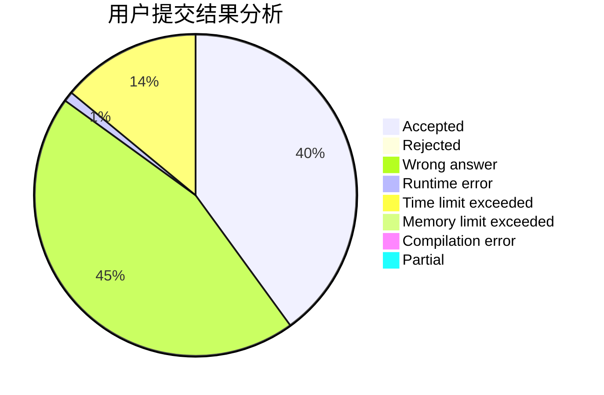
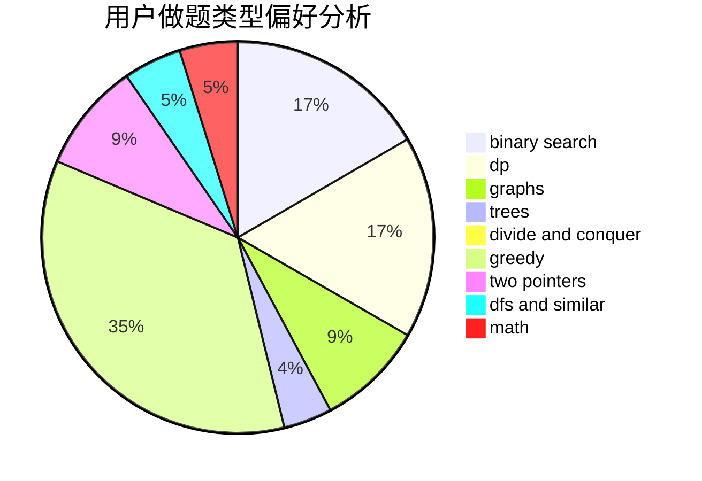

# Ean1zhi

<!-- tabs:start -->

#### **用户提交结果分析**

#### **用户做题类型偏好分析**

<!-- tabs:end -->
# 推荐题目
[545D](https://codeforces.com/contest/545/problem/D)
[1394B](https://codeforces.com/contest/1394/problem/B)
[1073D](https://codeforces.com/contest/1073/problem/D)
[665C](https://codeforces.com/contest/665/problem/C)
[1379E](https://codeforces.com/contest/1379/problem/E)
[478B](https://codeforces.com/contest/478/problem/B)
[821B](https://codeforces.com/contest/821/problem/B)
[74A](https://codeforces.com/contest/74/problem/A)
[821C](https://codeforces.com/contest/821/problem/C)
[821D](https://codeforces.com/contest/821/problem/D)
