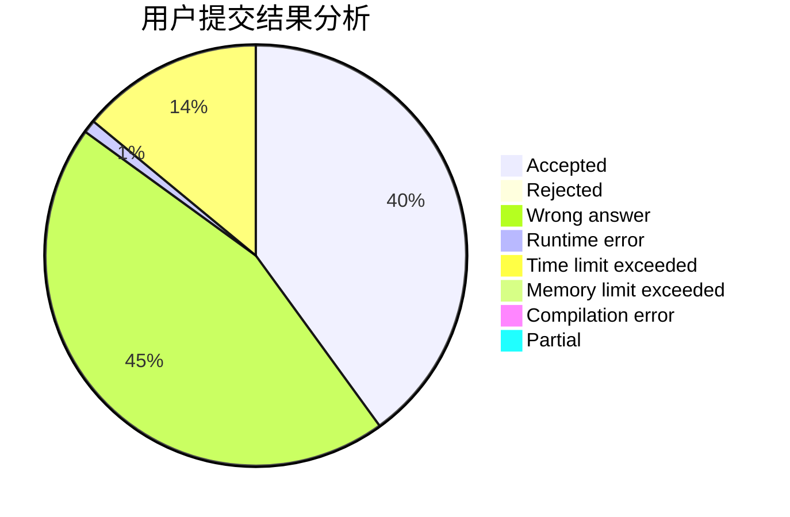
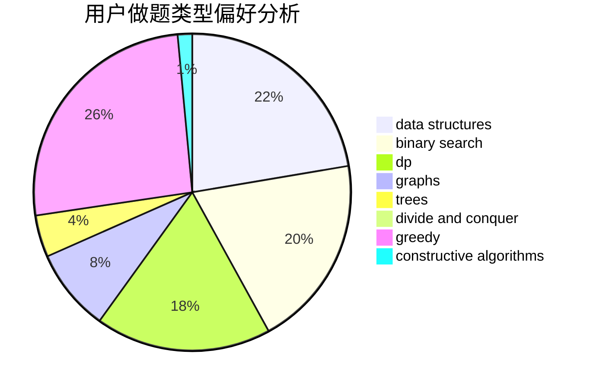

# Ean1zhi

<!-- tabs:start -->

#### **用户提交结果分析**

#### **用户做题类型偏好分析**

#### **用户错题知识点分析**

<!-- tabs:end -->
# 推荐题目
[545D](https://codeforces.com/contest/545/problem/D)		greedy,
                        implementation,
                        sortings		  
[1394B](https://codeforces.com/contest/1394/problem/B)		brute force,
                        dfs and similar,
                        graphs,
                        hashing		  
[1073D](https://codeforces.com/contest/1073/problem/D)		binary search,
                        brute force,
                        data structures,
                        greedy		  
[665C](https://codeforces.com/contest/665/problem/C)		dp,
                        greedy,
                        strings		  
[1379E](https://codeforces.com/contest/1379/problem/E)		constructive algorithms,
                        divide and conquer,
                        dp,
                        math,
                        trees		  
[478B](https://codeforces.com/contest/478/problem/B)		combinatorics,
                        constructive algorithms,
                        greedy,
                        math		  
[821B](https://codeforces.com/contest/821/problem/B)		brute force,
                        math		  
[74A](https://codeforces.com/contest/74/problem/A)		implementation		  
[821C](https://codeforces.com/contest/821/problem/C)		data structures,
                        greedy,
                        trees		  
[821D](https://codeforces.com/contest/821/problem/D)		dfs and similar,
                        graphs,
                        shortest paths		  
