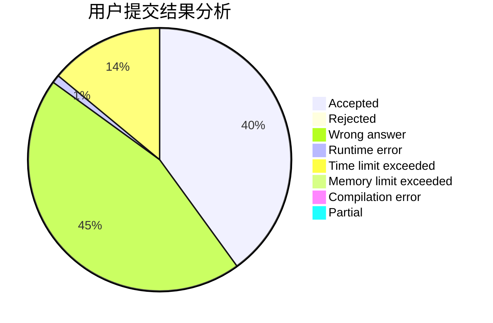
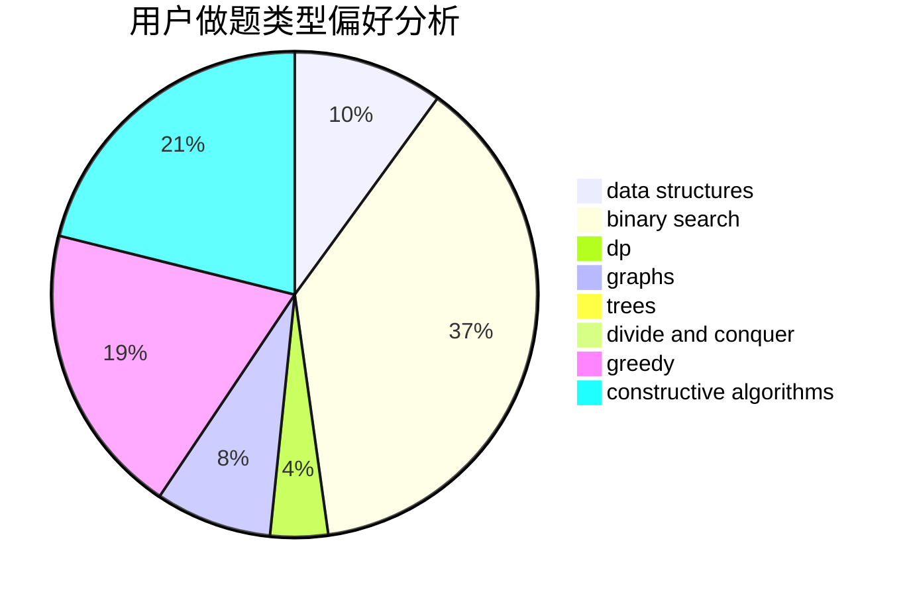

# Ean1zhi
<!-- tabs:start -->
#### **用户提交结果分析**

#### **用户做题类型偏好分析**

#### **用户错题知识点分析**

<!-- tabs:end -->
# 推荐题目
[Linear Congruential Generator](http://codeforces.com/problemset/problem/1030/G)		number theory		  
[Pashmak and Buses](http://codeforces.com/problemset/problem/459/C)		combinatorics,
                        constructive algorithms,
                        math		  
[Running Competition](http://codeforces.com/problemset/problem/1398/G)		bitmasks,
                        fft,
                        math,
                        number theory		  
[Ebony and Ivory](http://codeforces.com/problemset/problem/633/A)		brute force,
                        math,
                        number theory		  
[Diverse Substring](http://codeforces.com/problemset/problem/1073/A)		implementation,
                        strings		  
[Dreamoon and Strings](https://codeforces.com/contest/477/problem/C)		dp,
                        strings		  
[Fake NP](http://codeforces.com/problemset/problem/805/A)		greedy,
                        math		  
[Berland Miners](http://codeforces.com/problemset/problem/533/A)		binary search,
                        data structures,
                        dfs and similar,
                        greedy,
                        trees		  
[Distinguish Rz(θ) from Ry(θ)](http://codeforces.com/problemset/problem/1357/A5)		nan		  
[Quantum Classification - Dataset 7](http://codeforces.com/problemset/problem/1357/D5)		nan		  
<!-- tabs:start -->
#### **data structures**
[Linear Congruential Generator](http://codeforces.com/problemset/problem/533/A)		binary search,
                        data structures,
                        dfs and similar,
                        greedy,
                        trees		  
[Pashmak and Buses](http://codeforces.com/problemset/problem/1252/D)		data structures,
                        dp,
                        strings,
                        trees		  
[Running Competition](http://codeforces.com/problemset/problem/1141/F2)		data structures,
                        greedy		  
[Ebony and Ivory](http://codeforces.com/problemset/problem/1442/B)		combinatorics,
                        data structures,
                        dsu,
                        greedy,
                        implementation		  
[Diverse Substring](http://codeforces.com/problemset/problem/519/E)		binary search,
                        data structures,
                        dfs and similar,
                        dp,
                        trees		  
[Dreamoon and Strings](http://codeforces.com/problemset/problem/460/C)		binary search,
                        data structures,
                        greedy		  
[Fake NP](http://codeforces.com/problemset/problem/1492/C)		binary search,
                        data structures,
                        dp,
                        greedy,
                        two pointers		  
[Berland Miners](http://codeforces.com/problemset/problem/1490/G)		binary search,
                        data structures,
                        math		  
[Distinguish Rz(θ) from Ry(θ)](http://codeforces.com/problemset/problem/1479/D)		binary search,
                        bitmasks,
                        brute force,
                        data structures,
                        probabilities,
                        trees		  
[Quantum Classification - Dataset 7](http://codeforces.com/problemset/problem/1497/A)		brute force,
                        data structures,
                        greedy,
                        sortings		  
#### **binary search**
[Linear Congruential Generator](http://codeforces.com/problemset/problem/533/A)		binary search,
                        data structures,
                        dfs and similar,
                        greedy,
                        trees		  
[Pashmak and Buses](http://codeforces.com/problemset/problem/371/C)		binary search,
                        brute force		  
[Running Competition](http://codeforces.com/problemset/problem/1244/E)		binary search,
                        constructive algorithms,
                        greedy,
                        sortings,
                        ternary search,
                        two pointers		  
[Ebony and Ivory](http://codeforces.com/problemset/problem/1462/E2)		binary search,
                        combinatorics,
                        implementation,
                        math,
                        sortings,
                        two pointers		  
[Diverse Substring](http://codeforces.com/problemset/problem/519/E)		binary search,
                        data structures,
                        dfs and similar,
                        dp,
                        trees		  
[Dreamoon and Strings](http://codeforces.com/problemset/problem/460/C)		binary search,
                        data structures,
                        greedy		  
[Fake NP](http://codeforces.com/problemset/problem/1492/C)		binary search,
                        data structures,
                        dp,
                        greedy,
                        two pointers		  
[Berland Miners](http://codeforces.com/problemset/problem/1463/D)		binary search,
                        constructive algorithms,
                        greedy,
                        two pointers		  
[Distinguish Rz(θ) from Ry(θ)](http://codeforces.com/problemset/problem/1490/G)		binary search,
                        data structures,
                        math		  
[Quantum Classification - Dataset 7](http://codeforces.com/problemset/problem/1479/D)		binary search,
                        bitmasks,
                        brute force,
                        data structures,
                        probabilities,
                        trees		  
#### **dp**
[Linear Congruential Generator](https://codeforces.com/contest/477/problem/C)		dp,
                        strings		  
[Pashmak and Buses](http://codeforces.com/problemset/problem/1349/F2)		dp,
                        fft,
                        math		  
[Running Competition](http://codeforces.com/problemset/problem/1252/D)		data structures,
                        dp,
                        strings,
                        trees		  
[Ebony and Ivory](http://codeforces.com/problemset/problem/51/F)		dfs and similar,
                        dp,
                        graphs,
                        trees		  
[Diverse Substring](http://codeforces.com/problemset/problem/731/E)		dp,
                        games		  
[Dreamoon and Strings](http://codeforces.com/problemset/problem/201/D)		bitmasks,
                        brute force,
                        dp		  
[Fake NP](http://codeforces.com/problemset/problem/519/E)		binary search,
                        data structures,
                        dfs and similar,
                        dp,
                        trees		  
[Berland Miners](http://codeforces.com/problemset/problem/1497/D)		bitmasks,
                        dp,
                        graphs,
                        number theory		  
[Distinguish Rz(θ) from Ry(θ)](http://codeforces.com/problemset/problem/1472/C)		dp,
                        graphs		  
[Quantum Classification - Dataset 7](http://codeforces.com/problemset/problem/1384/B2)		constructive algorithms,
                        dp,
                        greedy,
                        implementation		  
#### **graph**
[Linear Congruential Generator](http://codeforces.com/problemset/problem/51/F)		dfs and similar,
                        dp,
                        graphs,
                        trees		  
[Pashmak and Buses](http://codeforces.com/problemset/problem/732/F)		dfs and similar,
                        graphs		  
[Running Competition](http://codeforces.com/problemset/problem/1497/D)		bitmasks,
                        dp,
                        graphs,
                        number theory		  
[Ebony and Ivory](http://codeforces.com/problemset/problem/1472/C)		dp,
                        graphs		  
[Diverse Substring](http://codeforces.com/problemset/problem/1487/C)		brute force,
                        constructive algorithms,
                        dfs and similar,
                        graphs,
                        greedy,
                        implementation,
                        math		  
[Dreamoon and Strings](http://codeforces.com/problemset/problem/1437/C)		dp,
                        flows,
                        graph matchings,
                        greedy,
                        math,
                        sortings		  
[Fake NP](http://codeforces.com/problemset/problem/1470/D)		constructive algorithms,
                        dfs and similar,
                        graph matchings,
                        graphs,
                        greedy		  
[Berland Miners](http://codeforces.com/problemset/problem/1476/C)		dp,
                        graphs,
                        greedy		  
[Distinguish Rz(θ) from Ry(θ)](http://codeforces.com/problemset/problem/1304/D)		constructive algorithms,
                        graphs,
                        greedy,
                        two pointers		  
[Quantum Classification - Dataset 7](http://codeforces.com/problemset/problem/1475/C)		combinatorics,
                        graphs,
                        math		  
#### **trees**
[Linear Congruential Generator](http://codeforces.com/problemset/problem/533/A)		binary search,
                        data structures,
                        dfs and similar,
                        greedy,
                        trees		  
[Pashmak and Buses](http://codeforces.com/problemset/problem/1252/D)		data structures,
                        dp,
                        strings,
                        trees		  
[Running Competition](http://codeforces.com/problemset/problem/51/F)		dfs and similar,
                        dp,
                        graphs,
                        trees		  
[Ebony and Ivory](http://codeforces.com/problemset/problem/452/B)		brute force,
                        constructive algorithms,
                        geometry,
                        trees		  
[Diverse Substring](http://codeforces.com/problemset/problem/519/E)		binary search,
                        data structures,
                        dfs and similar,
                        dp,
                        trees		  
[Dreamoon and Strings](http://codeforces.com/problemset/problem/1479/D)		binary search,
                        bitmasks,
                        brute force,
                        data structures,
                        probabilities,
                        trees		  
[Fake NP](http://codeforces.com/problemset/problem/1511/C)		brute force,
                        data structures,
                        implementation,
                        trees		  
[Berland Miners](http://codeforces.com/problemset/problem/1499/F)		combinatorics,
                        dfs and similar,
                        dp,
                        trees		  
[Distinguish Rz(θ) from Ry(θ)](http://codeforces.com/problemset/problem/1491/E)		brute force,
                        dfs and similar,
                        divide and conquer,
                        number theory,
                        trees		  
[Quantum Classification - Dataset 7](http://codeforces.com/problemset/problem/1466/D)		data structures,
                        greedy,
                        sortings,
                        trees		  
#### **divide and conquer**
[Linear Congruential Generator](http://codeforces.com/problemset/problem/576/C)		constructive algorithms,
                        divide and conquer,
                        geometry,
                        greedy,
                        sortings		  
[Pashmak and Buses](http://codeforces.com/problemset/problem/1461/D)		binary search,
                        brute force,
                        data structures,
                        divide and conquer,
                        implementation,
                        sortings		  
[Running Competition](http://codeforces.com/problemset/problem/1466/G)		combinatorics,
                        divide and conquer,
                        hashing,
                        math,
                        string suffix structures,
                        strings		  
[Ebony and Ivory](http://codeforces.com/problemset/problem/1490/D)		dfs and similar,
                        divide and conquer,
                        implementation		  
[Diverse Substring](https://codeforces.com/contest/1483/problem/C)		data structures,
                        divide and conquer,
                        dp		  
[Dreamoon and Strings](http://codeforces.com/problemset/problem/1491/E)		brute force,
                        dfs and similar,
                        divide and conquer,
                        number theory,
                        trees		  
[Fake NP](http://codeforces.com/problemset/problem/1303/G)		data structures,
                        divide and conquer,
                        geometry,
                        trees		  
[Berland Miners](http://codeforces.com/problemset/problem/1494/D)		constructive algorithms,
                        data structures,
                        dfs and similar,
                        divide and conquer,
                        dsu,
                        greedy,
                        sortings,
                        trees		  
[Distinguish Rz(θ) from Ry(θ)](http://codeforces.com/problemset/problem/1482/E)		data structures,
                        divide and conquer,
                        dp		  
[Quantum Classification - Dataset 7](http://codeforces.com/problemset/problem/566/C)		dfs and similar,
                        divide and conquer,
                        trees		  
#### **greedy**
[Linear Congruential Generator](http://codeforces.com/problemset/problem/805/A)		greedy,
                        math		  
[Pashmak and Buses](http://codeforces.com/problemset/problem/533/A)		binary search,
                        data structures,
                        dfs and similar,
                        greedy,
                        trees		  
[Running Competition](http://codeforces.com/problemset/problem/1141/F2)		data structures,
                        greedy		  
[Ebony and Ivory](http://codeforces.com/problemset/problem/576/C)		constructive algorithms,
                        divide and conquer,
                        geometry,
                        greedy,
                        sortings		  
[Diverse Substring](https://codeforces.com/contest/805/problem/D)		combinatorics,
                        greedy,
                        implementation,
                        math		  
[Dreamoon and Strings](http://codeforces.com/problemset/problem/1244/E)		binary search,
                        constructive algorithms,
                        greedy,
                        sortings,
                        ternary search,
                        two pointers		  
[Fake NP](https://codeforces.com/contest/805/problem/C)		constructive algorithms,
                        greedy,
                        math		  
[Berland Miners](http://codeforces.com/problemset/problem/1442/B)		combinatorics,
                        data structures,
                        dsu,
                        greedy,
                        implementation		  
[Distinguish Rz(θ) from Ry(θ)](http://codeforces.com/problemset/problem/1368/A)		brute force,
                        greedy,
                        implementation,
                        math		  
[Quantum Classification - Dataset 7](http://codeforces.com/problemset/problem/1384/B2)		constructive algorithms,
                        dp,
                        greedy,
                        implementation		  
#### **constructive algorithms**
[Linear Congruential Generator](http://codeforces.com/problemset/problem/459/C)		combinatorics,
                        constructive algorithms,
                        math		  
[Pashmak and Buses](http://codeforces.com/problemset/problem/576/C)		constructive algorithms,
                        divide and conquer,
                        geometry,
                        greedy,
                        sortings		  
[Running Competition](http://codeforces.com/problemset/problem/452/B)		brute force,
                        constructive algorithms,
                        geometry,
                        trees		  
[Ebony and Ivory](http://codeforces.com/problemset/problem/1244/E)		binary search,
                        constructive algorithms,
                        greedy,
                        sortings,
                        ternary search,
                        two pointers		  
[Diverse Substring](https://codeforces.com/contest/805/problem/C)		constructive algorithms,
                        greedy,
                        math		  
[Dreamoon and Strings](http://codeforces.com/problemset/problem/805/B)		constructive algorithms		  
[Fake NP](http://codeforces.com/problemset/problem/1384/B2)		constructive algorithms,
                        dp,
                        greedy,
                        implementation		  
[Berland Miners](http://codeforces.com/problemset/problem/1493/A)		constructive algorithms,
                        greedy		  
[Distinguish Rz(θ) from Ry(θ)](http://codeforces.com/problemset/problem/1463/D)		binary search,
                        constructive algorithms,
                        greedy,
                        two pointers		  
[Quantum Classification - Dataset 7](https://codeforces.com/contest/1456/problem/B)		bitmasks,
                        brute force,
                        constructive algorithms		  
#### **sortings**
[Linear Congruential Generator](http://codeforces.com/problemset/problem/576/C)		constructive algorithms,
                        divide and conquer,
                        geometry,
                        greedy,
                        sortings		  
[Pashmak and Buses](http://codeforces.com/problemset/problem/1244/E)		binary search,
                        constructive algorithms,
                        greedy,
                        sortings,
                        ternary search,
                        two pointers		  
[Running Competition](http://codeforces.com/problemset/problem/1462/E2)		binary search,
                        combinatorics,
                        implementation,
                        math,
                        sortings,
                        two pointers		  
[Ebony and Ivory](https://codeforces.com/contest/1496/problem/C)		geometry,
                        greedy,
                        math,
                        sortings		  
[Diverse Substring](http://codeforces.com/problemset/problem/1495/A)		geometry,
                        greedy,
                        math,
                        sortings		  
[Dreamoon and Strings](http://codeforces.com/problemset/problem/1497/A)		brute force,
                        data structures,
                        greedy,
                        sortings		  
[Fake NP](http://codeforces.com/problemset/problem/1427/A)		math,
                        sortings		  
[Berland Miners](http://codeforces.com/problemset/problem/1461/D)		binary search,
                        brute force,
                        data structures,
                        divide and conquer,
                        implementation,
                        sortings		  
[Distinguish Rz(θ) from Ry(θ)](http://codeforces.com/problemset/problem/1437/C)		dp,
                        flows,
                        graph matchings,
                        greedy,
                        math,
                        sortings		  
[Quantum Classification - Dataset 7](http://codeforces.com/problemset/problem/1473/A)		greedy,
                        implementation,
                        math,
                        sortings		  
<!-- tabs:end -->
