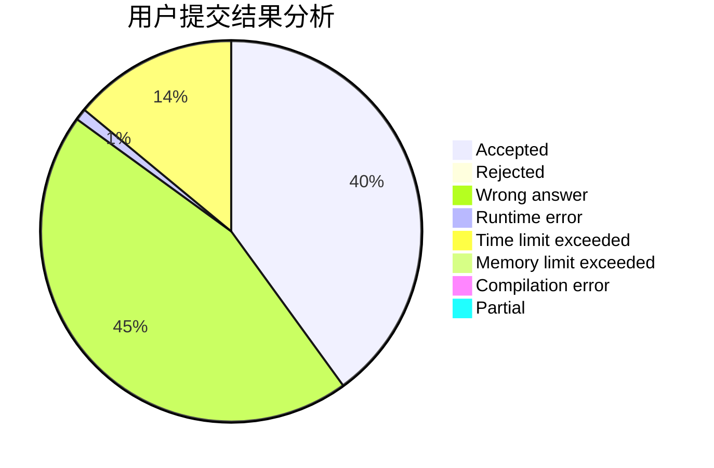
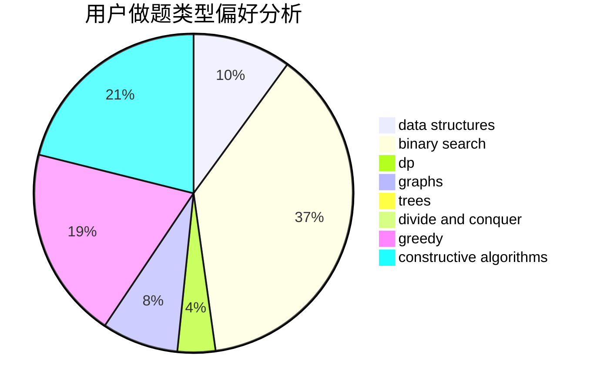

# Ean1zhi

<!-- tabs:start -->

#### **用户提交结果分析**

#### **用户做题类型偏好分析**

#### **用户错题知识点分析**

<!-- tabs:end -->
# 推荐题目
[51F](https://codeforces.com/contest/51/problem/F)		dfs and similar,
                        dp,
                        graphs,
                        trees		  
[1384B2](https://codeforces.com/contest/1384B/problem/2)		constructive algorithms,
                        dp,
                        greedy,
                        implementation		  
[1073A](https://codeforces.com/contest/1073/problem/A)		implementation,
                        strings		  
[633A](https://codeforces.com/contest/633/problem/A)		brute force,
                        math,
                        number theory		  
[1371A](https://codeforces.com/contest/1371/problem/A)		math		  
[459C](https://codeforces.com/contest/459/problem/C)		combinatorics,
                        constructive algorithms,
                        math		  
[805A](https://codeforces.com/contest/805/problem/A)		greedy,
                        math		  
[731E](https://codeforces.com/contest/731/problem/E)		dp,
                        games		  
[805B](https://codeforces.com/contest/805/problem/B)		constructive algorithms		  
[805C](https://codeforces.com/contest/805/problem/C)		dsu,graphs,sortings,trees		  
