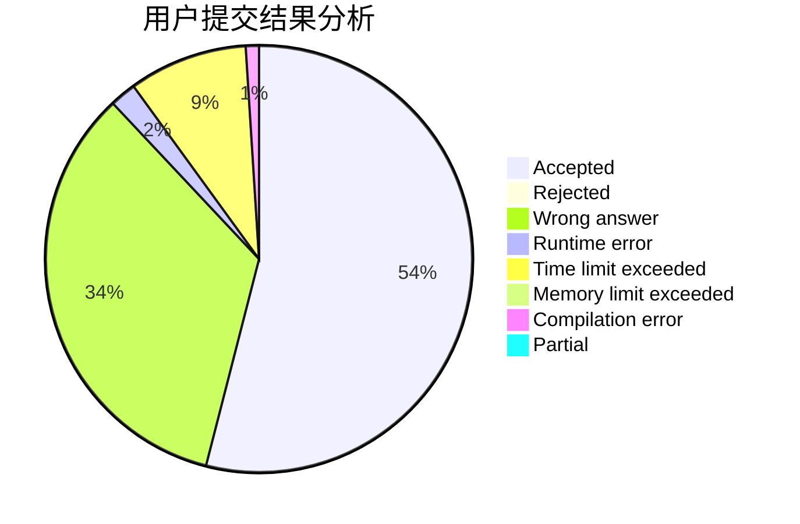
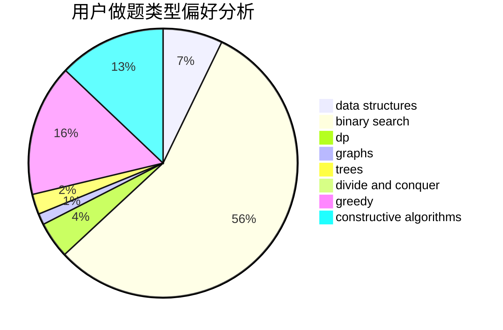
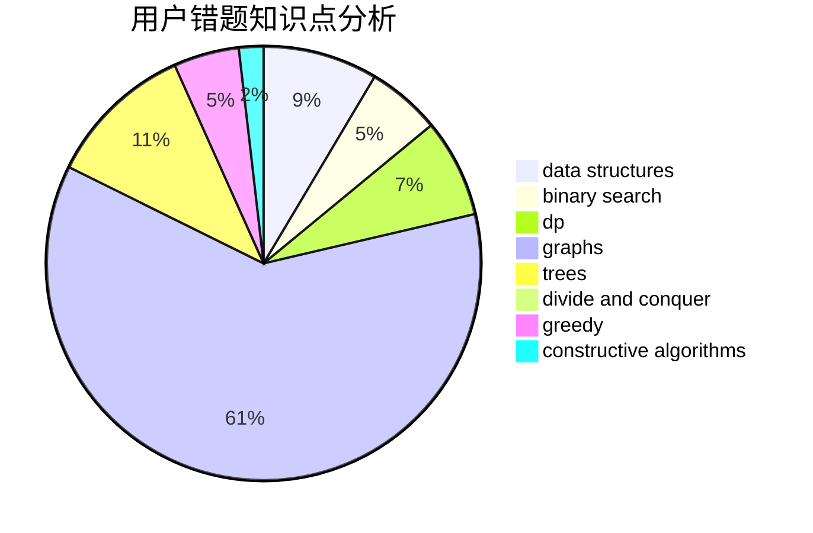

# Early

<!-- tabs:start -->

#### **用户提交结果分析**

#### **用户做题类型偏好分析**

#### **用户错题知识点分析**

<!-- tabs:end -->
# 推荐题目
[140B](https://codeforces.com/contest/140/problem/B)		brute force,
                        greedy,
                        implementation		  
[1332E](https://codeforces.com/contest/1332/problem/E)		combinatorics,
                        constructive algorithms,
                        math,
                        matrices		  
[377E](https://codeforces.com/contest/377/problem/E)		dp,
                        geometry		  
[807C](https://codeforces.com/contest/807/problem/C)		dsu,graphs,sortings,trees		  
[807A](https://codeforces.com/contest/807/problem/A)		implementation,
                        sortings		  
[1145C](https://codeforces.com/contest/1145/problem/C)		bitmasks,
                        brute force		  
[570D](https://codeforces.com/contest/570/problem/D)		binary search,
                        bitmasks,
                        constructive algorithms,
                        dfs and similar,
                        graphs,
                        trees		  
[526A](https://codeforces.com/contest/526/problem/A)		brute force,
                        implementation		  
[1505B](https://codeforces.com/contest/1505/problem/B)		implementation,
                        number theory		  
[300D](https://codeforces.com/contest/300/problem/D)		dp,
                        fft		  
