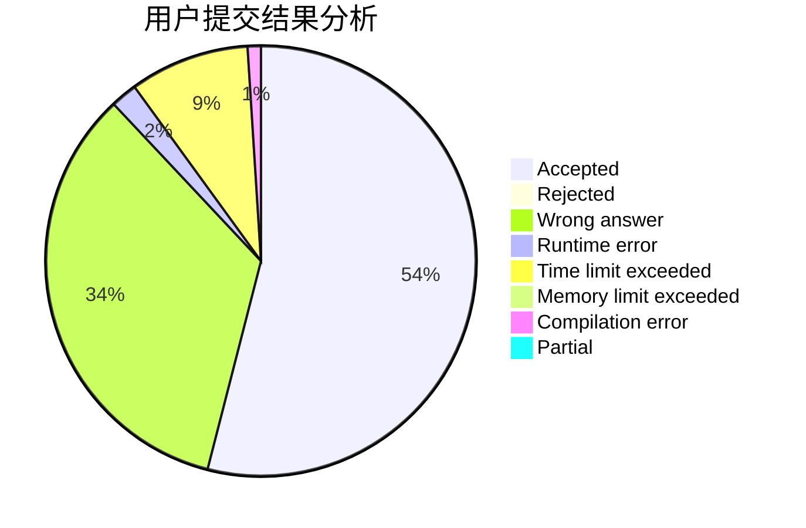
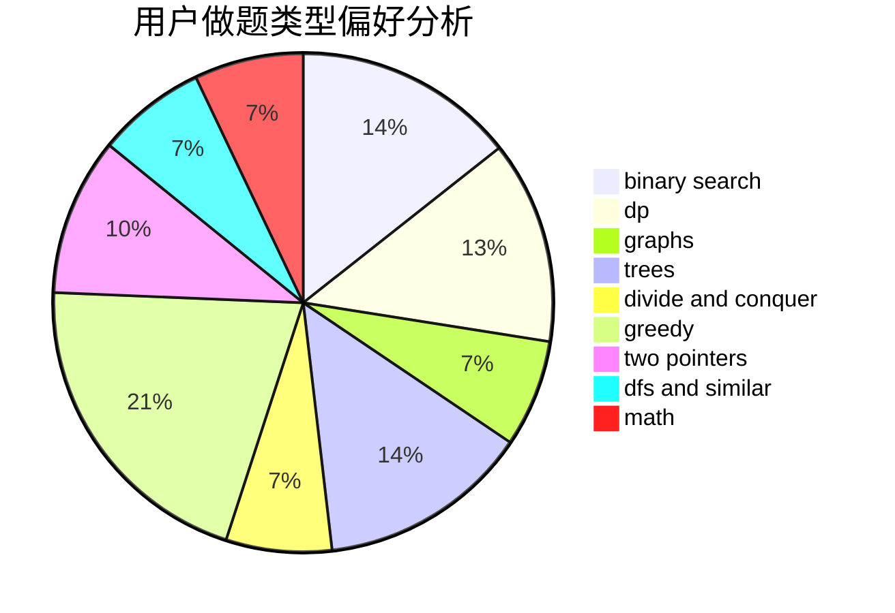

# Early

<!-- tabs:start -->

#### **用户提交结果分析**

#### **用户做题类型偏好分析**

<!-- tabs:end -->
# 推荐题目
[1420D](https://codeforces.com/contest/1420/problem/D)
[1339B](https://codeforces.com/contest/1339/problem/B)
[407B](https://codeforces.com/contest/407/problem/B)
[822D](https://codeforces.com/contest/822/problem/D)
[822B](https://codeforces.com/contest/822/problem/B)
[1147D](https://codeforces.com/contest/1147/problem/D)
[591A](https://codeforces.com/contest/591/problem/A)
[550A](https://codeforces.com/contest/550/problem/A)
[152B](https://codeforces.com/contest/152/problem/B)
[319B](https://codeforces.com/contest/319/problem/B)
