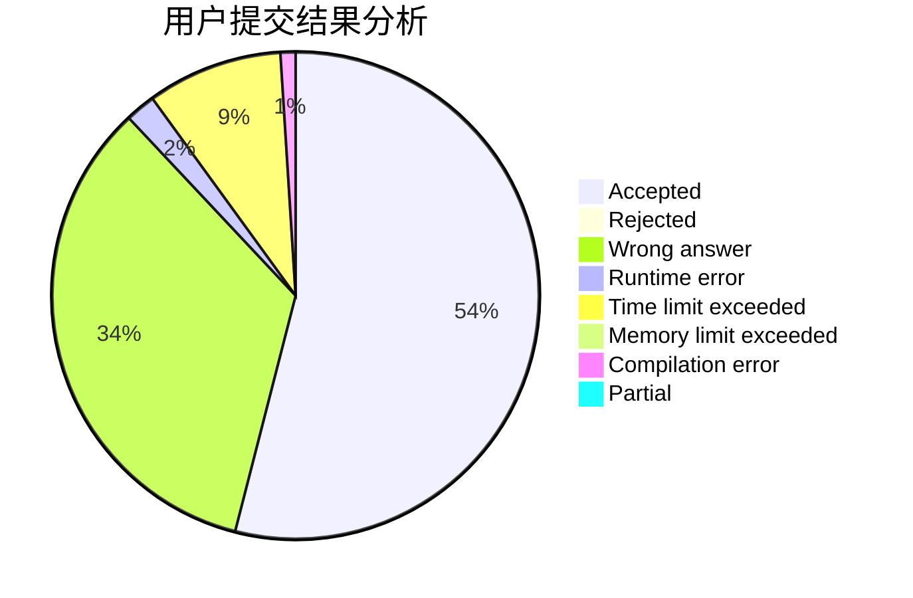
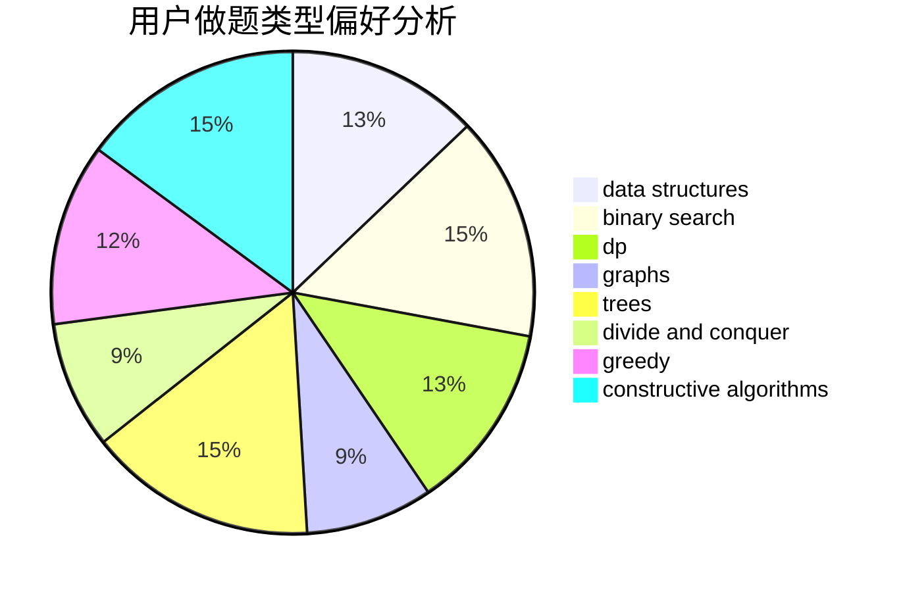
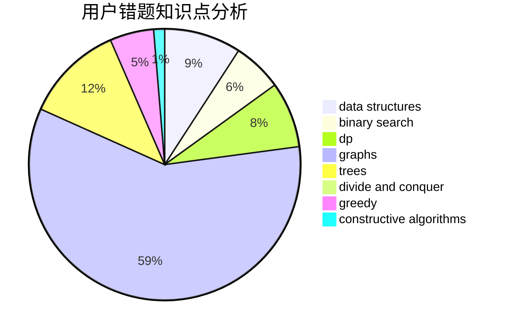

# Early

<!-- tabs:start -->

#### **用户提交结果分析**

#### **用户做题类型偏好分析**

#### **用户错题知识点分析**

<!-- tabs:end -->
# 推荐题目
[1420D](https://codeforces.com/contest/1420/problem/D)		combinatorics,
                        data structures,
                        sortings		  
[1339B](https://codeforces.com/contest/1339/problem/B)		constructive algorithms,
                        sortings		  
[407B](https://codeforces.com/contest/407/problem/B)		dp,
                        implementation		  
[822D](https://codeforces.com/contest/822/problem/D)		brute force,
                        dp,
                        greedy,
                        math,
                        number theory		  
[822B](https://codeforces.com/contest/822/problem/B)		brute force,
                        implementation,
                        strings		  
[1147D](https://codeforces.com/contest/1147/problem/D)		dfs and similar,
                        graphs		  
[591A](https://codeforces.com/contest/591/problem/A)		implementation,
                        math		  
[550A](https://codeforces.com/contest/550/problem/A)		brute force,
                        dp,
                        greedy,
                        implementation,
                        strings		  
[152B](https://codeforces.com/contest/152/problem/B)		binary search,
                        implementation		  
[319B](https://codeforces.com/contest/319/problem/B)		data structures,
                        implementation		  
