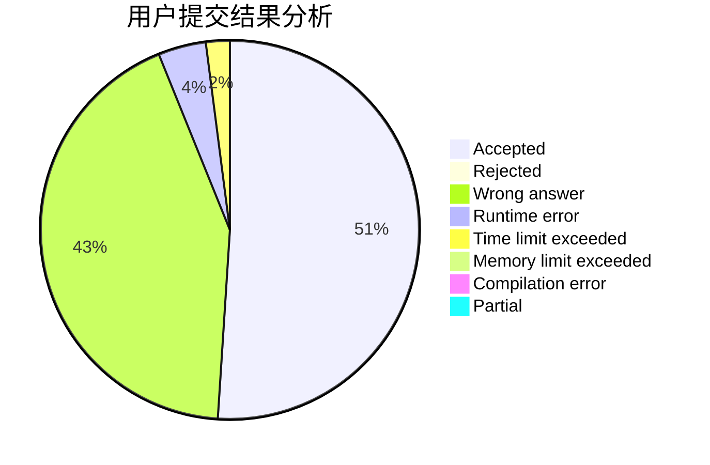
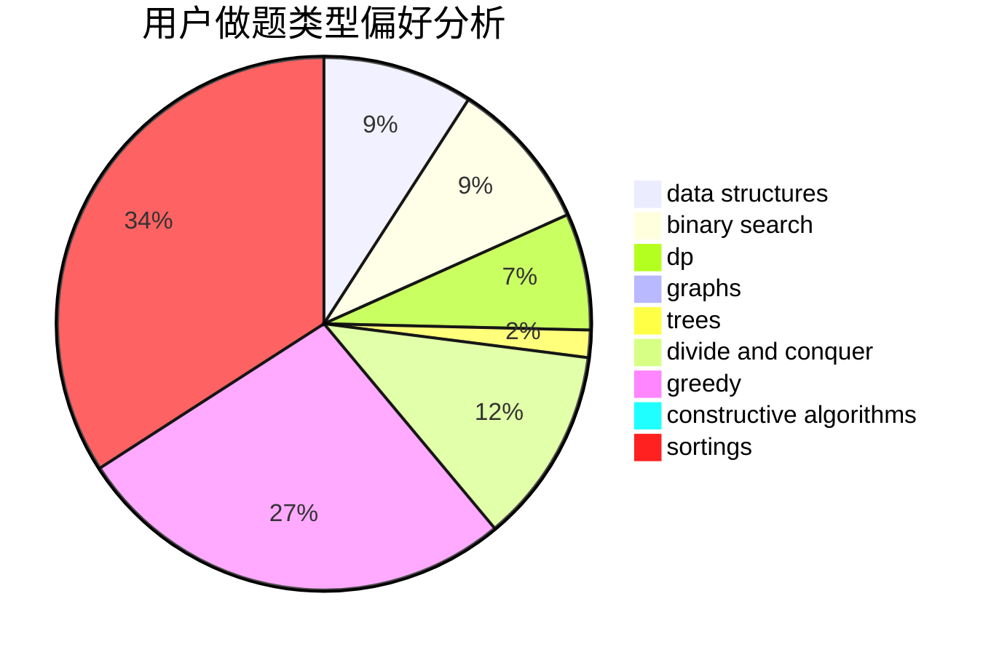

# EasonCF
<!-- tabs:start -->
#### **用户提交结果分析**

#### **用户做题类型偏好分析**

#### **用户错题知识点分析**

<!-- tabs:end -->
# 推荐题目
[787D](https://codeforces.com/contest/787/problem/D)		data structures,
                        graphs,
                        shortest paths		  
[383A](http://codeforces.com/problemset/problem/383/A)		data structures,
                        greedy		  
[1209E1](http://codeforces.com/problemset/problem/1209/E1)		bitmasks,
                        brute force,
                        dp,
                        greedy,
                        sortings		  
[1187F](http://codeforces.com/problemset/problem/1187/F)		dp,
                        math,
                        probabilities		  
[808B](http://codeforces.com/problemset/problem/808/B)		data structures,
                        implementation,
                        math		  
[808A](http://codeforces.com/problemset/problem/808/A)		implementation		  
[409B](http://codeforces.com/problemset/problem/409/B)		*special problem		  
[1184A1](http://codeforces.com/problemset/problem/1184/A1)		brute force,
                        math,
                        number theory		  
[144E](http://codeforces.com/problemset/problem/144/E)		data structures,
                        greedy		  
[1347B](https://codeforces.com/contest/1347/problem/B)		brute force,
                        implementation,
                        math		  
<!-- tabs:start -->
#### **data structures**
[787D](https://codeforces.com/contest/787/problem/D)		data structures,
                        graphs,
                        shortest paths		  
[383A](http://codeforces.com/problemset/problem/383/A)		data structures,
                        greedy		  
[808B](http://codeforces.com/problemset/problem/808/B)		data structures,
                        implementation,
                        math		  
[144E](http://codeforces.com/problemset/problem/144/E)		data structures,
                        greedy		  
[1342D](http://codeforces.com/problemset/problem/1342/D)		binary search,
                        constructive algorithms,
                        data structures,
                        greedy,
                        sortings,
                        two pointers		  
[1468B](http://codeforces.com/problemset/problem/1468/B)		data structures,
                        dsu		  
[528B](https://codeforces.com/contest/528/problem/B)		data structures,
                        dp,
                        greedy,
                        implementation,
                        sortings		  
[1466I](http://codeforces.com/problemset/problem/1466/I)		binary search,
                        data structures,
                        data structures,
                        interactive		  
[1468M](http://codeforces.com/problemset/problem/1468/M)		data structures,
                        graphs,
                        implementation		  
[1468A](http://codeforces.com/problemset/problem/1468/A)		data structures,
                        dp,
                        greedy		  
#### **binary search**
[1371E1](http://codeforces.com/problemset/problem/1371/E1)		binary search,
                        brute force,
                        combinatorics,
                        math,
                        number theory,
                        sortings		  
[1468G](http://codeforces.com/problemset/problem/1468/G)		binary search,
                        geometry		  
[1342D](http://codeforces.com/problemset/problem/1342/D)		binary search,
                        constructive algorithms,
                        data structures,
                        greedy,
                        sortings,
                        two pointers		  
[1468D](http://codeforces.com/problemset/problem/1468/D)		binary search,
                        sortings		  
[1359C](http://codeforces.com/problemset/problem/1359/C)		binary search,
                        math		  
[1344D](http://codeforces.com/problemset/problem/1344/D)		binary search,
                        greedy,
                        math		  
[1466I](http://codeforces.com/problemset/problem/1466/I)		binary search,
                        data structures,
                        data structures,
                        interactive		  
[1492C](http://codeforces.com/problemset/problem/1492/C)		binary search,
                        data structures,
                        dp,
                        greedy,
                        two pointers		  
[1463D](http://codeforces.com/problemset/problem/1463/D)		binary search,
                        constructive algorithms,
                        greedy,
                        two pointers		  
[1490G](http://codeforces.com/problemset/problem/1490/G)		binary search,
                        data structures,
                        math		  
#### **dp**
[1209E1](http://codeforces.com/problemset/problem/1209/E1)		bitmasks,
                        brute force,
                        dp,
                        greedy,
                        sortings		  
[1187F](http://codeforces.com/problemset/problem/1187/F)		dp,
                        math,
                        probabilities		  
[528B](https://codeforces.com/contest/528/problem/B)		data structures,
                        dp,
                        greedy,
                        implementation,
                        sortings		  
[1466H](http://codeforces.com/problemset/problem/1466/H)		combinatorics,
                        dp,
                        graphs,
                        greedy,
                        math		  
[1468A](http://codeforces.com/problemset/problem/1468/A)		data structures,
                        dp,
                        greedy		  
[1492C](http://codeforces.com/problemset/problem/1492/C)		binary search,
                        data structures,
                        dp,
                        greedy,
                        two pointers		  
[1457C](https://codeforces.com/contest/1457/problem/C)		brute force,
                        dp,
                        implementation		  
[1491C](http://codeforces.com/problemset/problem/1491/C)		brute force,
                        data structures,
                        dp,
                        greedy,
                        implementation		  
[1437C](http://codeforces.com/problemset/problem/1437/C)		dp,
                        flows,
                        graph matchings,
                        greedy,
                        math,
                        sortings		  
[1499B](http://codeforces.com/problemset/problem/1499/B)		brute force,
                        dp,
                        greedy,
                        implementation		  
#### **graph**
[787D](https://codeforces.com/contest/787/problem/D)		data structures,
                        graphs,
                        shortest paths		  
[1466H](http://codeforces.com/problemset/problem/1466/H)		combinatorics,
                        dp,
                        graphs,
                        greedy,
                        math		  
[1392I](http://codeforces.com/problemset/problem/1392/I)		fft,
                        graphs,
                        math		  
[1325E](http://codeforces.com/problemset/problem/1325/E)		brute force,
                        dfs and similar,
                        graphs,
                        number theory,
                        shortest paths		  
[1468M](http://codeforces.com/problemset/problem/1468/M)		data structures,
                        graphs,
                        implementation		  
[1466F](http://codeforces.com/problemset/problem/1466/F)		bitmasks,
                        dfs and similar,
                        dsu,
                        graphs,
                        greedy,
                        math,
                        sortings		  
[1487C](http://codeforces.com/problemset/problem/1487/C)		brute force,
                        constructive algorithms,
                        dfs and similar,
                        graphs,
                        greedy,
                        implementation,
                        math		  
[1437C](http://codeforces.com/problemset/problem/1437/C)		dp,
                        flows,
                        graph matchings,
                        greedy,
                        math,
                        sortings		  
[1470D](http://codeforces.com/problemset/problem/1470/D)		constructive algorithms,
                        dfs and similar,
                        graph matchings,
                        graphs,
                        greedy		  
[1476C](http://codeforces.com/problemset/problem/1476/C)		dp,
                        graphs,
                        greedy		  
#### **trees**
[1479D](http://codeforces.com/problemset/problem/1479/D)		binary search,
                        bitmasks,
                        brute force,
                        data structures,
                        probabilities,
                        trees		  
[1511C](http://codeforces.com/problemset/problem/1511/C)		brute force,
                        data structures,
                        implementation,
                        trees		  
[1499F](http://codeforces.com/problemset/problem/1499/F)		combinatorics,
                        dfs and similar,
                        dp,
                        trees		  
[1491E](http://codeforces.com/problemset/problem/1491/E)		brute force,
                        dfs and similar,
                        divide and conquer,
                        number theory,
                        trees		  
[1466D](http://codeforces.com/problemset/problem/1466/D)		data structures,
                        greedy,
                        sortings,
                        trees		  
[1495D](http://codeforces.com/problemset/problem/1495/D)		combinatorics,
                        dfs and similar,
                        graphs,
                        math,
                        shortest paths,
                        trees		  
[1303G](http://codeforces.com/problemset/problem/1303/G)		data structures,
                        divide and conquer,
                        geometry,
                        trees		  
[1454E](http://codeforces.com/problemset/problem/1454/E)		combinatorics,
                        dfs and similar,
                        graphs,
                        trees		  
[1494D](http://codeforces.com/problemset/problem/1494/D)		constructive algorithms,
                        data structures,
                        dfs and similar,
                        divide and conquer,
                        dsu,
                        greedy,
                        sortings,
                        trees		  
[1292C](http://codeforces.com/problemset/problem/1292/C)		combinatorics,
                        dfs and similar,
                        dp,
                        greedy,
                        trees		  
#### **divide and conquer**
[1461D](http://codeforces.com/problemset/problem/1461/D)		binary search,
                        brute force,
                        data structures,
                        divide and conquer,
                        implementation,
                        sortings		  
[1466G](http://codeforces.com/problemset/problem/1466/G)		combinatorics,
                        divide and conquer,
                        hashing,
                        math,
                        string suffix structures,
                        strings		  
[1490D](http://codeforces.com/problemset/problem/1490/D)		dfs and similar,
                        divide and conquer,
                        implementation		  
[1483C](https://codeforces.com/contest/1483/problem/C)		data structures,
                        divide and conquer,
                        dp		  
[1491E](http://codeforces.com/problemset/problem/1491/E)		brute force,
                        dfs and similar,
                        divide and conquer,
                        number theory,
                        trees		  
[1303G](http://codeforces.com/problemset/problem/1303/G)		data structures,
                        divide and conquer,
                        geometry,
                        trees		  
[1494D](http://codeforces.com/problemset/problem/1494/D)		constructive algorithms,
                        data structures,
                        dfs and similar,
                        divide and conquer,
                        dsu,
                        greedy,
                        sortings,
                        trees		  
[1482E](http://codeforces.com/problemset/problem/1482/E)		data structures,
                        divide and conquer,
                        dp		  
[566C](http://codeforces.com/problemset/problem/566/C)		dfs and similar,
                        divide and conquer,
                        trees		  
[1428F](http://codeforces.com/problemset/problem/1428/F)		binary search,
                        data structures,
                        divide and conquer,
                        dp,
                        two pointers		  
#### **greedy**
[383A](http://codeforces.com/problemset/problem/383/A)		data structures,
                        greedy		  
[1209E1](http://codeforces.com/problemset/problem/1209/E1)		bitmasks,
                        brute force,
                        dp,
                        greedy,
                        sortings		  
[144E](http://codeforces.com/problemset/problem/144/E)		data structures,
                        greedy		  
[1082B](http://codeforces.com/problemset/problem/1082/B)		greedy		  
[529B](http://codeforces.com/problemset/problem/529/B)		brute force,
                        greedy,
                        sortings		  
[1342D](http://codeforces.com/problemset/problem/1342/D)		binary search,
                        constructive algorithms,
                        data structures,
                        greedy,
                        sortings,
                        two pointers		  
[1132A](http://codeforces.com/problemset/problem/1132/A)		greedy,
                        implementation		  
[286C](http://codeforces.com/problemset/problem/286/C)		greedy,
                        implementation		  
[528B](https://codeforces.com/contest/528/problem/B)		data structures,
                        dp,
                        greedy,
                        implementation,
                        sortings		  
[1466H](http://codeforces.com/problemset/problem/1466/H)		combinatorics,
                        dp,
                        graphs,
                        greedy,
                        math		  
#### **constructive algorithms**
[1342D](http://codeforces.com/problemset/problem/1342/D)		binary search,
                        constructive algorithms,
                        data structures,
                        greedy,
                        sortings,
                        two pointers		  
[1473C](http://codeforces.com/problemset/problem/1473/C)		constructive algorithms,
                        math		  
[1467C](http://codeforces.com/problemset/problem/1467/C)		constructive algorithms,
                        greedy		  
[1261A](https://codeforces.com/contest/1261/problem/A)		constructive algorithms		  
[1343B](http://codeforces.com/problemset/problem/1343/B)		constructive algorithms,
                        math		  
[1451E2](http://codeforces.com/problemset/problem/1451/E2)		bitmasks,
                        constructive algorithms,
                        interactive,
                        math		  
[1493A](http://codeforces.com/problemset/problem/1493/A)		constructive algorithms,
                        greedy		  
[1463D](http://codeforces.com/problemset/problem/1463/D)		binary search,
                        constructive algorithms,
                        greedy,
                        two pointers		  
[1456B](https://codeforces.com/contest/1456/problem/B)		bitmasks,
                        brute force,
                        constructive algorithms		  
[1492D](http://codeforces.com/problemset/problem/1492/D)		bitmasks,
                        constructive algorithms,
                        greedy,
                        math		  
#### **sortings**
[1209E1](http://codeforces.com/problemset/problem/1209/E1)		bitmasks,
                        brute force,
                        dp,
                        greedy,
                        sortings		  
[1371E1](http://codeforces.com/problemset/problem/1371/E1)		binary search,
                        brute force,
                        combinatorics,
                        math,
                        number theory,
                        sortings		  
[529B](http://codeforces.com/problemset/problem/529/B)		brute force,
                        greedy,
                        sortings		  
[1342D](http://codeforces.com/problemset/problem/1342/D)		binary search,
                        constructive algorithms,
                        data structures,
                        greedy,
                        sortings,
                        two pointers		  
[1468D](http://codeforces.com/problemset/problem/1468/D)		binary search,
                        sortings		  
[528B](https://codeforces.com/contest/528/problem/B)		data structures,
                        dp,
                        greedy,
                        implementation,
                        sortings		  
[1466F](http://codeforces.com/problemset/problem/1466/F)		bitmasks,
                        dfs and similar,
                        dsu,
                        graphs,
                        greedy,
                        math,
                        sortings		  
[1496C](https://codeforces.com/contest/1496/problem/C)		geometry,
                        greedy,
                        math,
                        sortings		  
[1495A](http://codeforces.com/problemset/problem/1495/A)		geometry,
                        greedy,
                        math,
                        sortings		  
[1497A](http://codeforces.com/problemset/problem/1497/A)		brute force,
                        data structures,
                        greedy,
                        sortings		  
<!-- tabs:end -->
