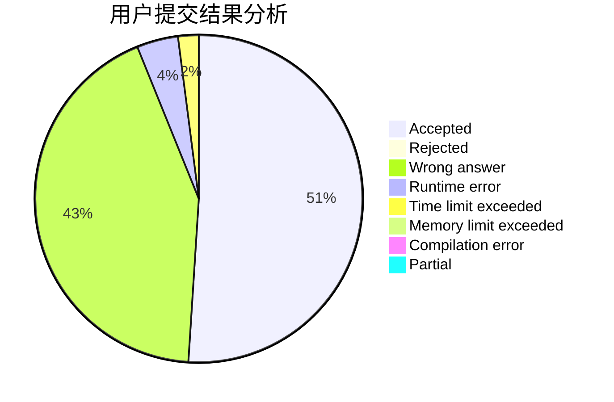
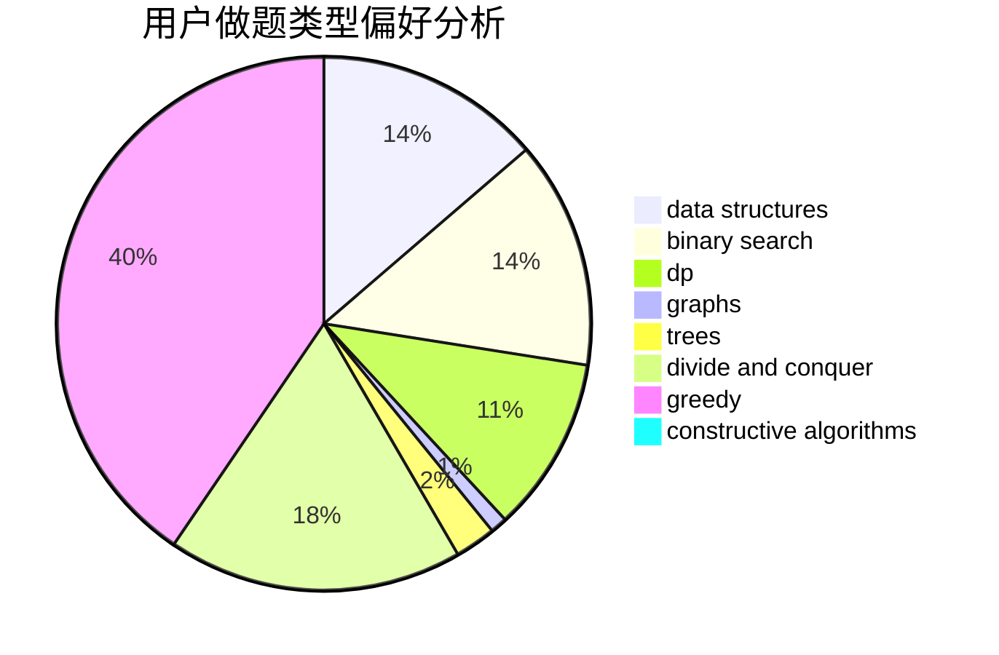

# EasonCF
<!-- tabs:start -->
#### **用户提交结果分析**

#### **用户做题类型偏好分析**

#### **用户错题知识点分析**

<!-- tabs:end -->
# 推荐题目
[Legacy](https://codeforces.com/contest/787/problem/D)		data structures,
                        graphs,
                        shortest paths		  
[Milking cows](http://codeforces.com/problemset/problem/383/A)		data structures,
                        greedy		  
[Rotate Columns (easy version)](http://codeforces.com/problemset/problem/1209/E1)		bitmasks,
                        brute force,
                        dp,
                        greedy,
                        sortings		  
[Expected Square Beauty](http://codeforces.com/problemset/problem/1187/F)		dp,
                        math,
                        probabilities		  
[Average Sleep Time](http://codeforces.com/problemset/problem/808/B)		data structures,
                        implementation,
                        math		  
[Lucky Year](http://codeforces.com/problemset/problem/808/A)		implementation		  
[Mysterious Language](http://codeforces.com/problemset/problem/409/B)		*special problem		  
[Heidi Learns Hashing (Easy)](http://codeforces.com/problemset/problem/1184/A1)		brute force,
                        math,
                        number theory		  
[Competition](http://codeforces.com/problemset/problem/144/E)		data structures,
                        greedy		  
[Square?](https://codeforces.com/contest/1347/problem/B)		brute force,
                        implementation,
                        math		  
<!-- tabs:start -->
#### **data structures**
[Legacy](https://codeforces.com/contest/787/problem/D)		data structures,
                        graphs,
                        shortest paths		  
[Milking cows](http://codeforces.com/problemset/problem/383/A)		data structures,
                        greedy		  
[Rotate Columns (easy version)](http://codeforces.com/problemset/problem/808/B)		data structures,
                        implementation,
                        math		  
[Expected Square Beauty](http://codeforces.com/problemset/problem/144/E)		data structures,
                        greedy		  
[Average Sleep Time](http://codeforces.com/problemset/problem/1342/D)		binary search,
                        constructive algorithms,
                        data structures,
                        greedy,
                        sortings,
                        two pointers		  
[Lucky Year](http://codeforces.com/problemset/problem/1468/B)		data structures,
                        dsu		  
[Mysterious Language](https://codeforces.com/contest/528/problem/B)		data structures,
                        dp,
                        greedy,
                        implementation,
                        sortings		  
[Heidi Learns Hashing (Easy)](http://codeforces.com/problemset/problem/1466/I)		binary search,
                        data structures,
                        data structures,
                        interactive		  
[Competition](http://codeforces.com/problemset/problem/1468/M)		data structures,
                        graphs,
                        implementation		  
[Square?](http://codeforces.com/problemset/problem/1468/A)		data structures,
                        dp,
                        greedy		  
#### **binary search**
[Legacy](http://codeforces.com/problemset/problem/1371/E1)		binary search,
                        brute force,
                        combinatorics,
                        math,
                        number theory,
                        sortings		  
[Milking cows](http://codeforces.com/problemset/problem/1468/G)		binary search,
                        geometry		  
[Rotate Columns (easy version)](http://codeforces.com/problemset/problem/1342/D)		binary search,
                        constructive algorithms,
                        data structures,
                        greedy,
                        sortings,
                        two pointers		  
[Expected Square Beauty](http://codeforces.com/problemset/problem/1468/D)		binary search,
                        sortings		  
[Average Sleep Time](http://codeforces.com/problemset/problem/1359/C)		binary search,
                        math		  
[Lucky Year](http://codeforces.com/problemset/problem/1344/D)		binary search,
                        greedy,
                        math		  
[Mysterious Language](http://codeforces.com/problemset/problem/1466/I)		binary search,
                        data structures,
                        data structures,
                        interactive		  
[Heidi Learns Hashing (Easy)](http://codeforces.com/problemset/problem/1492/C)		binary search,
                        data structures,
                        dp,
                        greedy,
                        two pointers		  
[Competition](http://codeforces.com/problemset/problem/1463/D)		binary search,
                        constructive algorithms,
                        greedy,
                        two pointers		  
[Square?](http://codeforces.com/problemset/problem/1490/G)		binary search,
                        data structures,
                        math		  
#### **dp**
[Legacy](http://codeforces.com/problemset/problem/1209/E1)		bitmasks,
                        brute force,
                        dp,
                        greedy,
                        sortings		  
[Milking cows](http://codeforces.com/problemset/problem/1187/F)		dp,
                        math,
                        probabilities		  
[Rotate Columns (easy version)](https://codeforces.com/contest/528/problem/B)		data structures,
                        dp,
                        greedy,
                        implementation,
                        sortings		  
[Expected Square Beauty](http://codeforces.com/problemset/problem/1466/H)		combinatorics,
                        dp,
                        graphs,
                        greedy,
                        math		  
[Average Sleep Time](http://codeforces.com/problemset/problem/1468/A)		data structures,
                        dp,
                        greedy		  
[Lucky Year](http://codeforces.com/problemset/problem/1492/C)		binary search,
                        data structures,
                        dp,
                        greedy,
                        two pointers		  
[Mysterious Language](https://codeforces.com/contest/1457/problem/C)		brute force,
                        dp,
                        implementation		  
[Heidi Learns Hashing (Easy)](http://codeforces.com/problemset/problem/1491/C)		brute force,
                        data structures,
                        dp,
                        greedy,
                        implementation		  
[Competition](http://codeforces.com/problemset/problem/1437/C)		dp,
                        flows,
                        graph matchings,
                        greedy,
                        math,
                        sortings		  
[Square?](http://codeforces.com/problemset/problem/1499/B)		brute force,
                        dp,
                        greedy,
                        implementation		  
#### **graph**
[Legacy](https://codeforces.com/contest/787/problem/D)		data structures,
                        graphs,
                        shortest paths		  
[Milking cows](http://codeforces.com/problemset/problem/1466/H)		combinatorics,
                        dp,
                        graphs,
                        greedy,
                        math		  
[Rotate Columns (easy version)](http://codeforces.com/problemset/problem/1392/I)		fft,
                        graphs,
                        math		  
[Expected Square Beauty](http://codeforces.com/problemset/problem/1325/E)		brute force,
                        dfs and similar,
                        graphs,
                        number theory,
                        shortest paths		  
[Average Sleep Time](http://codeforces.com/problemset/problem/1468/M)		data structures,
                        graphs,
                        implementation		  
[Lucky Year](http://codeforces.com/problemset/problem/1466/F)		bitmasks,
                        dfs and similar,
                        dsu,
                        graphs,
                        greedy,
                        math,
                        sortings		  
[Mysterious Language](http://codeforces.com/problemset/problem/1487/C)		brute force,
                        constructive algorithms,
                        dfs and similar,
                        graphs,
                        greedy,
                        implementation,
                        math		  
[Heidi Learns Hashing (Easy)](http://codeforces.com/problemset/problem/1437/C)		dp,
                        flows,
                        graph matchings,
                        greedy,
                        math,
                        sortings		  
[Competition](http://codeforces.com/problemset/problem/1470/D)		constructive algorithms,
                        dfs and similar,
                        graph matchings,
                        graphs,
                        greedy		  
[Square?](http://codeforces.com/problemset/problem/1476/C)		dp,
                        graphs,
                        greedy		  
#### **trees**
[Legacy](http://codeforces.com/problemset/problem/1479/D)		binary search,
                        bitmasks,
                        brute force,
                        data structures,
                        probabilities,
                        trees		  
[Milking cows](http://codeforces.com/problemset/problem/1511/C)		brute force,
                        data structures,
                        implementation,
                        trees		  
[Rotate Columns (easy version)](http://codeforces.com/problemset/problem/1499/F)		combinatorics,
                        dfs and similar,
                        dp,
                        trees		  
[Expected Square Beauty](http://codeforces.com/problemset/problem/1491/E)		brute force,
                        dfs and similar,
                        divide and conquer,
                        number theory,
                        trees		  
[Average Sleep Time](http://codeforces.com/problemset/problem/1466/D)		data structures,
                        greedy,
                        sortings,
                        trees		  
[Lucky Year](http://codeforces.com/problemset/problem/1495/D)		combinatorics,
                        dfs and similar,
                        graphs,
                        math,
                        shortest paths,
                        trees		  
[Mysterious Language](http://codeforces.com/problemset/problem/1303/G)		data structures,
                        divide and conquer,
                        geometry,
                        trees		  
[Heidi Learns Hashing (Easy)](http://codeforces.com/problemset/problem/1454/E)		combinatorics,
                        dfs and similar,
                        graphs,
                        trees		  
[Competition](http://codeforces.com/problemset/problem/1494/D)		constructive algorithms,
                        data structures,
                        dfs and similar,
                        divide and conquer,
                        dsu,
                        greedy,
                        sortings,
                        trees		  
[Square?](http://codeforces.com/problemset/problem/1292/C)		combinatorics,
                        dfs and similar,
                        dp,
                        greedy,
                        trees		  
#### **divide and conquer**
[Legacy](http://codeforces.com/problemset/problem/1461/D)		binary search,
                        brute force,
                        data structures,
                        divide and conquer,
                        implementation,
                        sortings		  
[Milking cows](http://codeforces.com/problemset/problem/1466/G)		combinatorics,
                        divide and conquer,
                        hashing,
                        math,
                        string suffix structures,
                        strings		  
[Rotate Columns (easy version)](http://codeforces.com/problemset/problem/1490/D)		dfs and similar,
                        divide and conquer,
                        implementation		  
[Expected Square Beauty](https://codeforces.com/contest/1483/problem/C)		data structures,
                        divide and conquer,
                        dp		  
[Average Sleep Time](http://codeforces.com/problemset/problem/1491/E)		brute force,
                        dfs and similar,
                        divide and conquer,
                        number theory,
                        trees		  
[Lucky Year](http://codeforces.com/problemset/problem/1303/G)		data structures,
                        divide and conquer,
                        geometry,
                        trees		  
[Mysterious Language](http://codeforces.com/problemset/problem/1494/D)		constructive algorithms,
                        data structures,
                        dfs and similar,
                        divide and conquer,
                        dsu,
                        greedy,
                        sortings,
                        trees		  
[Heidi Learns Hashing (Easy)](http://codeforces.com/problemset/problem/1482/E)		data structures,
                        divide and conquer,
                        dp		  
[Competition](http://codeforces.com/problemset/problem/566/C)		dfs and similar,
                        divide and conquer,
                        trees		  
[Square?](http://codeforces.com/problemset/problem/1428/F)		binary search,
                        data structures,
                        divide and conquer,
                        dp,
                        two pointers		  
#### **greedy**
[Legacy](http://codeforces.com/problemset/problem/383/A)		data structures,
                        greedy		  
[Milking cows](http://codeforces.com/problemset/problem/1209/E1)		bitmasks,
                        brute force,
                        dp,
                        greedy,
                        sortings		  
[Rotate Columns (easy version)](http://codeforces.com/problemset/problem/144/E)		data structures,
                        greedy		  
[Expected Square Beauty](http://codeforces.com/problemset/problem/1082/B)		greedy		  
[Average Sleep Time](http://codeforces.com/problemset/problem/529/B)		brute force,
                        greedy,
                        sortings		  
[Lucky Year](http://codeforces.com/problemset/problem/1342/D)		binary search,
                        constructive algorithms,
                        data structures,
                        greedy,
                        sortings,
                        two pointers		  
[Mysterious Language](http://codeforces.com/problemset/problem/1132/A)		greedy,
                        implementation		  
[Heidi Learns Hashing (Easy)](http://codeforces.com/problemset/problem/286/C)		greedy,
                        implementation		  
[Competition](https://codeforces.com/contest/528/problem/B)		data structures,
                        dp,
                        greedy,
                        implementation,
                        sortings		  
[Square?](http://codeforces.com/problemset/problem/1466/H)		combinatorics,
                        dp,
                        graphs,
                        greedy,
                        math		  
#### **constructive algorithms**
[Legacy](http://codeforces.com/problemset/problem/1342/D)		binary search,
                        constructive algorithms,
                        data structures,
                        greedy,
                        sortings,
                        two pointers		  
[Milking cows](http://codeforces.com/problemset/problem/1473/C)		constructive algorithms,
                        math		  
[Rotate Columns (easy version)](http://codeforces.com/problemset/problem/1467/C)		constructive algorithms,
                        greedy		  
[Expected Square Beauty](https://codeforces.com/contest/1261/problem/A)		constructive algorithms		  
[Average Sleep Time](http://codeforces.com/problemset/problem/1343/B)		constructive algorithms,
                        math		  
[Lucky Year](http://codeforces.com/problemset/problem/1451/E2)		bitmasks,
                        constructive algorithms,
                        interactive,
                        math		  
[Mysterious Language](http://codeforces.com/problemset/problem/1493/A)		constructive algorithms,
                        greedy		  
[Heidi Learns Hashing (Easy)](http://codeforces.com/problemset/problem/1463/D)		binary search,
                        constructive algorithms,
                        greedy,
                        two pointers		  
[Competition](https://codeforces.com/contest/1456/problem/B)		bitmasks,
                        brute force,
                        constructive algorithms		  
[Square?](http://codeforces.com/problemset/problem/1492/D)		bitmasks,
                        constructive algorithms,
                        greedy,
                        math		  
#### **sortings**
[Legacy](http://codeforces.com/problemset/problem/1209/E1)		bitmasks,
                        brute force,
                        dp,
                        greedy,
                        sortings		  
[Milking cows](http://codeforces.com/problemset/problem/1371/E1)		binary search,
                        brute force,
                        combinatorics,
                        math,
                        number theory,
                        sortings		  
[Rotate Columns (easy version)](http://codeforces.com/problemset/problem/529/B)		brute force,
                        greedy,
                        sortings		  
[Expected Square Beauty](http://codeforces.com/problemset/problem/1342/D)		binary search,
                        constructive algorithms,
                        data structures,
                        greedy,
                        sortings,
                        two pointers		  
[Average Sleep Time](http://codeforces.com/problemset/problem/1468/D)		binary search,
                        sortings		  
[Lucky Year](https://codeforces.com/contest/528/problem/B)		data structures,
                        dp,
                        greedy,
                        implementation,
                        sortings		  
[Mysterious Language](http://codeforces.com/problemset/problem/1466/F)		bitmasks,
                        dfs and similar,
                        dsu,
                        graphs,
                        greedy,
                        math,
                        sortings		  
[Heidi Learns Hashing (Easy)](https://codeforces.com/contest/1496/problem/C)		geometry,
                        greedy,
                        math,
                        sortings		  
[Competition](http://codeforces.com/problemset/problem/1495/A)		geometry,
                        greedy,
                        math,
                        sortings		  
[Square?](http://codeforces.com/problemset/problem/1497/A)		brute force,
                        data structures,
                        greedy,
                        sortings		  
<!-- tabs:end -->
