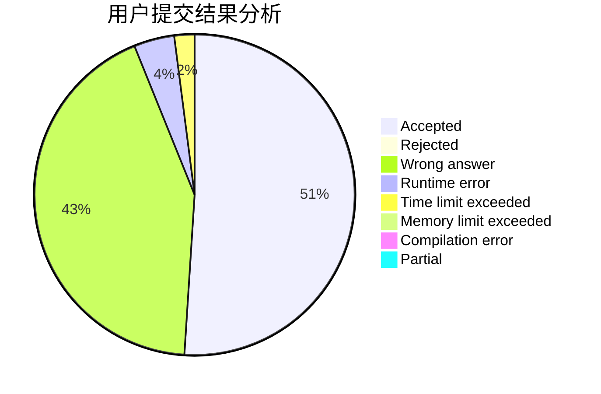
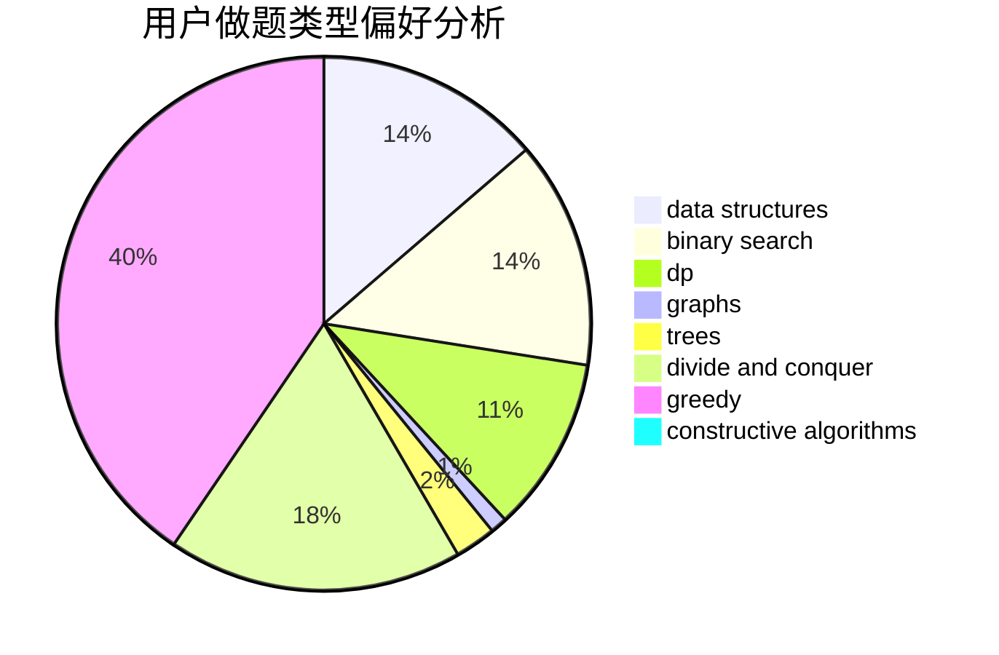

# EasonCF
<!-- tabs:start -->
#### **用户提交结果分析**

#### **用户做题类型偏好分析**

#### **用户错题知识点分析**

<!-- tabs:end -->
# 推荐题目
[Legacy](https://codeforces.com/contest/787/problem/D)		data structures,
                        graphs,
                        shortest paths		  
[Milking cows](http://codeforces.com/problemset/problem/383/A)		data structures,
                        greedy		  
[Rotate Columns (easy version)](http://codeforces.com/problemset/problem/1209/E1)		bitmasks,
                        brute force,
                        dp,
                        greedy,
                        sortings		  
[Expected Square Beauty](http://codeforces.com/problemset/problem/1187/F)		dp,
                        math,
                        probabilities		  
[Average Sleep Time](http://codeforces.com/problemset/problem/808/B)		data structures,
                        implementation,
                        math		  
[Lucky Year](http://codeforces.com/problemset/problem/808/A)		implementation		  
[Mysterious Language](http://codeforces.com/problemset/problem/409/B)		*special problem		  
[Heidi Learns Hashing (Easy)](http://codeforces.com/problemset/problem/1184/A1)		brute force,
                        math,
                        number theory		  
[Competition](http://codeforces.com/problemset/problem/144/E)		data structures,
                        greedy		  
[Square?](https://codeforces.com/contest/1347/problem/B)		brute force,
                        implementation,
                        math		  
<!-- tabs:start -->
#### **data structures**
[Legacy](https://codeforces.com/contest/787/problem/D)		data structures,
                        graphs,
                        shortest paths		  
[Milking cows](http://codeforces.com/problemset/problem/383/A)		data structures,
                        greedy		  
[Average Sleep Time](http://codeforces.com/problemset/problem/808/B)		data structures,
                        implementation,
                        math		  
[Competition](http://codeforces.com/problemset/problem/144/E)		data structures,
                        greedy		  
[Multiple Testcases](http://codeforces.com/problemset/problem/1342/D)		binary search,
                        constructive algorithms,
                        data structures,
                        greedy,
                        sortings,
                        two pointers		  
[Bakery](http://codeforces.com/problemset/problem/1468/B)		data structures,
                        dsu		  
[Clique Problem](https://codeforces.com/contest/528/problem/B)		data structures,
                        dp,
                        greedy,
                        implementation,
                        sortings		  
[The Riddle of the Sphinx](http://codeforces.com/problemset/problem/1466/I)		binary search,
                        data structures,
                        data structures,
                        interactive		  
[Similar Sets](http://codeforces.com/problemset/problem/1468/M)		data structures,
                        graphs,
                        implementation		  
[LaIS](http://codeforces.com/problemset/problem/1468/A)		data structures,
                        dp,
                        greedy		  
#### **binary search**
[Asterism (Easy Version)](http://codeforces.com/problemset/problem/1371/E1)		binary search,
                        brute force,
                        combinatorics,
                        math,
                        number theory,
                        sortings		  
[Hobbits](http://codeforces.com/problemset/problem/1468/G)		binary search,
                        geometry		  
[Multiple Testcases](http://codeforces.com/problemset/problem/1342/D)		binary search,
                        constructive algorithms,
                        data structures,
                        greedy,
                        sortings,
                        two pointers		  
[Firecrackers](http://codeforces.com/problemset/problem/1468/D)		binary search,
                        sortings		  
[Mixing Water](http://codeforces.com/problemset/problem/1359/C)		binary search,
                        math		  
[Résumé Review](http://codeforces.com/problemset/problem/1344/D)		binary search,
                        greedy,
                        math		  
[The Riddle of the Sphinx](http://codeforces.com/problemset/problem/1466/I)		binary search,
                        data structures,
                        data structures,
                        interactive		  
[Maximum width](http://codeforces.com/problemset/problem/1492/C)		binary search,
                        data structures,
                        dp,
                        greedy,
                        two pointers		  
[Pairs](http://codeforces.com/problemset/problem/1463/D)		binary search,
                        constructive algorithms,
                        greedy,
                        two pointers		  
[Old Floppy Drive](http://codeforces.com/problemset/problem/1490/G)		binary search,
                        data structures,
                        math		  
#### **dp**
[Rotate Columns (easy version)](http://codeforces.com/problemset/problem/1209/E1)		bitmasks,
                        brute force,
                        dp,
                        greedy,
                        sortings		  
[Expected Square Beauty](http://codeforces.com/problemset/problem/1187/F)		dp,
                        math,
                        probabilities		  
[Clique Problem](https://codeforces.com/contest/528/problem/B)		data structures,
                        dp,
                        greedy,
                        implementation,
                        sortings		  
[Finding satisfactory solutions](http://codeforces.com/problemset/problem/1466/H)		combinatorics,
                        dp,
                        graphs,
                        greedy,
                        math		  
[LaIS](http://codeforces.com/problemset/problem/1468/A)		data structures,
                        dp,
                        greedy		  
[Maximum width](http://codeforces.com/problemset/problem/1492/C)		binary search,
                        data structures,
                        dp,
                        greedy,
                        two pointers		  
[Bouncing Ball](https://codeforces.com/contest/1457/problem/C)		brute force,
                        dp,
                        implementation		  
[Pekora and Trampoline](http://codeforces.com/problemset/problem/1491/C)		brute force,
                        data structures,
                        dp,
                        greedy,
                        implementation		  
[Chef Monocarp](http://codeforces.com/problemset/problem/1437/C)		dp,
                        flows,
                        graph matchings,
                        greedy,
                        math,
                        sortings		  
[Binary Removals](http://codeforces.com/problemset/problem/1499/B)		brute force,
                        dp,
                        greedy,
                        implementation		  
#### **graph**
[Legacy](https://codeforces.com/contest/787/problem/D)		data structures,
                        graphs,
                        shortest paths		  
[Finding satisfactory solutions](http://codeforces.com/problemset/problem/1466/H)		combinatorics,
                        dp,
                        graphs,
                        greedy,
                        math		  
[Kevin and Grid](http://codeforces.com/problemset/problem/1392/I)		fft,
                        graphs,
                        math		  
[Ehab's REAL Number Theory Problem](http://codeforces.com/problemset/problem/1325/E)		brute force,
                        dfs and similar,
                        graphs,
                        number theory,
                        shortest paths		  
[Similar Sets](http://codeforces.com/problemset/problem/1468/M)		data structures,
                        graphs,
                        implementation		  
[Euclid's nightmare](http://codeforces.com/problemset/problem/1466/F)		bitmasks,
                        dfs and similar,
                        dsu,
                        graphs,
                        greedy,
                        math,
                        sortings		  
[Minimum Ties](http://codeforces.com/problemset/problem/1487/C)		brute force,
                        constructive algorithms,
                        dfs and similar,
                        graphs,
                        greedy,
                        implementation,
                        math		  
[Chef Monocarp](http://codeforces.com/problemset/problem/1437/C)		dp,
                        flows,
                        graph matchings,
                        greedy,
                        math,
                        sortings		  
[Strange Housing](http://codeforces.com/problemset/problem/1470/D)		constructive algorithms,
                        dfs and similar,
                        graph matchings,
                        graphs,
                        greedy		  
[Longest Simple Cycle](http://codeforces.com/problemset/problem/1476/C)		dp,
                        graphs,
                        greedy		  
#### **trees**
[Odd Mineral Resource](http://codeforces.com/problemset/problem/1479/D)		binary search,
                        bitmasks,
                        brute force,
                        data structures,
                        probabilities,
                        trees		  
[Yet Another Card Deck](http://codeforces.com/problemset/problem/1511/C)		brute force,
                        data structures,
                        implementation,
                        trees		  
[Diameter Cuts](http://codeforces.com/problemset/problem/1499/F)		combinatorics,
                        dfs and similar,
                        dp,
                        trees		  
[Fib-tree](http://codeforces.com/problemset/problem/1491/E)		brute force,
                        dfs and similar,
                        divide and conquer,
                        number theory,
                        trees		  
[13th Labour of Heracles](http://codeforces.com/problemset/problem/1466/D)		data structures,
                        greedy,
                        sortings,
                        trees		  
[BFS Trees](http://codeforces.com/problemset/problem/1495/D)		combinatorics,
                        dfs and similar,
                        graphs,
                        math,
                        shortest paths,
                        trees		  
[Sum of Prefix Sums](http://codeforces.com/problemset/problem/1303/G)		data structures,
                        divide and conquer,
                        geometry,
                        trees		  
[Number of Simple Paths](http://codeforces.com/problemset/problem/1454/E)		combinatorics,
                        dfs and similar,
                        graphs,
                        trees		  
[Dogeforces](http://codeforces.com/problemset/problem/1494/D)		constructive algorithms,
                        data structures,
                        dfs and similar,
                        divide and conquer,
                        dsu,
                        greedy,
                        sortings,
                        trees		  
[Xenon's Attack on the Gangs](http://codeforces.com/problemset/problem/1292/C)		combinatorics,
                        dfs and similar,
                        dp,
                        greedy,
                        trees		  
#### **divide and conquer**
[Divide and Summarize](http://codeforces.com/problemset/problem/1461/D)		binary search,
                        brute force,
                        data structures,
                        divide and conquer,
                        implementation,
                        sortings		  
[Song of the Sirens](http://codeforces.com/problemset/problem/1466/G)		combinatorics,
                        divide and conquer,
                        hashing,
                        math,
                        string suffix structures,
                        strings		  
[Permutation Transformation](http://codeforces.com/problemset/problem/1490/D)		dfs and similar,
                        divide and conquer,
                        implementation		  
[Skyline Photo](https://codeforces.com/contest/1483/problem/C)		data structures,
                        divide and conquer,
                        dp		  
[Fib-tree](http://codeforces.com/problemset/problem/1491/E)		brute force,
                        dfs and similar,
                        divide and conquer,
                        number theory,
                        trees		  
[Sum of Prefix Sums](http://codeforces.com/problemset/problem/1303/G)		data structures,
                        divide and conquer,
                        geometry,
                        trees		  
[Dogeforces](http://codeforces.com/problemset/problem/1494/D)		constructive algorithms,
                        data structures,
                        dfs and similar,
                        divide and conquer,
                        dsu,
                        greedy,
                        sortings,
                        trees		  
[Logistical Questions](http://codeforces.com/problemset/problem/566/C)		dfs and similar,
                        divide and conquer,
                        trees		  
[Fruit Sequences](http://codeforces.com/problemset/problem/1428/F)		binary search,
                        data structures,
                        divide and conquer,
                        dp,
                        two pointers		  
[Dr. Evil Underscores](http://codeforces.com/problemset/problem/1285/D)		bitmasks,
                        brute force,
                        dfs and similar,
                        divide and conquer,
                        dp,
                        greedy,
                        strings,
                        trees		  
#### **greedy**
[Milking cows](http://codeforces.com/problemset/problem/383/A)		data structures,
                        greedy		  
[Rotate Columns (easy version)](http://codeforces.com/problemset/problem/1209/E1)		bitmasks,
                        brute force,
                        dp,
                        greedy,
                        sortings		  
[Competition](http://codeforces.com/problemset/problem/144/E)		data structures,
                        greedy		  
[Vova and Trophies](http://codeforces.com/problemset/problem/1082/B)		greedy		  
[Group Photo 2 (online mirror version)](http://codeforces.com/problemset/problem/529/B)		brute force,
                        greedy,
                        sortings		  
[Multiple Testcases](http://codeforces.com/problemset/problem/1342/D)		binary search,
                        constructive algorithms,
                        data structures,
                        greedy,
                        sortings,
                        two pointers		  
[Regular Bracket Sequence](http://codeforces.com/problemset/problem/1132/A)		greedy,
                        implementation		  
[Main Sequence](http://codeforces.com/problemset/problem/286/C)		greedy,
                        implementation		  
[Clique Problem](https://codeforces.com/contest/528/problem/B)		data structures,
                        dp,
                        greedy,
                        implementation,
                        sortings		  
[Finding satisfactory solutions](http://codeforces.com/problemset/problem/1466/H)		combinatorics,
                        dp,
                        graphs,
                        greedy,
                        math		  
#### **constructive algorithms**
[Multiple Testcases](http://codeforces.com/problemset/problem/1342/D)		binary search,
                        constructive algorithms,
                        data structures,
                        greedy,
                        sortings,
                        two pointers		  
[No More Inversions](http://codeforces.com/problemset/problem/1473/C)		constructive algorithms,
                        math		  
[Three Bags](http://codeforces.com/problemset/problem/1467/C)		constructive algorithms,
                        greedy		  
[Messy](https://codeforces.com/contest/1261/problem/A)		constructive algorithms		  
[Balanced Array](http://codeforces.com/problemset/problem/1343/B)		constructive algorithms,
                        math		  
[Bitwise Queries (Hard Version)](http://codeforces.com/problemset/problem/1451/E2)		bitmasks,
                        constructive algorithms,
                        interactive,
                        math		  
[Anti-knapsack](http://codeforces.com/problemset/problem/1493/A)		constructive algorithms,
                        greedy		  
[Pairs](http://codeforces.com/problemset/problem/1463/D)		binary search,
                        constructive algorithms,
                        greedy,
                        two pointers		  
[XOR-gun](https://codeforces.com/contest/1456/problem/B)		bitmasks,
                        brute force,
                        constructive algorithms		  
[Genius's Gambit](http://codeforces.com/problemset/problem/1492/D)		bitmasks,
                        constructive algorithms,
                        greedy,
                        math		  
#### **sortings**
[Rotate Columns (easy version)](http://codeforces.com/problemset/problem/1209/E1)		bitmasks,
                        brute force,
                        dp,
                        greedy,
                        sortings		  
[Asterism (Easy Version)](http://codeforces.com/problemset/problem/1371/E1)		binary search,
                        brute force,
                        combinatorics,
                        math,
                        number theory,
                        sortings		  
[Group Photo 2 (online mirror version)](http://codeforces.com/problemset/problem/529/B)		brute force,
                        greedy,
                        sortings		  
[Multiple Testcases](http://codeforces.com/problemset/problem/1342/D)		binary search,
                        constructive algorithms,
                        data structures,
                        greedy,
                        sortings,
                        two pointers		  
[Firecrackers](http://codeforces.com/problemset/problem/1468/D)		binary search,
                        sortings		  
[Clique Problem](https://codeforces.com/contest/528/problem/B)		data structures,
                        dp,
                        greedy,
                        implementation,
                        sortings		  
[Euclid's nightmare](http://codeforces.com/problemset/problem/1466/F)		bitmasks,
                        dfs and similar,
                        dsu,
                        graphs,
                        greedy,
                        math,
                        sortings		  
[Diamond Miner](https://codeforces.com/contest/1496/problem/C)		geometry,
                        greedy,
                        math,
                        sortings		  
[Meximization](http://codeforces.com/problemset/problem/1497/A)		brute force,
                        data structures,
                        greedy,
                        sortings		  
[Avoiding Zero](http://codeforces.com/problemset/problem/1427/A)		math,
                        sortings		  
<!-- tabs:end -->
