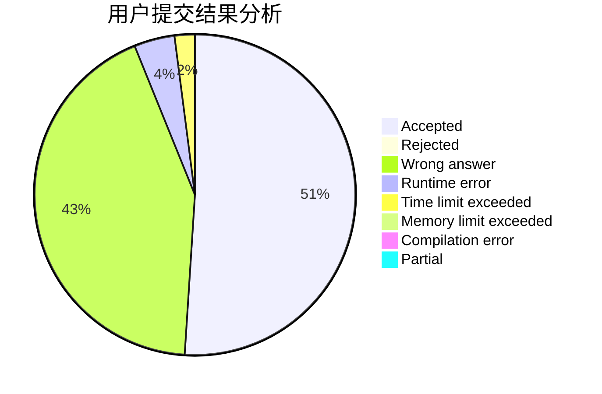
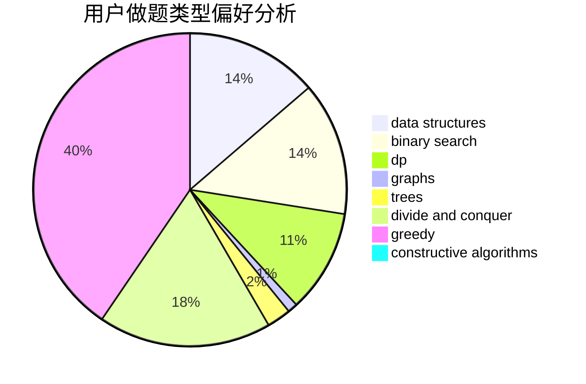

# EasonCF

<!-- tabs:start -->

#### **用户提交结果分析**

#### **用户做题类型偏好分析**

#### **用户错题知识点分析**

<!-- tabs:end -->
# 推荐题目
[1473C](https://codeforces.com/contest/1473/problem/C)		constructive algorithms,
                        math		  
[787D](https://codeforces.com/contest/787/problem/D)		dsu,graphs,sortings,trees		  
[383A](https://codeforces.com/contest/383/problem/A)		data structures,
                        greedy		  
[1187F](https://codeforces.com/contest/1187/problem/F)		dp,
                        math,
                        probabilities		  
[529B](https://codeforces.com/contest/529/problem/B)		brute force,
                        greedy,
                        sortings		  
[808A](https://codeforces.com/contest/808/problem/A)		implementation		  
[409B](https://codeforces.com/contest/409/problem/B)		*special problem		  
[1326B](https://codeforces.com/contest/1326/problem/B)		implementation,
                        math		  
[1184A1](https://codeforces.com/contest/1184A/problem/1)		brute force,
                        math,
                        number theory		  
[1342D](https://codeforces.com/contest/1342/problem/D)		binary search,
                        constructive algorithms,
                        data structures,
                        greedy,
                        sortings,
                        two pointers		  
