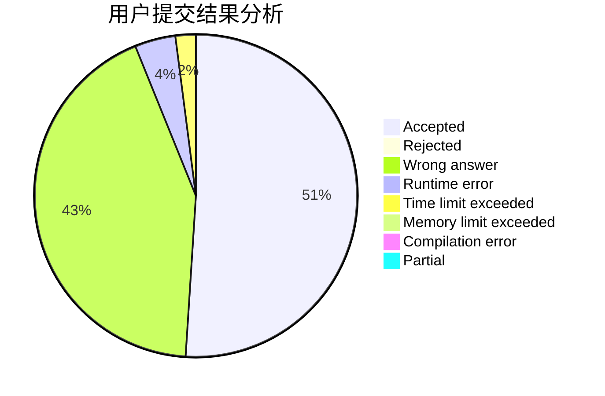
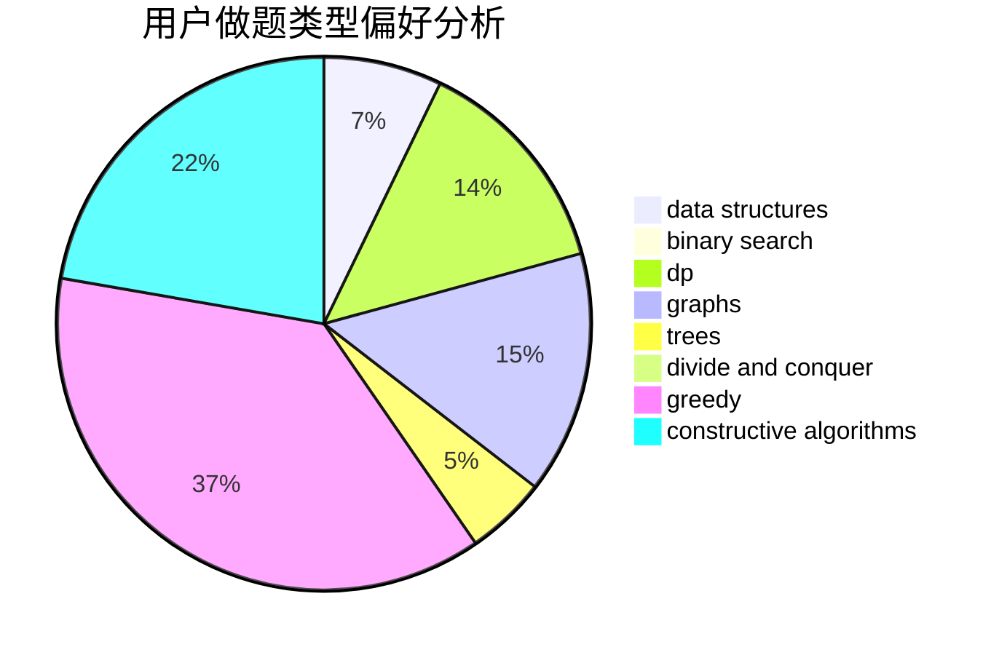

# EasonCF

<!-- tabs:start -->

#### **用户提交结果分析**

#### **用户做题类型偏好分析**

#### **用户错题知识点分析**

<!-- tabs:end -->
# 推荐题目
[1481F](https://codeforces.com/contest/1481/problem/F)		dp,
                        greedy,
                        trees		  
[803D](https://codeforces.com/contest/803/problem/D)		binary search,
                        greedy		  
[414B](https://codeforces.com/contest/414/problem/B)		combinatorics,
                        dp,
                        number theory		  
[1191C](https://codeforces.com/contest/1191/problem/C)		dsu,graphs,sortings,trees		  
[553A](https://codeforces.com/contest/553/problem/A)		combinatorics,
                        dp,
                        math		  
[822F](https://codeforces.com/contest/822/problem/F)		constructive algorithms,
                        dfs and similar,
                        trees		  
[436D](https://codeforces.com/contest/436/problem/D)		dp		  
[1332D](https://codeforces.com/contest/1332/problem/D)		bitmasks,
                        constructive algorithms,
                        math		  
[1187B](https://codeforces.com/contest/1187/problem/B)		binary search,
                        implementation,
                        strings		  
[1349B](https://codeforces.com/contest/1349/problem/B)		constructive algorithms,
                        greedy,
                        math		  
