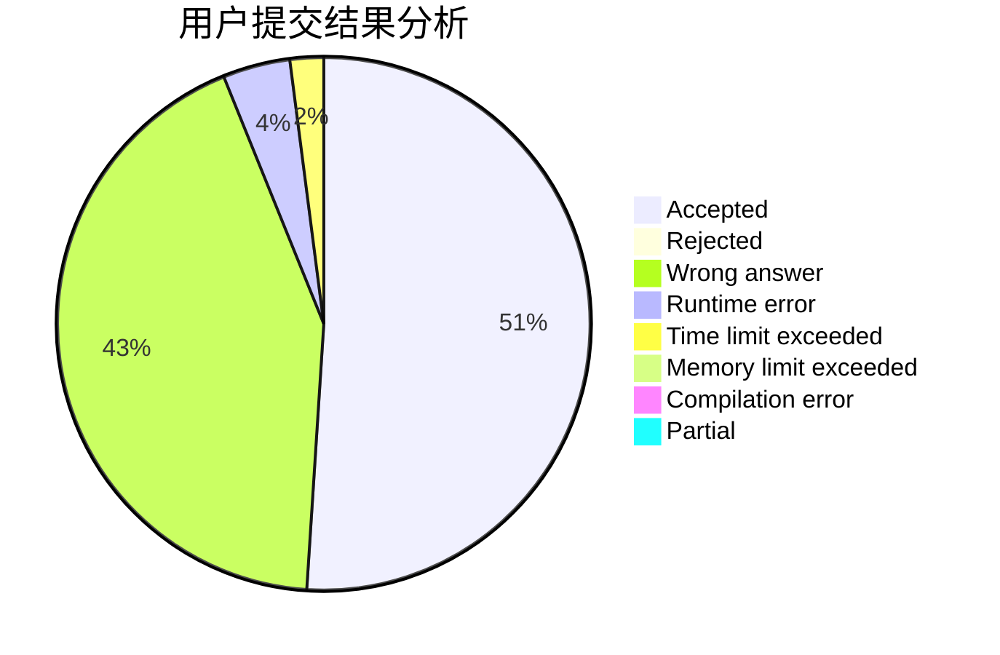
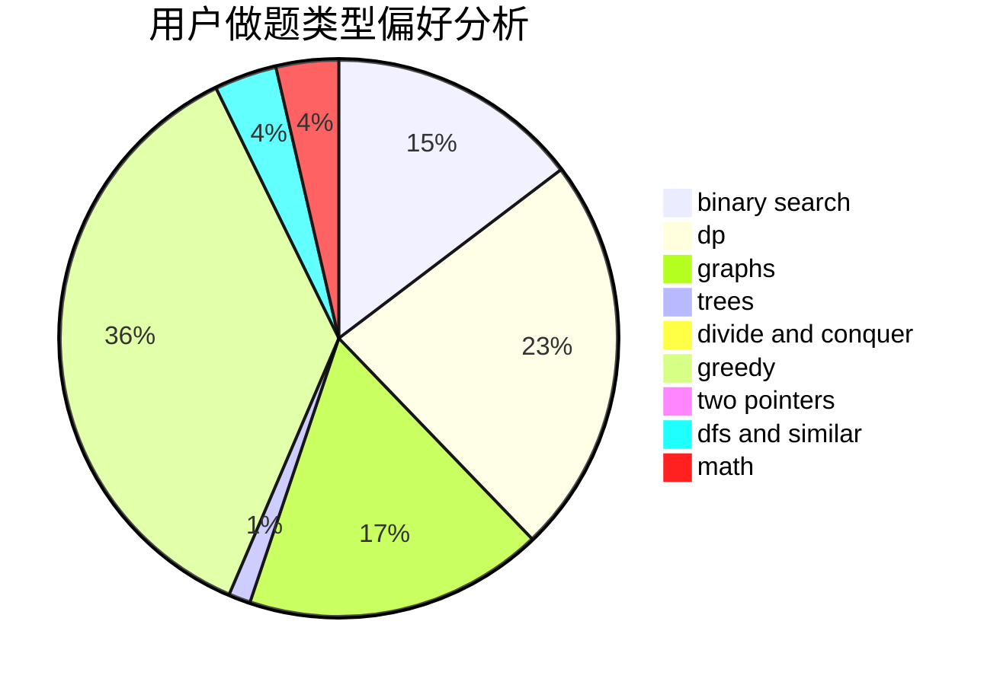

# EasonCF

<!-- tabs:start -->

#### **用户提交结果分析**

#### **用户做题类型偏好分析**

<!-- tabs:end -->
# 推荐题目
[1481F](https://codeforces.com/contest/1481/problem/F)
[803D](https://codeforces.com/contest/803/problem/D)
[414B](https://codeforces.com/contest/414/problem/B)
[1191C](https://codeforces.com/contest/1191/problem/C)
[553A](https://codeforces.com/contest/553/problem/A)
[822F](https://codeforces.com/contest/822/problem/F)
[436D](https://codeforces.com/contest/436/problem/D)
[1332D](https://codeforces.com/contest/1332/problem/D)
[1187B](https://codeforces.com/contest/1187/problem/B)
[1349B](https://codeforces.com/contest/1349/problem/B)
