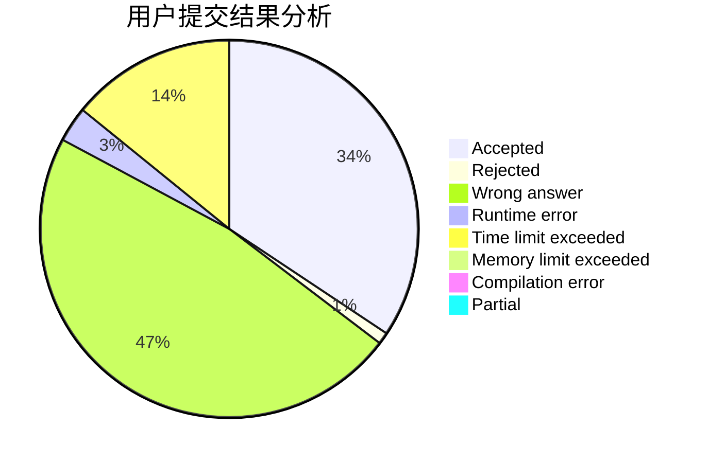
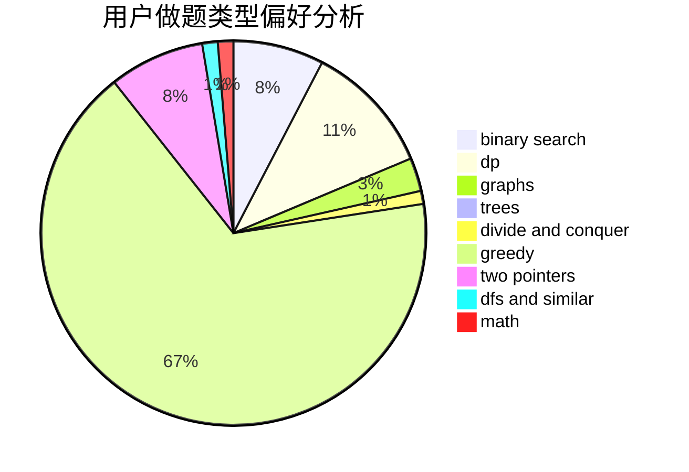

# 01191020csl

<!-- tabs:start -->

#### **用户提交结果分析**

#### **用户做题类型偏好分析**

<!-- tabs:end -->
# 推荐题目
[1027F](https://codeforces.com/contest/1027/problem/F)
[1028D](https://codeforces.com/contest/1028/problem/D)
[1028G](https://codeforces.com/contest/1028/problem/G)
[1029C](https://codeforces.com/contest/1029/problem/C)
[1030G](https://codeforces.com/contest/1030/problem/G)
[1030B](https://codeforces.com/contest/1030/problem/B)
[1029D](https://codeforces.com/contest/1029/problem/D)
[1028A](https://codeforces.com/contest/1028/problem/A)
[1030D](https://codeforces.com/contest/1030/problem/D)
[1027C](https://codeforces.com/contest/1027/problem/C)
