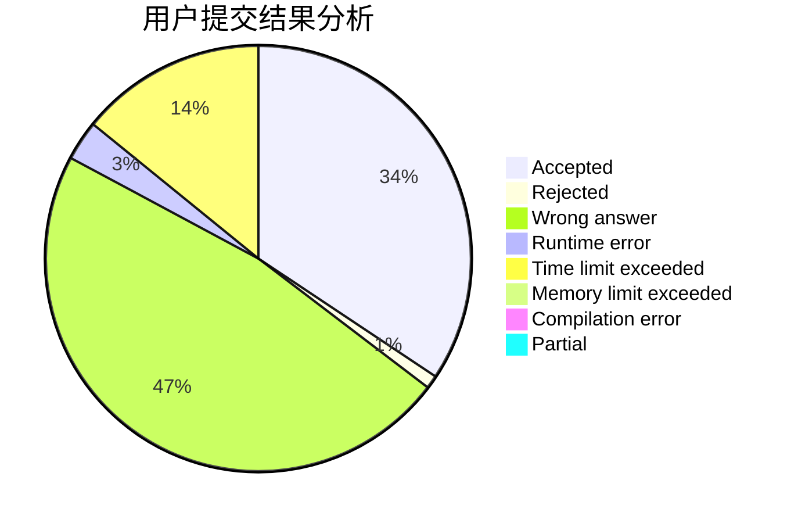
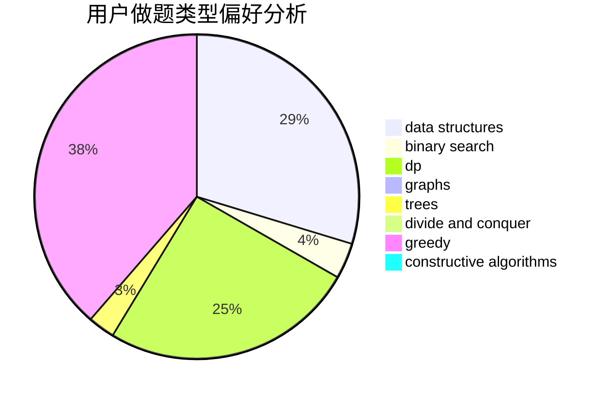
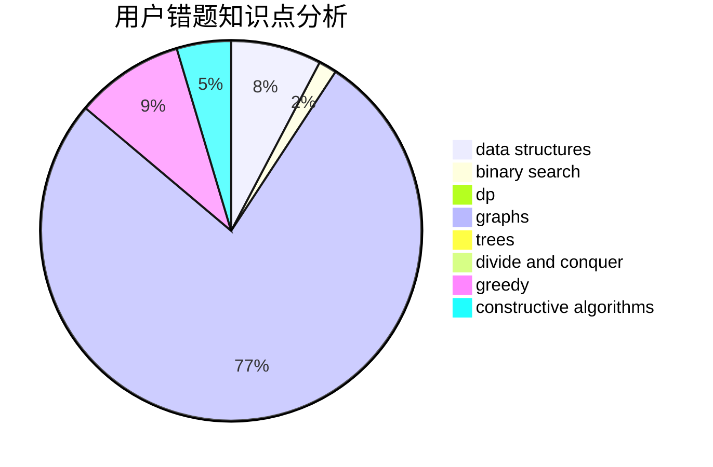

# 01191020csl

<!-- tabs:start -->

#### **用户提交结果分析**

#### **用户做题类型偏好分析**

#### **用户错题知识点分析**

<!-- tabs:end -->
# 推荐题目
[1027C](https://codeforces.com/contest/1027/problem/C)		greedy		  
[1028A](https://codeforces.com/contest/1028/problem/A)		implementation		  
[1028C](https://codeforces.com/contest/1028/problem/C)		geometry,
                        implementation,
                        sortings		  
[1028H](https://codeforces.com/contest/1028/problem/H)		math		  
[1030C](https://codeforces.com/contest/1030/problem/C)		implementation		  
[102A](https://codeforces.com/contest/102/problem/A)		brute force		  
[1029A](https://codeforces.com/contest/1029/problem/A)		implementation,
                        strings		  
[1027E](https://codeforces.com/contest/1027/problem/E)		combinatorics,
                        dp,
                        math		  
[1030A](https://codeforces.com/contest/1030/problem/A)		implementation		  
[1025G](https://codeforces.com/contest/1025/problem/G)		constructive algorithms,
                        math		  
