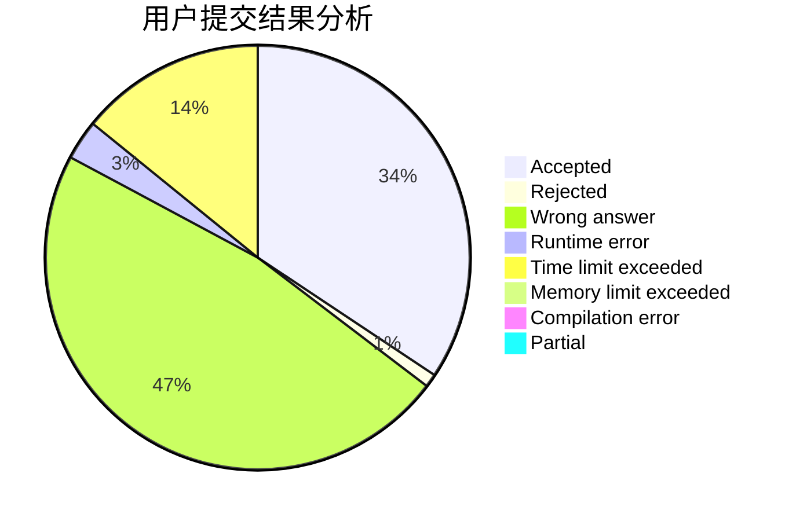
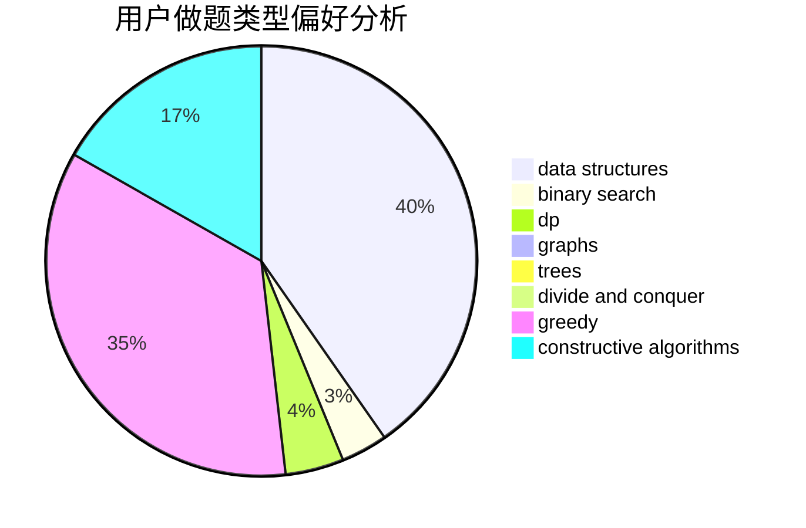
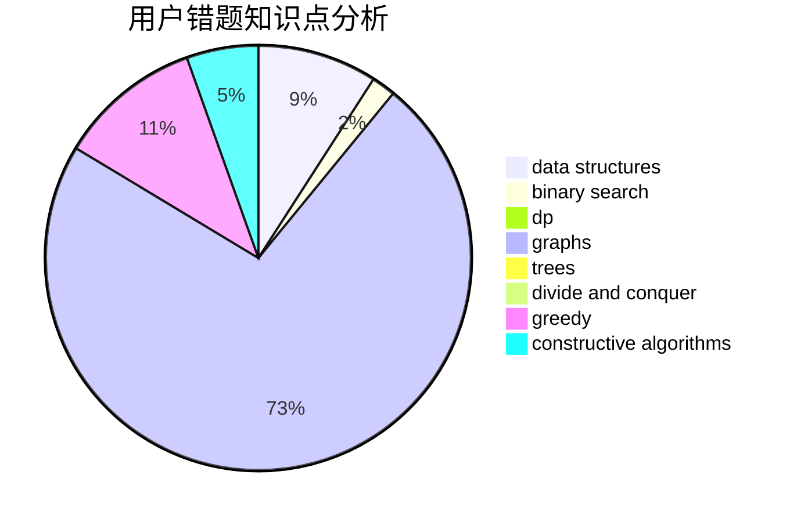

# 01191020csl

<!-- tabs:start -->

#### **用户提交结果分析**

#### **用户做题类型偏好分析**

#### **用户错题知识点分析**

<!-- tabs:end -->
# 推荐题目
[1027F](https://codeforces.com/contest/1027/problem/F)		binary search,
                        dfs and similar,
                        dsu,
                        graph matchings,
                        graphs		  
[1028D](https://codeforces.com/contest/1028/problem/D)		combinatorics,
                        data structures,
                        greedy		  
[1028G](https://codeforces.com/contest/1028/problem/G)		dp,
                        interactive		  
[1029C](https://codeforces.com/contest/1029/problem/C)		greedy,
                        math,
                        sortings		  
[1030G](https://codeforces.com/contest/1030/problem/G)		number theory		  
[1030B](https://codeforces.com/contest/1030/problem/B)		geometry		  
[1029D](https://codeforces.com/contest/1029/problem/D)		implementation,
                        math		  
[1028A](https://codeforces.com/contest/1028/problem/A)		implementation		  
[1030D](https://codeforces.com/contest/1030/problem/D)		geometry,
                        number theory		  
[1027C](https://codeforces.com/contest/1027/problem/C)		greedy		  
