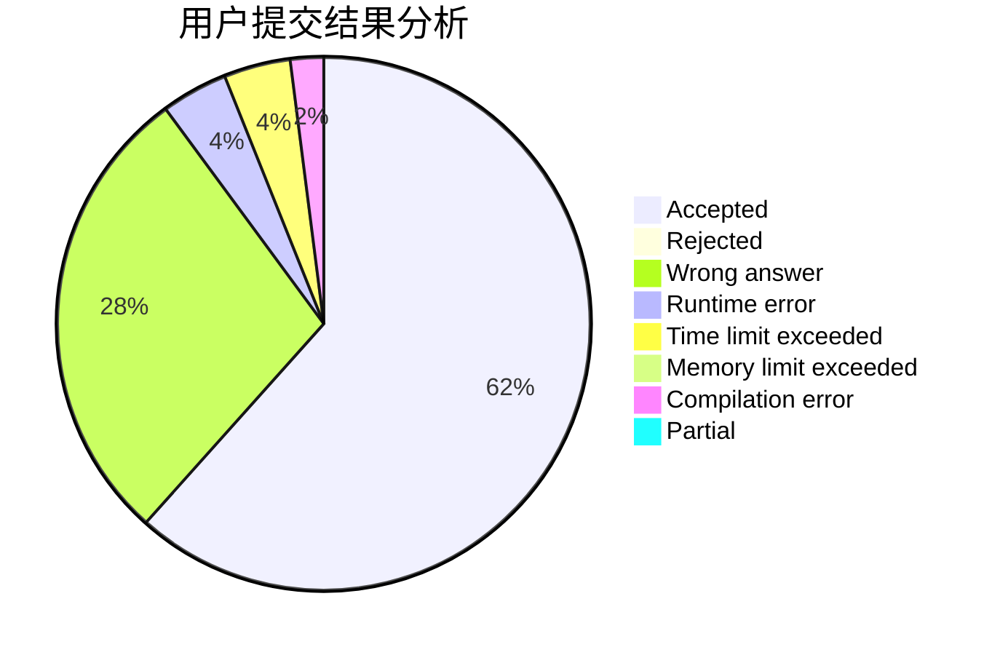
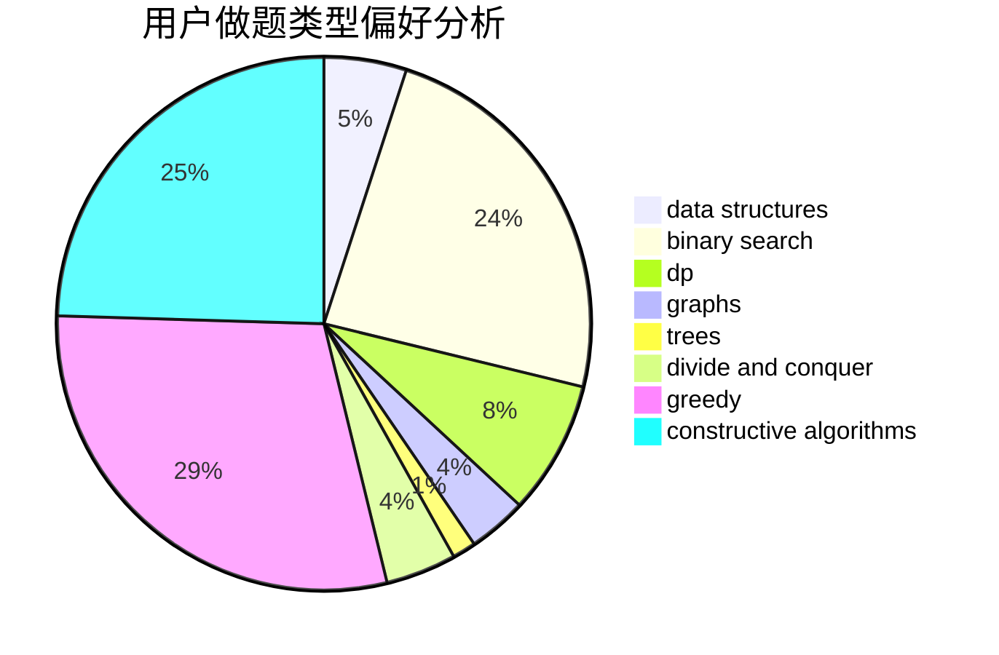
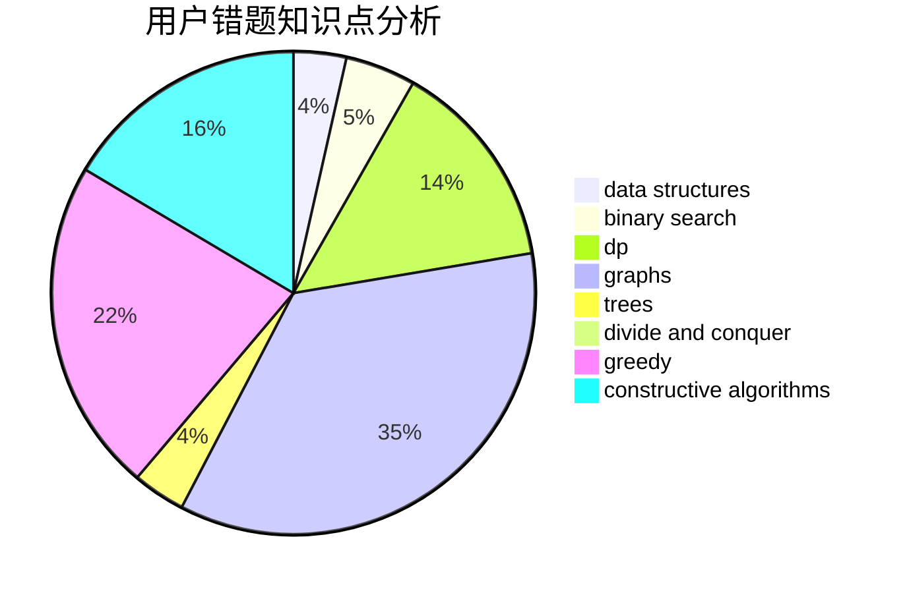

# 2018030402032

<!-- tabs:start -->

#### **用户提交结果分析**

#### **用户做题类型偏好分析**

#### **用户错题知识点分析**

<!-- tabs:end -->
# 推荐题目
[1244D](https://codeforces.com/contest/1244/problem/D)		brute force,
                        constructive algorithms,
                        dp,
                        graphs,
                        implementation,
                        trees		  
[1244E](https://codeforces.com/contest/1244/problem/E)		binary search,
                        constructive algorithms,
                        greedy,
                        sortings,
                        ternary search,
                        two pointers		  
[1243D](https://codeforces.com/contest/1243/problem/D)		dsu,graphs,sortings,trees		  
[1056F](https://codeforces.com/contest/1056/problem/F)		binary search,
                        dp,
                        math		  
[1243A](https://codeforces.com/contest/1243/problem/A)		implementation		  
[1243B2](https://codeforces.com/contest/1243B/problem/2)		strings		  
[1243C](https://codeforces.com/contest/1243/problem/C)		dsu,graphs,sortings,trees		  
[1244F](https://codeforces.com/contest/1244/problem/F)		constructive algorithms,
                        implementation		  
[1244C](https://codeforces.com/contest/1244/problem/C)		brute force,
                        math,
                        number theory		  
[1244A](https://codeforces.com/contest/1244/problem/A)		math		  
