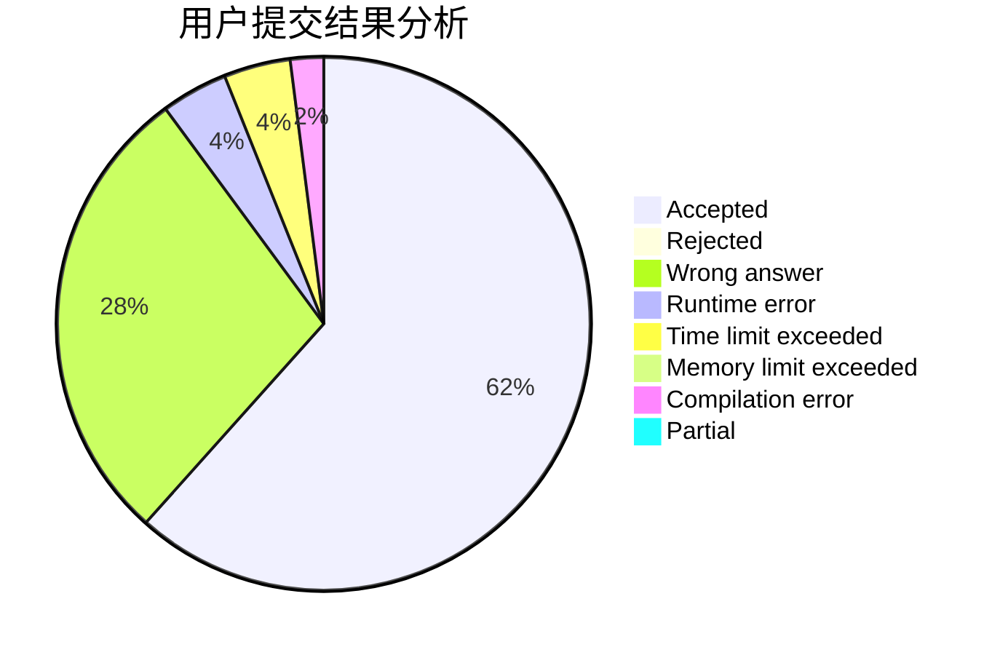
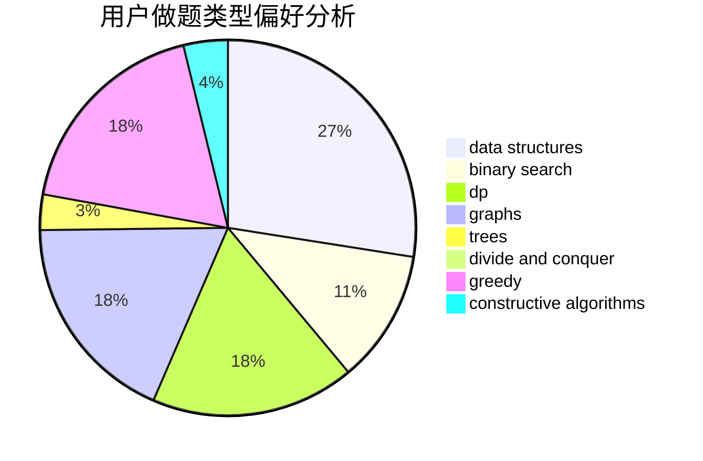
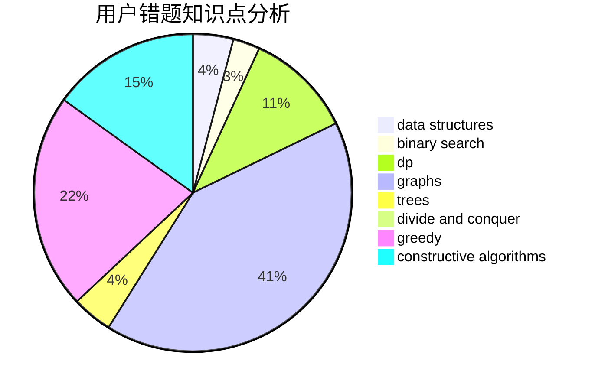

# 2018030402032

<!-- tabs:start -->

#### **用户提交结果分析**

#### **用户做题类型偏好分析**

#### **用户错题知识点分析**

<!-- tabs:end -->
# 推荐题目
[1249F](https://codeforces.com/contest/1249/problem/F)		dp,
                        trees		  
[124A](https://codeforces.com/contest/124/problem/A)		math		  
[1248E](https://codeforces.com/contest/1248/problem/E)		dsu,graphs,sortings,trees		  
[1057B](https://codeforces.com/contest/1057/problem/B)		*special problem,
                        brute force		  
[12482](https://codeforces.com/contest/1248/problem/2)		dsu,graphs,sortings,trees		  
[1248B](https://codeforces.com/contest/1248/problem/B)		greedy,
                        math,
                        sortings		  
[1248C](https://codeforces.com/contest/1248/problem/C)		dsu,graphs,sortings,trees		  
[1250A](https://codeforces.com/contest/1250/problem/A)		implementation		  
[1249E](https://codeforces.com/contest/1249/problem/E)		dp,
                        shortest paths		  
[12492](https://codeforces.com/contest/1249/problem/2)		dsu,graphs,sortings,trees		  
