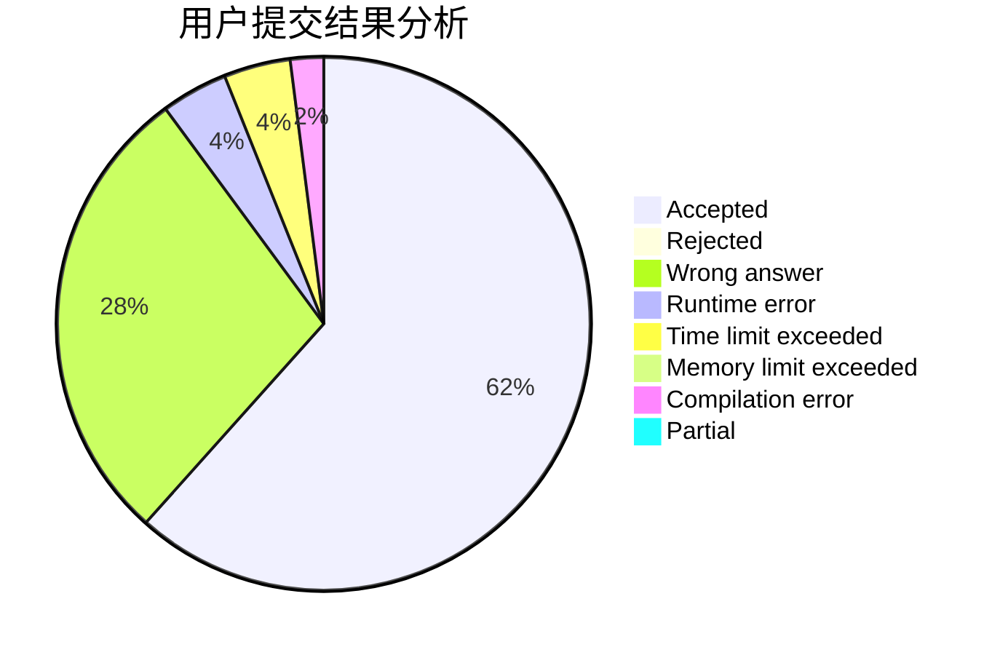
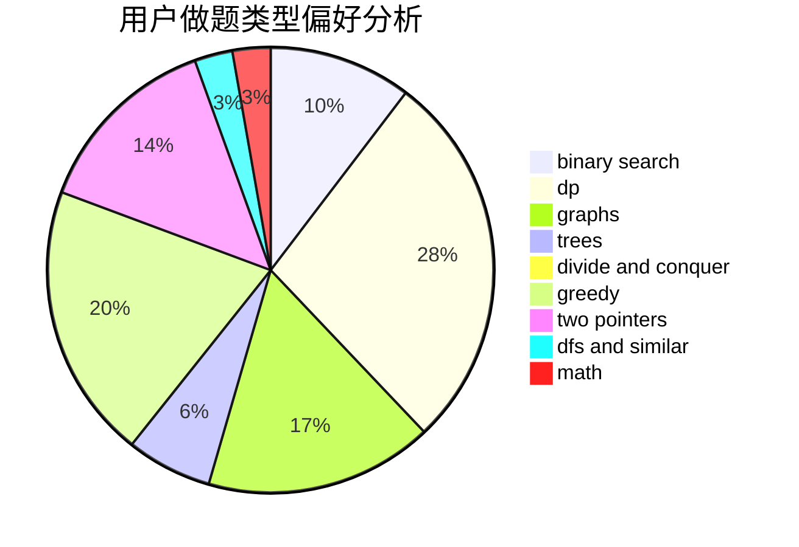

# 2018030402032

<!-- tabs:start -->

#### **用户提交结果分析**

#### **用户做题类型偏好分析**

<!-- tabs:end -->
# 推荐题目
[1249F](https://codeforces.com/contest/1249/problem/F)
[124A](https://codeforces.com/contest/124/problem/A)
[1248E](https://codeforces.com/contest/1248/problem/E)
[1057B](https://codeforces.com/contest/1057/problem/B)
[12482](https://codeforces.com/contest/1248/problem/2)
[1248B](https://codeforces.com/contest/1248/problem/B)
[1248C](https://codeforces.com/contest/1248/problem/C)
[1250A](https://codeforces.com/contest/1250/problem/A)
[1249E](https://codeforces.com/contest/1249/problem/E)
[12492](https://codeforces.com/contest/1249/problem/2)
