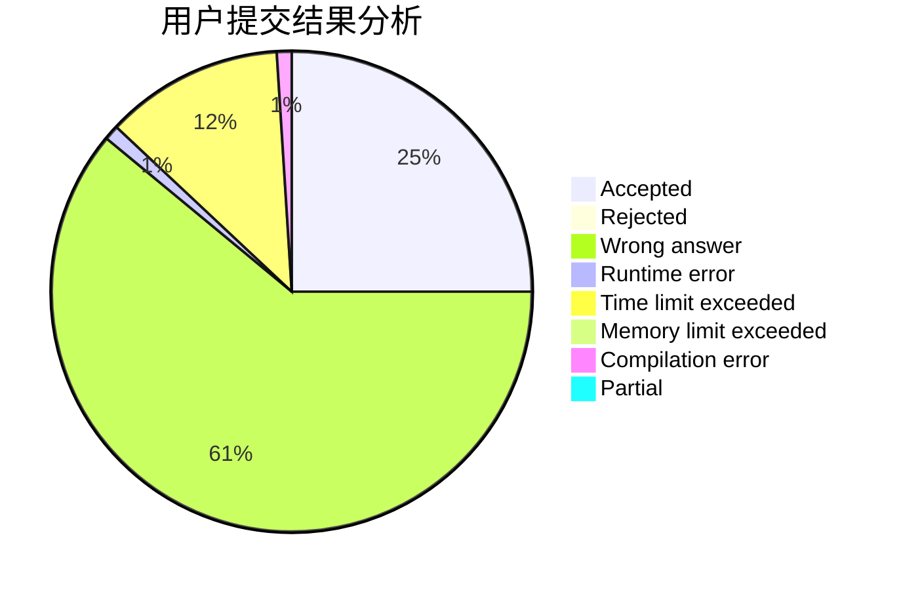
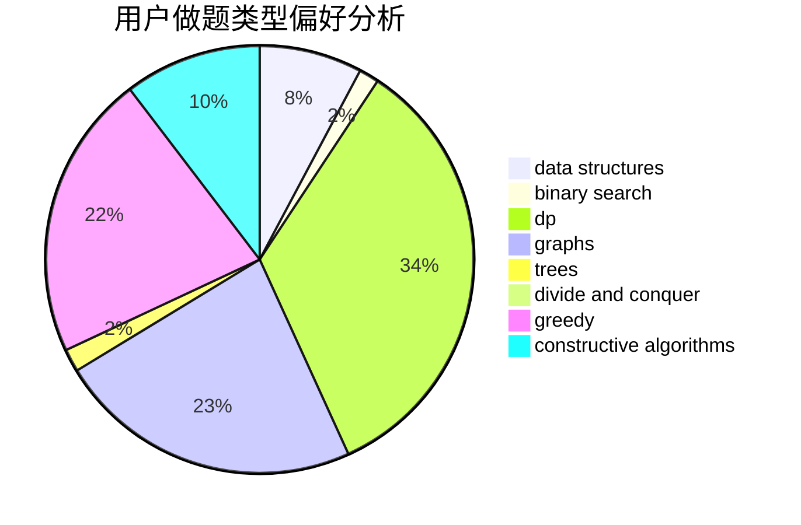
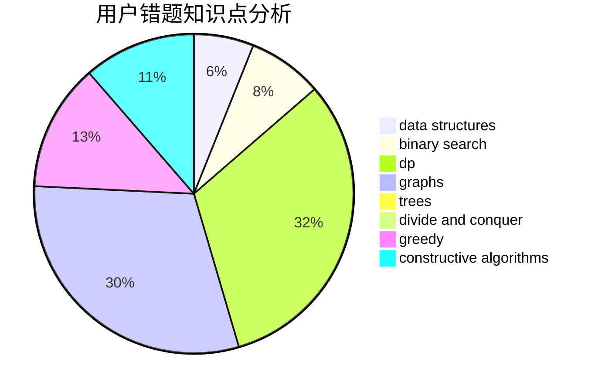

# EasonTAO

<!-- tabs:start -->

#### **用户提交结果分析**

#### **用户做题类型偏好分析**

#### **用户错题知识点分析**

<!-- tabs:end -->
# 推荐题目
[1430G](https://codeforces.com/contest/1430/problem/G)		bitmasks,
                        dfs and similar,
                        dp,
                        flows,
                        graphs,
                        math		  
[1307C](https://codeforces.com/contest/1307/problem/C)		brute force,
                        dp,
                        math,
                        strings		  
[417C](https://codeforces.com/contest/417/problem/C)		constructive algorithms,
                        graphs,
                        implementation		  
[1468L](https://codeforces.com/contest/1468/problem/L)		binary search,
                        greedy,
                        math,
                        number theory		  
[697B](https://codeforces.com/contest/697/problem/B)		brute force,
                        implementation,
                        math,
                        strings		  
[802B](https://codeforces.com/contest/802/problem/B)		data structures,
                        greedy		  
[295C](https://codeforces.com/contest/295/problem/C)		combinatorics,
                        dp,
                        graphs,
                        shortest paths		  
[1162E](https://codeforces.com/contest/1162/problem/E)		dsu,graphs,sortings,trees		  
[1249C1](https://codeforces.com/contest/1249C/problem/1)		brute force,
                        greedy,
                        implementation		  
[1328F](https://codeforces.com/contest/1328/problem/F)		greedy		  
