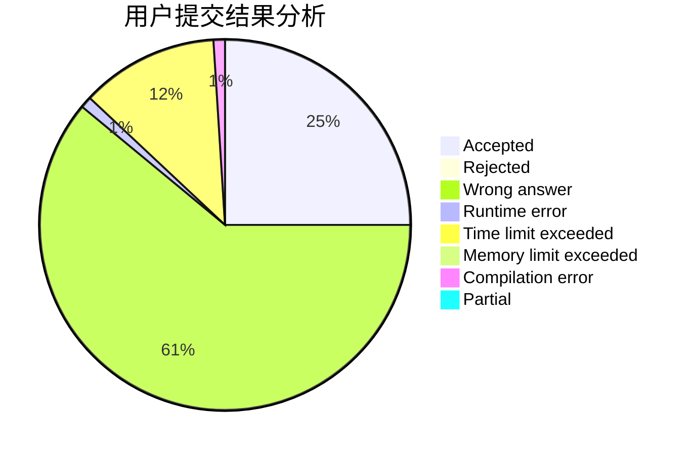
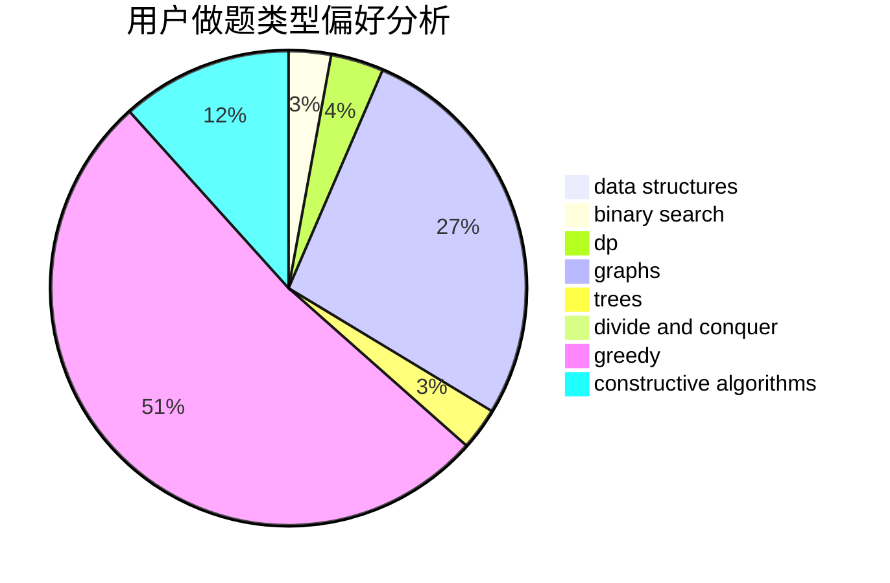
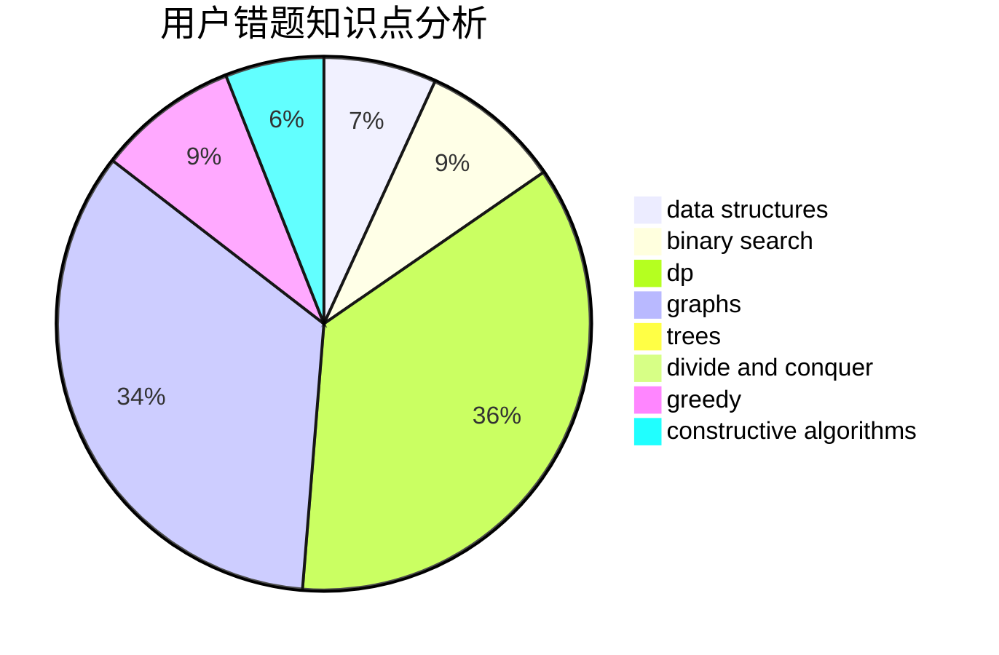

# EasonTAO

<!-- tabs:start -->

#### **用户提交结果分析**

#### **用户做题类型偏好分析**

#### **用户错题知识点分析**

<!-- tabs:end -->
# 推荐题目
[1439E](https://codeforces.com/contest/1439/problem/E)		bitmasks,
                        data structures,
                        games,
                        trees		  
[1315D](https://codeforces.com/contest/1315/problem/D)		dsu,graphs,sortings,trees		  
[442B](https://codeforces.com/contest/442/problem/B)		greedy,
                        math,
                        probabilities		  
[1476F](https://codeforces.com/contest/1476/problem/F)		binary search,
                        data structures,
                        dp		  
[713E](https://codeforces.com/contest/713/problem/E)		binary search,
                        dp		  
[817A](https://codeforces.com/contest/817/problem/A)		implementation,
                        math,
                        number theory		  
[312A](https://codeforces.com/contest/312/problem/A)		implementation,
                        strings		  
[1164M](https://codeforces.com/contest/1164/problem/M)		dsu,graphs,sortings,trees		  
[1252L](https://codeforces.com/contest/1252/problem/L)		flows,
                        graphs		  
[13352](https://codeforces.com/contest/1335/problem/2)		dsu,graphs,sortings,trees		  
