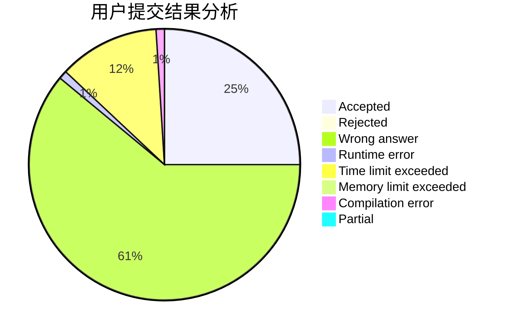
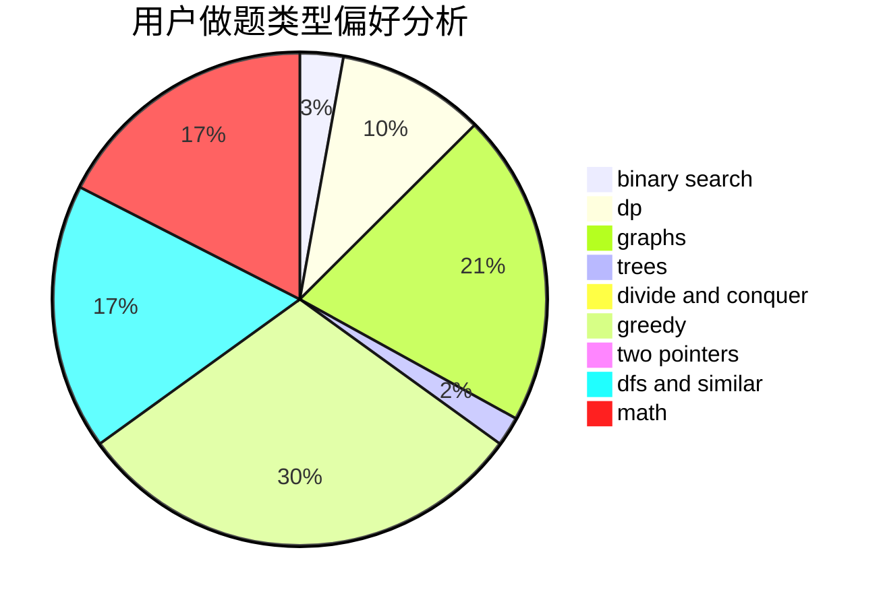

# EasonTAO

<!-- tabs:start -->

#### **用户提交结果分析**

#### **用户做题类型偏好分析**

<!-- tabs:end -->
# 推荐题目
[1439E](https://codeforces.com/contest/1439/problem/E)
[1315D](https://codeforces.com/contest/1315/problem/D)
[442B](https://codeforces.com/contest/442/problem/B)
[1476F](https://codeforces.com/contest/1476/problem/F)
[713E](https://codeforces.com/contest/713/problem/E)
[817A](https://codeforces.com/contest/817/problem/A)
[312A](https://codeforces.com/contest/312/problem/A)
[1164M](https://codeforces.com/contest/1164/problem/M)
[1252L](https://codeforces.com/contest/1252/problem/L)
[13352](https://codeforces.com/contest/1335/problem/2)
