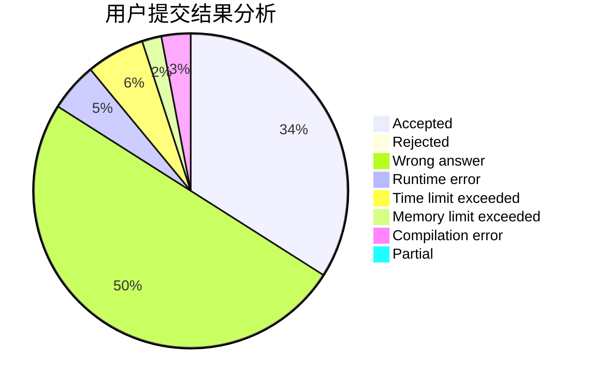
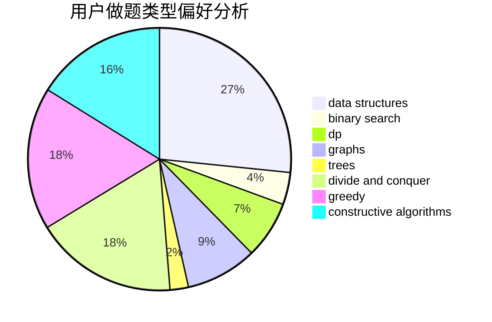
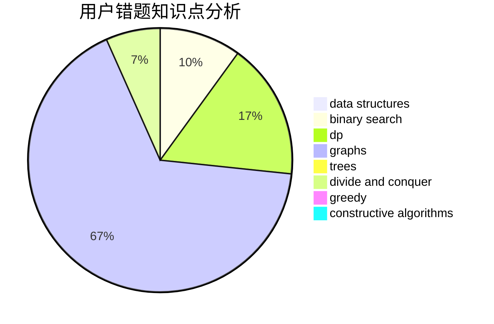

# Ebola_Emperor

<!-- tabs:start -->

#### **用户提交结果分析**

#### **用户做题类型偏好分析**

#### **用户错题知识点分析**

<!-- tabs:end -->
# 推荐题目
[672A](https://codeforces.com/contest/672/problem/A)		implementation		  
[61E](https://codeforces.com/contest/61/problem/E)		data structures,
                        trees		  
[825F](https://codeforces.com/contest/825/problem/F)		dp,
                        hashing,
                        string suffix structures,
                        strings		  
[575C](https://codeforces.com/contest/575/problem/C)		bitmasks,
                        brute force,
                        graph matchings		  
[1147D](https://codeforces.com/contest/1147/problem/D)		dfs and similar,
                        graphs		  
[290C](https://codeforces.com/contest/290/problem/C)		*special problem,
                        graph matchings,
                        implementation,
                        trees		  
[635E](https://codeforces.com/contest/635/problem/E)		dsu,graphs,sortings,trees		  
[1213F](https://codeforces.com/contest/1213/problem/F)		data structures,
                        dfs and similar,
                        dsu,
                        graphs,
                        greedy,
                        implementation,
                        strings		  
[354E](https://codeforces.com/contest/354/problem/E)		constructive algorithms,
                        dfs and similar,
                        dp		  
[1178B](https://codeforces.com/contest/1178/problem/B)		dp,
                        strings		  
