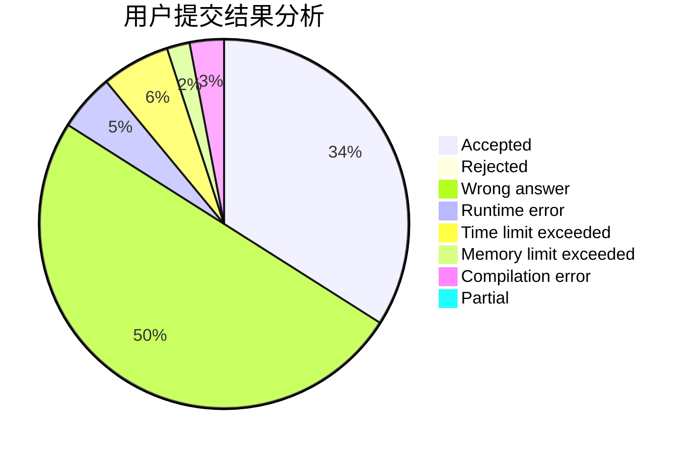
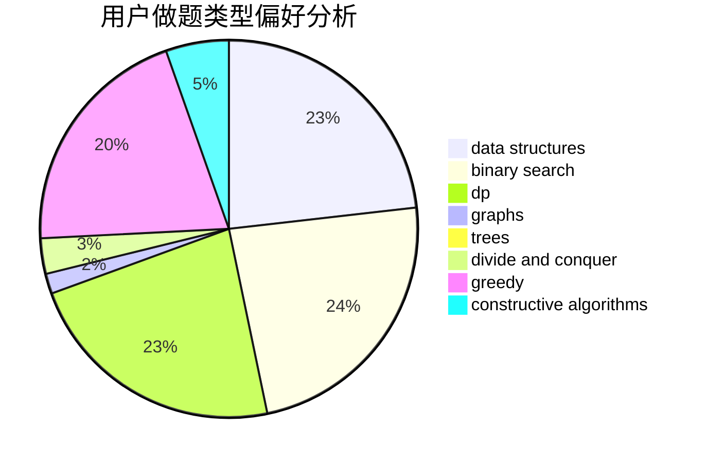
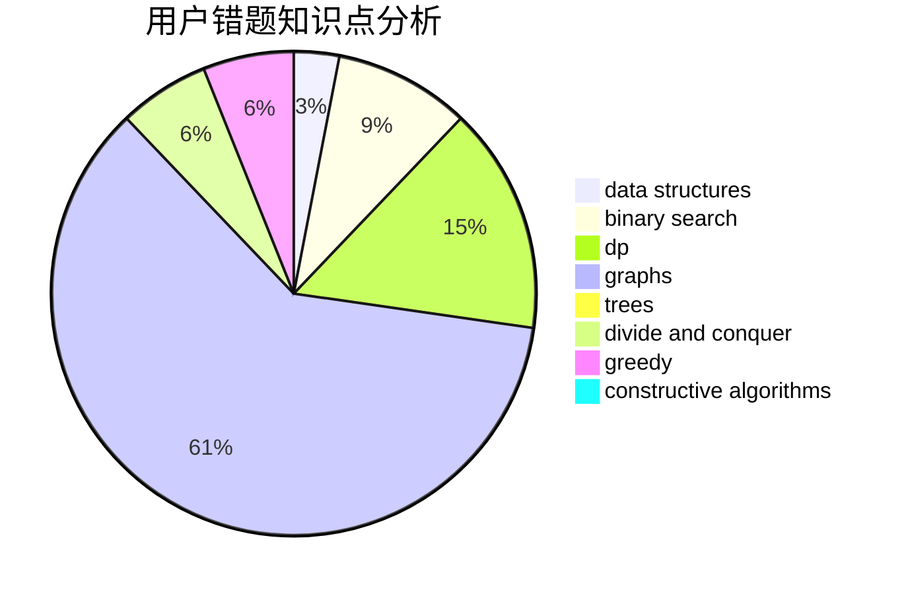

# Ebola_Emperor
<!-- tabs:start -->
#### **用户提交结果分析**

#### **用户做题类型偏好分析**

#### **用户错题知识点分析**

<!-- tabs:end -->
# 推荐题目
[Intellectual Inquiry](http://codeforces.com/problemset/problem/645/E)		dp,
                        greedy,
                        strings		  
[Little Girl and Maximum Sum](http://codeforces.com/problemset/problem/276/C)		data structures,
                        greedy,
                        implementation,
                        sortings		  
[Card Game](http://codeforces.com/problemset/problem/808/F)		binary search,
                        flows,
                        graphs		  
[Two Substrings](http://codeforces.com/problemset/problem/550/A)		brute force,
                        dp,
                        greedy,
                        implementation,
                        strings		  
[Mystery Circuit](http://codeforces.com/problemset/problem/1145/C)		bitmasks,
                        brute force		  
[Animal Observation (hard version)](http://codeforces.com/problemset/problem/1304/F2)		data structures,
                        dp,
                        greedy		  
[Party](http://codeforces.com/problemset/problem/23/B)		constructive algorithms,
                        graphs,
                        math		  
[Bmail Computer Network](http://codeforces.com/problemset/problem/1057/A)		*special problem,
                        dfs and similar,
                        trees		  
[Uniqueness](http://codeforces.com/problemset/problem/1208/B)		binary search,
                        brute force,
                        implementation,
                        two pointers		  
[Moonwalk challenge](http://codeforces.com/problemset/problem/1045/J)		data structures,
                        strings,
                        trees		  
<!-- tabs:start -->
#### **data structures**
[Intellectual Inquiry](http://codeforces.com/problemset/problem/276/C)		data structures,
                        greedy,
                        implementation,
                        sortings		  
[Little Girl and Maximum Sum](http://codeforces.com/problemset/problem/1304/F2)		data structures,
                        dp,
                        greedy		  
[Card Game](http://codeforces.com/problemset/problem/1045/J)		data structures,
                        strings,
                        trees		  
[Two Substrings](http://codeforces.com/problemset/problem/763/E)		data structures,
                        divide and conquer,
                        dsu		  
[Mystery Circuit](http://codeforces.com/problemset/problem/407/E)		data structures		  
[Animal Observation (hard version)](http://codeforces.com/problemset/problem/190/E)		data structures,
                        dsu,
                        graphs,
                        hashing,
                        sortings		  
[Party](http://codeforces.com/problemset/problem/464/E)		data structures,
                        graphs,
                        shortest paths		  
[Bmail Computer Network](http://codeforces.com/problemset/problem/1464/F)		data structures,
                        trees		  
[Uniqueness](http://codeforces.com/problemset/problem/1175/B)		data structures,
                        expression parsing,
                        implementation		  
[Moonwalk challenge](http://codeforces.com/problemset/problem/617/E)		data structures		  
#### **binary search**
[Intellectual Inquiry](http://codeforces.com/problemset/problem/808/F)		binary search,
                        flows,
                        graphs		  
[Little Girl and Maximum Sum](http://codeforces.com/problemset/problem/1208/B)		binary search,
                        brute force,
                        implementation,
                        two pointers		  
[Card Game](http://codeforces.com/problemset/problem/1492/C)		binary search,
                        data structures,
                        dp,
                        greedy,
                        two pointers		  
[Two Substrings](http://codeforces.com/problemset/problem/1463/D)		binary search,
                        constructive algorithms,
                        greedy,
                        two pointers		  
[Mystery Circuit](http://codeforces.com/problemset/problem/1490/G)		binary search,
                        data structures,
                        math		  
[Animal Observation (hard version)](http://codeforces.com/problemset/problem/1479/D)		binary search,
                        bitmasks,
                        brute force,
                        data structures,
                        probabilities,
                        trees		  
[Party](http://codeforces.com/problemset/problem/1436/E)		binary search,
                        data structures,
                        two pointers		  
[Bmail Computer Network](http://codeforces.com/problemset/problem/1461/D)		binary search,
                        brute force,
                        data structures,
                        divide and conquer,
                        implementation,
                        sortings		  
[Uniqueness](http://codeforces.com/problemset/problem/1493/C)		binary search,
                        brute force,
                        constructive algorithms,
                        greedy,
                        strings		  
[Moonwalk challenge](http://codeforces.com/problemset/problem/1487/D)		binary search,
                        brute force,
                        math,
                        number theory		  
#### **dp**
[Intellectual Inquiry](http://codeforces.com/problemset/problem/645/E)		dp,
                        greedy,
                        strings		  
[Little Girl and Maximum Sum](http://codeforces.com/problemset/problem/550/A)		brute force,
                        dp,
                        greedy,
                        implementation,
                        strings		  
[Card Game](http://codeforces.com/problemset/problem/1304/F2)		data structures,
                        dp,
                        greedy		  
[Two Substrings](http://codeforces.com/problemset/problem/1348/E)		brute force,
                        dp,
                        greedy,
                        math		  
[Mystery Circuit](http://codeforces.com/problemset/problem/808/G)		dp,
                        strings		  
[Animal Observation (hard version)](http://codeforces.com/problemset/problem/580/A)		brute force,
                        dp,
                        implementation		  
[Party](http://codeforces.com/problemset/problem/666/A)		dp,
                        implementation,
                        strings		  
[Bmail Computer Network](https://codeforces.com/contest/1397/problem/E)		dp,
                        greedy,
                        implementation		  
[Uniqueness](http://codeforces.com/problemset/problem/1475/B)		brute force,
                        dp,
                        math		  
[Moonwalk challenge](http://codeforces.com/problemset/problem/489/C)		dp,
                        greedy,
                        implementation		  
#### **graph**
[Intellectual Inquiry](http://codeforces.com/problemset/problem/808/F)		binary search,
                        flows,
                        graphs		  
[Little Girl and Maximum Sum](http://codeforces.com/problemset/problem/23/B)		constructive algorithms,
                        graphs,
                        math		  
[Card Game](http://codeforces.com/problemset/problem/761/E)		constructive algorithms,
                        dfs and similar,
                        graphs,
                        greedy,
                        trees		  
[Two Substrings](https://codeforces.com/contest/218/problem/C)		brute force,
                        dfs and similar,
                        dsu,
                        graphs		  
[Mystery Circuit](http://codeforces.com/problemset/problem/190/E)		data structures,
                        dsu,
                        graphs,
                        hashing,
                        sortings		  
[Animal Observation (hard version)](http://codeforces.com/problemset/problem/464/E)		data structures,
                        graphs,
                        shortest paths		  
[Party](http://codeforces.com/problemset/problem/1487/C)		brute force,
                        constructive algorithms,
                        dfs and similar,
                        graphs,
                        greedy,
                        implementation,
                        math		  
[Bmail Computer Network](http://codeforces.com/problemset/problem/1437/C)		dp,
                        flows,
                        graph matchings,
                        greedy,
                        math,
                        sortings		  
[Uniqueness](http://codeforces.com/problemset/problem/1470/D)		constructive algorithms,
                        dfs and similar,
                        graph matchings,
                        graphs,
                        greedy		  
[Moonwalk challenge](http://codeforces.com/problemset/problem/1476/C)		dp,
                        graphs,
                        greedy		  
#### **trees**
[Intellectual Inquiry](http://codeforces.com/problemset/problem/1057/A)		*special problem,
                        dfs and similar,
                        trees		  
[Little Girl and Maximum Sum](http://codeforces.com/problemset/problem/1045/J)		data structures,
                        strings,
                        trees		  
[Card Game](http://codeforces.com/problemset/problem/761/E)		constructive algorithms,
                        dfs and similar,
                        graphs,
                        greedy,
                        trees		  
[Two Substrings](http://codeforces.com/problemset/problem/1464/F)		data structures,
                        trees		  
[Mystery Circuit](http://codeforces.com/problemset/problem/1479/D)		binary search,
                        bitmasks,
                        brute force,
                        data structures,
                        probabilities,
                        trees		  
[Animal Observation (hard version)](http://codeforces.com/problemset/problem/1511/C)		brute force,
                        data structures,
                        implementation,
                        trees		  
[Party](http://codeforces.com/problemset/problem/1499/F)		combinatorics,
                        dfs and similar,
                        dp,
                        trees		  
[Bmail Computer Network](http://codeforces.com/problemset/problem/1491/E)		brute force,
                        dfs and similar,
                        divide and conquer,
                        number theory,
                        trees		  
[Uniqueness](http://codeforces.com/problemset/problem/1466/D)		data structures,
                        greedy,
                        sortings,
                        trees		  
[Moonwalk challenge](http://codeforces.com/problemset/problem/1495/D)		combinatorics,
                        dfs and similar,
                        graphs,
                        math,
                        shortest paths,
                        trees		  
#### **divide and conquer**
[Intellectual Inquiry](http://codeforces.com/problemset/problem/763/E)		data structures,
                        divide and conquer,
                        dsu		  
[Little Girl and Maximum Sum](http://codeforces.com/problemset/problem/1461/D)		binary search,
                        brute force,
                        data structures,
                        divide and conquer,
                        implementation,
                        sortings		  
[Card Game](http://codeforces.com/problemset/problem/1466/G)		combinatorics,
                        divide and conquer,
                        hashing,
                        math,
                        string suffix structures,
                        strings		  
[Two Substrings](http://codeforces.com/problemset/problem/1490/D)		dfs and similar,
                        divide and conquer,
                        implementation		  
[Mystery Circuit](https://codeforces.com/contest/1483/problem/C)		data structures,
                        divide and conquer,
                        dp		  
[Animal Observation (hard version)](http://codeforces.com/problemset/problem/1491/E)		brute force,
                        dfs and similar,
                        divide and conquer,
                        number theory,
                        trees		  
[Party](http://codeforces.com/problemset/problem/1303/G)		data structures,
                        divide and conquer,
                        geometry,
                        trees		  
[Bmail Computer Network](http://codeforces.com/problemset/problem/1494/D)		constructive algorithms,
                        data structures,
                        dfs and similar,
                        divide and conquer,
                        dsu,
                        greedy,
                        sortings,
                        trees		  
[Uniqueness](http://codeforces.com/problemset/problem/1482/E)		data structures,
                        divide and conquer,
                        dp		  
[Moonwalk challenge](http://codeforces.com/problemset/problem/566/C)		dfs and similar,
                        divide and conquer,
                        trees		  
#### **greedy**
[Intellectual Inquiry](http://codeforces.com/problemset/problem/645/E)		dp,
                        greedy,
                        strings		  
[Little Girl and Maximum Sum](http://codeforces.com/problemset/problem/276/C)		data structures,
                        greedy,
                        implementation,
                        sortings		  
[Card Game](http://codeforces.com/problemset/problem/550/A)		brute force,
                        dp,
                        greedy,
                        implementation,
                        strings		  
[Two Substrings](http://codeforces.com/problemset/problem/1304/F2)		data structures,
                        dp,
                        greedy		  
[Mystery Circuit](http://codeforces.com/problemset/problem/1348/E)		brute force,
                        dp,
                        greedy,
                        math		  
[Animal Observation (hard version)](http://codeforces.com/problemset/problem/258/A)		greedy,
                        math		  
[Party](http://codeforces.com/problemset/problem/761/E)		constructive algorithms,
                        dfs and similar,
                        graphs,
                        greedy,
                        trees		  
[Bmail Computer Network](http://codeforces.com/problemset/problem/746/E)		greedy,
                        implementation,
                        math		  
[Uniqueness](http://codeforces.com/problemset/problem/1129/A1)		brute force,
                        greedy		  
[Moonwalk challenge](http://codeforces.com/problemset/problem/1388/A)		brute force,
                        greedy,
                        math,
                        number theory		  
#### **constructive algorithms**
[Intellectual Inquiry](http://codeforces.com/problemset/problem/23/B)		constructive algorithms,
                        graphs,
                        math		  
[Little Girl and Maximum Sum](http://codeforces.com/problemset/problem/761/E)		constructive algorithms,
                        dfs and similar,
                        graphs,
                        greedy,
                        trees		  
[Card Game](http://codeforces.com/problemset/problem/1054/C)		constructive algorithms,
                        implementation		  
[Two Substrings](http://codeforces.com/problemset/problem/1288/F)		constructive algorithms,
                        flows		  
[Mystery Circuit](http://codeforces.com/problemset/problem/500/C)		constructive algorithms,
                        greedy,
                        implementation,
                        math		  
[Animal Observation (hard version)](http://codeforces.com/problemset/problem/1493/A)		constructive algorithms,
                        greedy		  
[Party](http://codeforces.com/problemset/problem/1463/D)		binary search,
                        constructive algorithms,
                        greedy,
                        two pointers		  
[Bmail Computer Network](https://codeforces.com/contest/1456/problem/B)		bitmasks,
                        brute force,
                        constructive algorithms		  
[Uniqueness](http://codeforces.com/problemset/problem/1492/D)		bitmasks,
                        constructive algorithms,
                        greedy,
                        math		  
[Moonwalk challenge](https://codeforces.com/contest/1504/problem/D)		constructive algorithms,
                        games,
                        interactive		  
#### **sortings**
[Intellectual Inquiry](http://codeforces.com/problemset/problem/276/C)		data structures,
                        greedy,
                        implementation,
                        sortings		  
[Little Girl and Maximum Sum](https://codeforces.com/contest/434/problem/A)		implementation,
                        math,
                        sortings		  
[Card Game](http://codeforces.com/problemset/problem/190/E)		data structures,
                        dsu,
                        graphs,
                        hashing,
                        sortings		  
[Two Substrings](http://codeforces.com/problemset/problem/809/A)		implementation,
                        math,
                        sortings		  
[Mystery Circuit](https://codeforces.com/contest/1496/problem/C)		geometry,
                        greedy,
                        math,
                        sortings		  
[Animal Observation (hard version)](http://codeforces.com/problemset/problem/1495/A)		geometry,
                        greedy,
                        math,
                        sortings		  
[Party](http://codeforces.com/problemset/problem/1497/A)		brute force,
                        data structures,
                        greedy,
                        sortings		  
[Bmail Computer Network](http://codeforces.com/problemset/problem/1427/A)		math,
                        sortings		  
[Uniqueness](http://codeforces.com/problemset/problem/1461/D)		binary search,
                        brute force,
                        data structures,
                        divide and conquer,
                        implementation,
                        sortings		  
[Moonwalk challenge](http://codeforces.com/problemset/problem/1437/C)		dp,
                        flows,
                        graph matchings,
                        greedy,
                        math,
                        sortings		  
<!-- tabs:end -->
