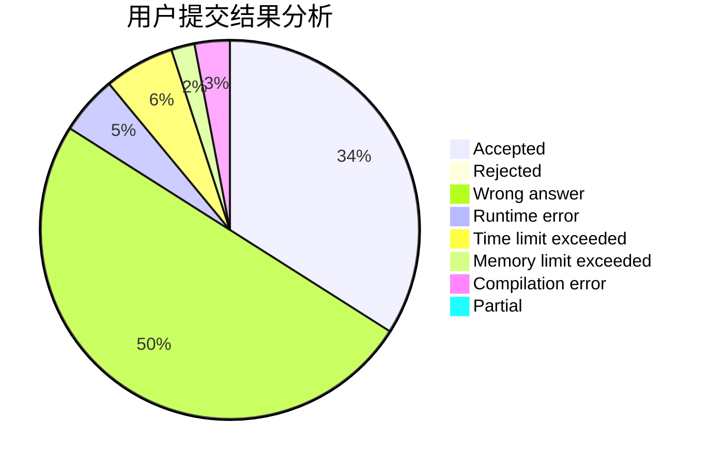
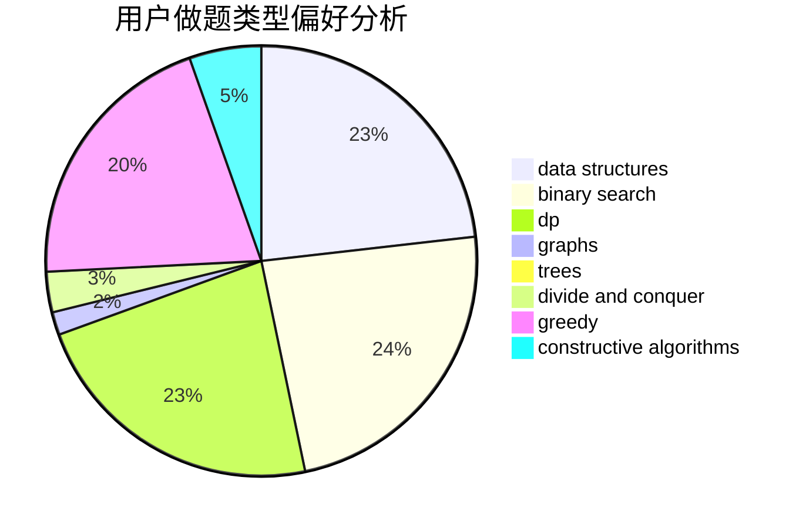
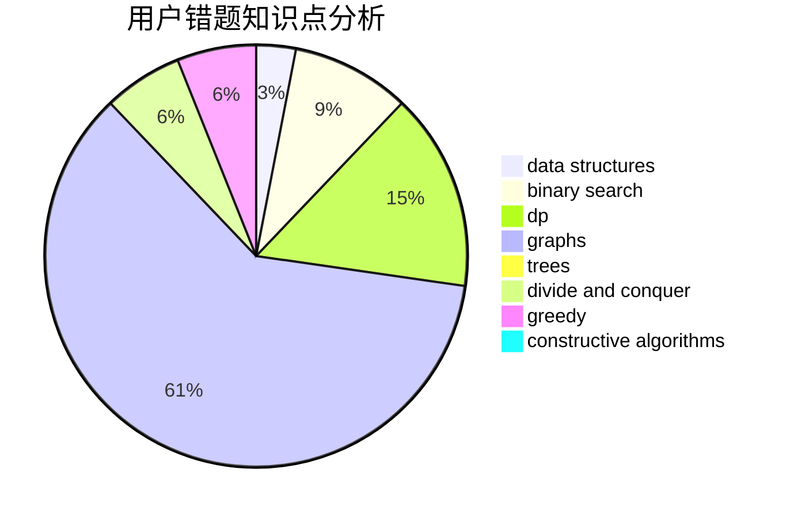

# Ebola_Emperor

<!-- tabs:start -->

#### **用户提交结果分析**

#### **用户做题类型偏好分析**

#### **用户错题知识点分析**

<!-- tabs:end -->
# 推荐题目
[645E](https://codeforces.com/contest/645/problem/E)		dp,
                        greedy,
                        strings		  
[600D](https://codeforces.com/contest/600/problem/D)		geometry		  
[808G](https://codeforces.com/contest/808/problem/G)		dp,
                        strings		  
[550A](https://codeforces.com/contest/550/problem/A)		brute force,
                        dp,
                        greedy,
                        implementation,
                        strings		  
[1145C](https://codeforces.com/contest/1145/problem/C)		bitmasks,
                        brute force		  
[276C](https://codeforces.com/contest/276/problem/C)		data structures,
                        greedy,
                        implementation,
                        sortings		  
[617E](https://codeforces.com/contest/617/problem/E)		data structures		  
[1208B](https://codeforces.com/contest/1208/problem/B)		binary search,
                        brute force,
                        implementation,
                        two pointers		  
[325D](https://codeforces.com/contest/325/problem/D)		dsu		  
[1175B](https://codeforces.com/contest/1175/problem/B)		data structures,
                        expression parsing,
                        implementation		  
