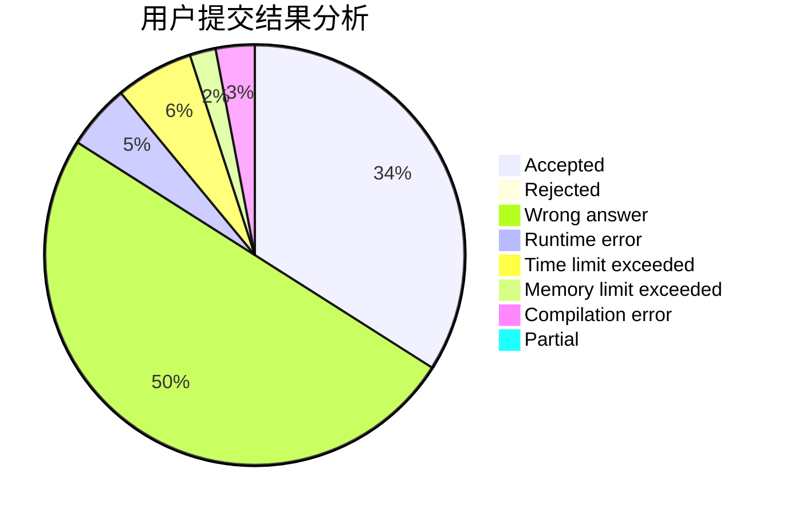
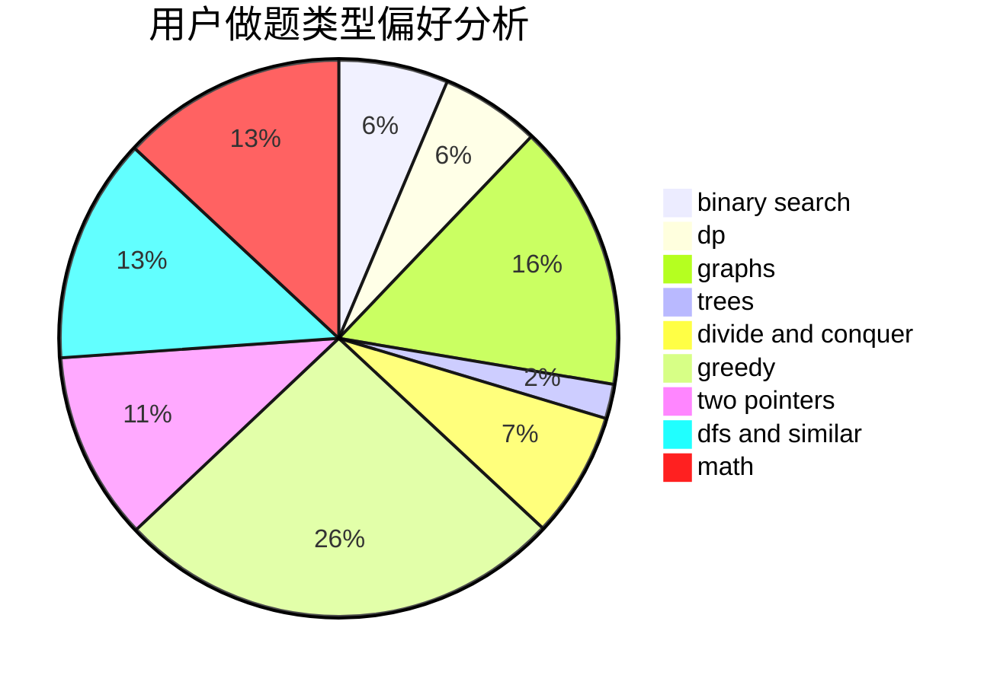

# Ebola_Emperor

<!-- tabs:start -->

#### **用户提交结果分析**

#### **用户做题类型偏好分析**

<!-- tabs:end -->
# 推荐题目
[672A](https://codeforces.com/contest/672/problem/A)
[61E](https://codeforces.com/contest/61/problem/E)
[825F](https://codeforces.com/contest/825/problem/F)
[575C](https://codeforces.com/contest/575/problem/C)
[1147D](https://codeforces.com/contest/1147/problem/D)
[290C](https://codeforces.com/contest/290/problem/C)
[635E](https://codeforces.com/contest/635/problem/E)
[1213F](https://codeforces.com/contest/1213/problem/F)
[354E](https://codeforces.com/contest/354/problem/E)
[1178B](https://codeforces.com/contest/1178/problem/B)
