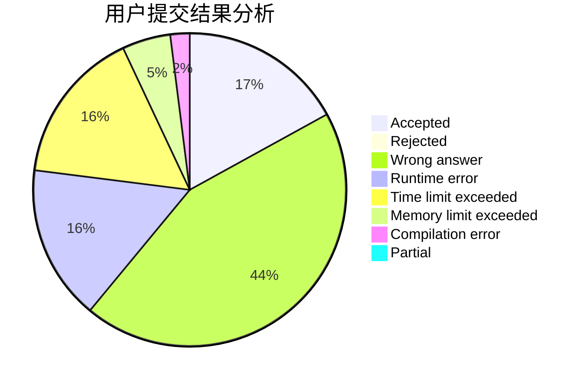
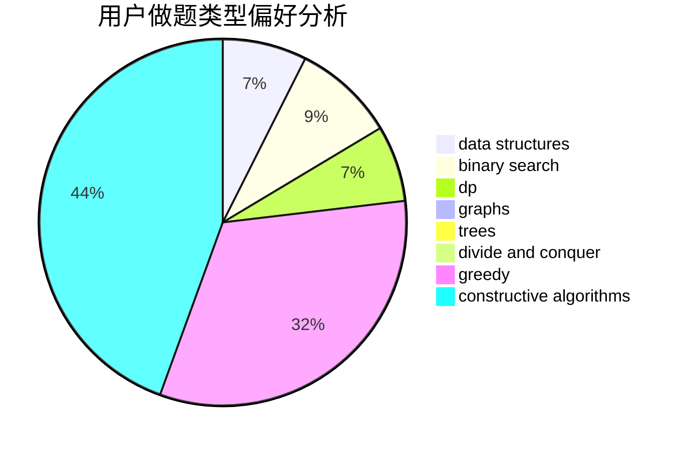

# Eclosion

<!-- tabs:start -->

#### **用户提交结果分析**

#### **用户做题类型偏好分析**

#### **用户错题知识点分析**

<!-- tabs:end -->
# 推荐题目
[265D](https://codeforces.com/contest/265/problem/D)		dsu,graphs,sortings,trees		  
[1336E2](https://codeforces.com/contest/1336E/problem/2)		bitmasks,
                        brute force,
                        combinatorics,
                        math		  
[809E](https://codeforces.com/contest/809/problem/E)		divide and conquer,
                        math,
                        number theory,
                        trees		  
[331C3](https://codeforces.com/contest/331C/problem/3)		dp		  
[1044B](https://codeforces.com/contest/1044/problem/B)		dfs and similar,
                        interactive,
                        trees		  
[809B](https://codeforces.com/contest/809/problem/B)		binary search,
                        interactive		  
[1162B](https://codeforces.com/contest/1162/problem/B)		brute force,
                        greedy		  
[380C](https://codeforces.com/contest/380/problem/C)		data structures,
                        schedules		  
[1119F](https://codeforces.com/contest/1119/problem/F)		data structures,
                        dp,
                        trees		  
[555C](https://codeforces.com/contest/555/problem/C)		data structures		  
