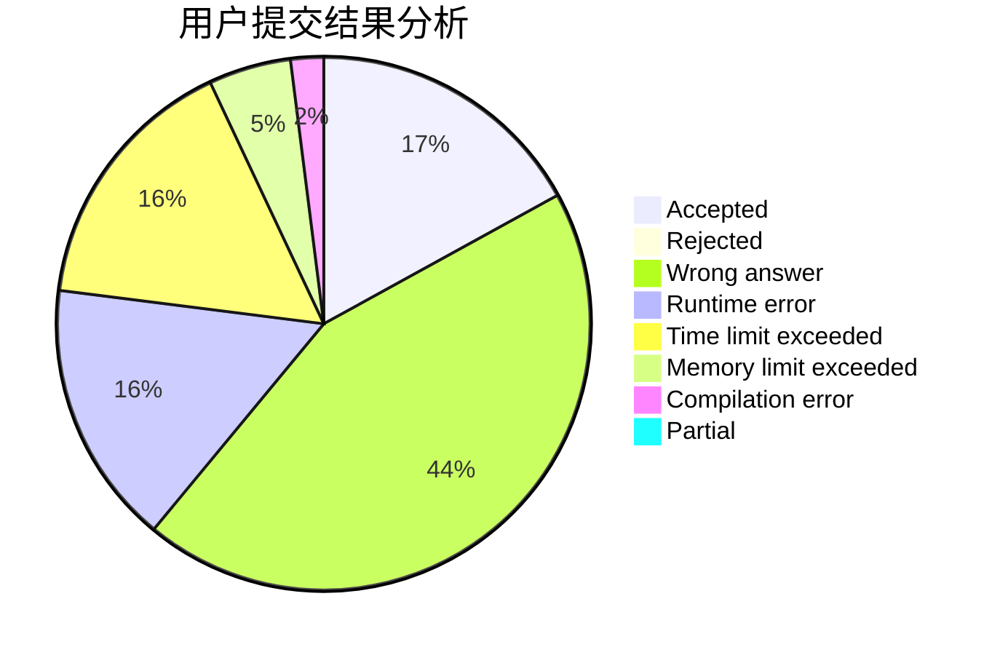
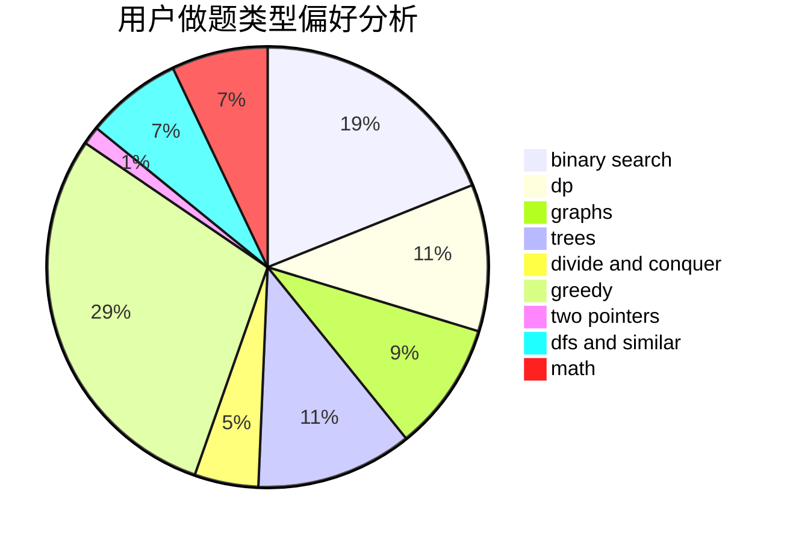

# Eclosion

<!-- tabs:start -->

#### **用户提交结果分析**

#### **用户做题类型偏好分析**

<!-- tabs:end -->
# 推荐题目
[281A](https://codeforces.com/contest/281/problem/A)
[1344A](https://codeforces.com/contest/1344/problem/A)
[827D](https://codeforces.com/contest/827/problem/D)
[359C](https://codeforces.com/contest/359/problem/C)
[1045C](https://codeforces.com/contest/1045/problem/C)
[827A](https://codeforces.com/contest/827/problem/A)
[1164I](https://codeforces.com/contest/1164/problem/I)
[411A](https://codeforces.com/contest/411/problem/A)
[1129B](https://codeforces.com/contest/1129/problem/B)
[57D](https://codeforces.com/contest/57/problem/D)
