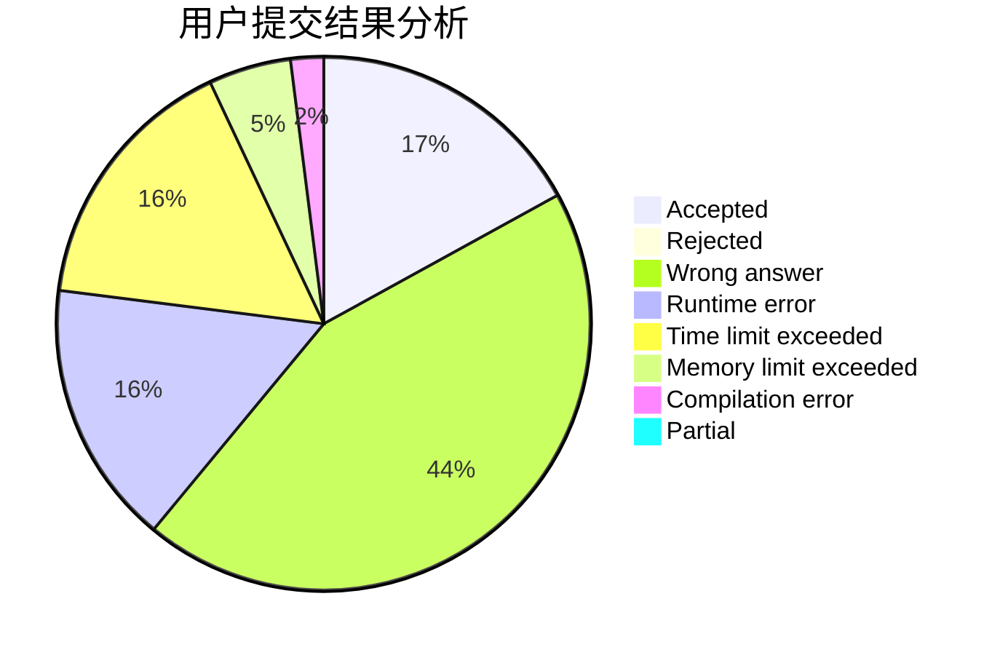
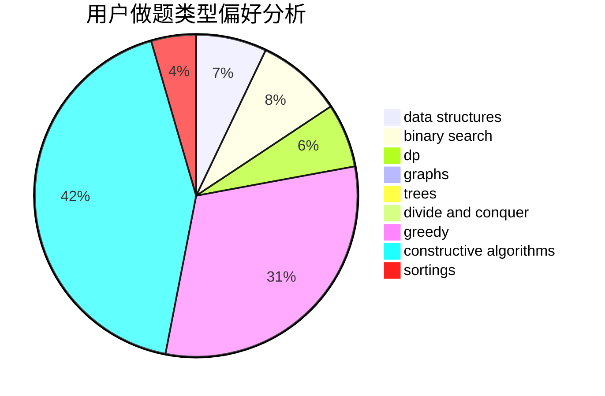

# Eclosion
<!-- tabs:start -->
#### **用户提交结果分析**

#### **用户做题类型偏好分析**

#### **用户错题知识点分析**

<!-- tabs:end -->
# 推荐题目
[1451E1](http://codeforces.com/problemset/problem/1451/E1)		bitmasks,
                        constructive algorithms,
                        interactive,
                        math		  
[1044B](http://codeforces.com/problemset/problem/1044/B)		dfs and similar,
                        interactive,
                        trees		  
[331C3](http://codeforces.com/problemset/problem/331/C3)		dp		  
[1336E2](http://codeforces.com/problemset/problem/1336/E2)		bitmasks,
                        brute force,
                        combinatorics,
                        math		  
[671D](http://codeforces.com/problemset/problem/671/D)		data structures,
                        dp,
                        greedy		  
[1119F](http://codeforces.com/problemset/problem/1119/F)		data structures,
                        dp,
                        trees		  
[1427F](http://codeforces.com/problemset/problem/1427/F)		data structures,
                        greedy,
                        trees		  
[553A](http://codeforces.com/problemset/problem/553/A)		combinatorics,
                        dp,
                        math		  
[809B](http://codeforces.com/problemset/problem/809/B)		binary search,
                        interactive		  
[799E](http://codeforces.com/problemset/problem/799/E)		data structures,
                        greedy,
                        two pointers		  
<!-- tabs:start -->
#### **data structures**
[671D](http://codeforces.com/problemset/problem/671/D)		data structures,
                        dp,
                        greedy		  
[1119F](http://codeforces.com/problemset/problem/1119/F)		data structures,
                        dp,
                        trees		  
[1427F](http://codeforces.com/problemset/problem/1427/F)		data structures,
                        greedy,
                        trees		  
[799E](http://codeforces.com/problemset/problem/799/E)		data structures,
                        greedy,
                        two pointers		  
[555C](http://codeforces.com/problemset/problem/555/C)		data structures		  
[341D](http://codeforces.com/problemset/problem/341/D)		data structures		  
[1298E](https://codeforces.com/contest/1298/problem/E)		binary search,
                        data structures,
                        implementation		  
[1446D2](http://codeforces.com/problemset/problem/1446/D2)		data structures,
                        greedy,
                        two pointers		  
[380C](http://codeforces.com/problemset/problem/380/C)		data structures,
                        schedules		  
[809D](http://codeforces.com/problemset/problem/809/D)		data structures,
                        dp		  
#### **binary search**
[809B](http://codeforces.com/problemset/problem/809/B)		binary search,
                        interactive		  
[416C](http://codeforces.com/problemset/problem/416/C)		binary search,
                        dp,
                        greedy,
                        implementation		  
[1165F1](http://codeforces.com/problemset/problem/1165/F1)		binary search,
                        greedy		  
[1298E](https://codeforces.com/contest/1298/problem/E)		binary search,
                        data structures,
                        implementation		  
[1240E](https://codeforces.com/contest/1240/problem/E)		binary search,
                        math,
                        number theory		  
[1344D](http://codeforces.com/problemset/problem/1344/D)		binary search,
                        greedy,
                        math		  
[1355C](http://codeforces.com/problemset/problem/1355/C)		binary search,
                        implementation,
                        math,
                        two pointers		  
[1492C](http://codeforces.com/problemset/problem/1492/C)		binary search,
                        data structures,
                        dp,
                        greedy,
                        two pointers		  
[1463D](http://codeforces.com/problemset/problem/1463/D)		binary search,
                        constructive algorithms,
                        greedy,
                        two pointers		  
[1490G](http://codeforces.com/problemset/problem/1490/G)		binary search,
                        data structures,
                        math		  
#### **dp**
[331C3](http://codeforces.com/problemset/problem/331/C3)		dp		  
[671D](http://codeforces.com/problemset/problem/671/D)		data structures,
                        dp,
                        greedy		  
[1119F](http://codeforces.com/problemset/problem/1119/F)		data structures,
                        dp,
                        trees		  
[553A](http://codeforces.com/problemset/problem/553/A)		combinatorics,
                        dp,
                        math		  
[416C](http://codeforces.com/problemset/problem/416/C)		binary search,
                        dp,
                        greedy,
                        implementation		  
[1140E](http://codeforces.com/problemset/problem/1140/E)		combinatorics,
                        divide and conquer,
                        dp		  
[265D](https://codeforces.com/contest/265/problem/D)		dp,
                        number theory		  
[785D](http://codeforces.com/problemset/problem/785/D)		combinatorics,
                        dp,
                        math,
                        number theory		  
[809C](http://codeforces.com/problemset/problem/809/C)		combinatorics,
                        divide and conquer,
                        dp		  
[294B](http://codeforces.com/problemset/problem/294/B)		dp,
                        greedy		  
#### **graph**
[1010D](http://codeforces.com/problemset/problem/1010/D)		dfs and similar,
                        graphs,
                        implementation,
                        trees		  
[1142E](http://codeforces.com/problemset/problem/1142/E)		graphs,
                        interactive		  
[1487C](http://codeforces.com/problemset/problem/1487/C)		brute force,
                        constructive algorithms,
                        dfs and similar,
                        graphs,
                        greedy,
                        implementation,
                        math		  
[1437C](http://codeforces.com/problemset/problem/1437/C)		dp,
                        flows,
                        graph matchings,
                        greedy,
                        math,
                        sortings		  
[1470D](http://codeforces.com/problemset/problem/1470/D)		constructive algorithms,
                        dfs and similar,
                        graph matchings,
                        graphs,
                        greedy		  
[1476C](http://codeforces.com/problemset/problem/1476/C)		dp,
                        graphs,
                        greedy		  
[1304D](http://codeforces.com/problemset/problem/1304/D)		constructive algorithms,
                        graphs,
                        greedy,
                        two pointers		  
[1475C](http://codeforces.com/problemset/problem/1475/C)		combinatorics,
                        graphs,
                        math		  
[553E](http://codeforces.com/problemset/problem/553/E)		dp,
                        fft,
                        graphs,
                        math,
                        probabilities		  
[1495C](http://codeforces.com/problemset/problem/1495/C)		constructive algorithms,
                        graphs		  
#### **trees**
[1044B](http://codeforces.com/problemset/problem/1044/B)		dfs and similar,
                        interactive,
                        trees		  
[1119F](http://codeforces.com/problemset/problem/1119/F)		data structures,
                        dp,
                        trees		  
[1427F](http://codeforces.com/problemset/problem/1427/F)		data structures,
                        greedy,
                        trees		  
[1010D](http://codeforces.com/problemset/problem/1010/D)		dfs and similar,
                        graphs,
                        implementation,
                        trees		  
[809E](http://codeforces.com/problemset/problem/809/E)		divide and conquer,
                        math,
                        number theory,
                        trees		  
[1479D](http://codeforces.com/problemset/problem/1479/D)		binary search,
                        bitmasks,
                        brute force,
                        data structures,
                        probabilities,
                        trees		  
[1511C](http://codeforces.com/problemset/problem/1511/C)		brute force,
                        data structures,
                        implementation,
                        trees		  
[1499F](http://codeforces.com/problemset/problem/1499/F)		combinatorics,
                        dfs and similar,
                        dp,
                        trees		  
[1491E](http://codeforces.com/problemset/problem/1491/E)		brute force,
                        dfs and similar,
                        divide and conquer,
                        number theory,
                        trees		  
[1466D](http://codeforces.com/problemset/problem/1466/D)		data structures,
                        greedy,
                        sortings,
                        trees		  
#### **divide and conquer**
[1140E](http://codeforces.com/problemset/problem/1140/E)		combinatorics,
                        divide and conquer,
                        dp		  
[809C](http://codeforces.com/problemset/problem/809/C)		combinatorics,
                        divide and conquer,
                        dp		  
[809E](http://codeforces.com/problemset/problem/809/E)		divide and conquer,
                        math,
                        number theory,
                        trees		  
[1461D](http://codeforces.com/problemset/problem/1461/D)		binary search,
                        brute force,
                        data structures,
                        divide and conquer,
                        implementation,
                        sortings		  
[1466G](http://codeforces.com/problemset/problem/1466/G)		combinatorics,
                        divide and conquer,
                        hashing,
                        math,
                        string suffix structures,
                        strings		  
[1490D](http://codeforces.com/problemset/problem/1490/D)		dfs and similar,
                        divide and conquer,
                        implementation		  
[1483C](https://codeforces.com/contest/1483/problem/C)		data structures,
                        divide and conquer,
                        dp		  
[1491E](http://codeforces.com/problemset/problem/1491/E)		brute force,
                        dfs and similar,
                        divide and conquer,
                        number theory,
                        trees		  
[1303G](http://codeforces.com/problemset/problem/1303/G)		data structures,
                        divide and conquer,
                        geometry,
                        trees		  
[1494D](http://codeforces.com/problemset/problem/1494/D)		constructive algorithms,
                        data structures,
                        dfs and similar,
                        divide and conquer,
                        dsu,
                        greedy,
                        sortings,
                        trees		  
#### **greedy**
[671D](http://codeforces.com/problemset/problem/671/D)		data structures,
                        dp,
                        greedy		  
[1427F](http://codeforces.com/problemset/problem/1427/F)		data structures,
                        greedy,
                        trees		  
[799E](http://codeforces.com/problemset/problem/799/E)		data structures,
                        greedy,
                        two pointers		  
[1162B](http://codeforces.com/problemset/problem/1162/B)		brute force,
                        greedy		  
[416C](http://codeforces.com/problemset/problem/416/C)		binary search,
                        dp,
                        greedy,
                        implementation		  
[1165F1](http://codeforces.com/problemset/problem/1165/F1)		binary search,
                        greedy		  
[294B](http://codeforces.com/problemset/problem/294/B)		dp,
                        greedy		  
[1163A](http://codeforces.com/problemset/problem/1163/A)		greedy,
                        math		  
[1446D2](http://codeforces.com/problemset/problem/1446/D2)		data structures,
                        greedy,
                        two pointers		  
[418B](https://codeforces.com/contest/418/problem/B)		bitmasks,
                        dp,
                        greedy,
                        sortings		  
#### **constructive algorithms**
[1451E1](http://codeforces.com/problemset/problem/1451/E1)		bitmasks,
                        constructive algorithms,
                        interactive,
                        math		  
[1375D](http://codeforces.com/problemset/problem/1375/D)		brute force,
                        constructive algorithms,
                        sortings		  
[1325D](http://codeforces.com/problemset/problem/1325/D)		bitmasks,
                        constructive algorithms,
                        greedy,
                        number theory		  
[1493A](http://codeforces.com/problemset/problem/1493/A)		constructive algorithms,
                        greedy		  
[1463D](http://codeforces.com/problemset/problem/1463/D)		binary search,
                        constructive algorithms,
                        greedy,
                        two pointers		  
[1456B](https://codeforces.com/contest/1456/problem/B)		bitmasks,
                        brute force,
                        constructive algorithms		  
[1492D](http://codeforces.com/problemset/problem/1492/D)		bitmasks,
                        constructive algorithms,
                        greedy,
                        math		  
[1504D](https://codeforces.com/contest/1504/problem/D)		constructive algorithms,
                        games,
                        interactive		  
[1483A](https://codeforces.com/contest/1483/problem/A)		brute force,
                        constructive algorithms,
                        greedy,
                        implementation		  
[1457D](https://codeforces.com/contest/1457/problem/D)		bitmasks,
                        brute force,
                        constructive algorithms		  
#### **sortings**
[418B](https://codeforces.com/contest/418/problem/B)		bitmasks,
                        dp,
                        greedy,
                        sortings		  
[1375D](http://codeforces.com/problemset/problem/1375/D)		brute force,
                        constructive algorithms,
                        sortings		  
[1495A](http://codeforces.com/problemset/problem/1495/A)		geometry,
                        greedy,
                        math,
                        sortings		  
[1496C](https://codeforces.com/contest/1496/problem/C)		geometry,
                        greedy,
                        math,
                        sortings		  
[1495A](http://codeforces.com/problemset/problem/1495/A)		geometry,
                        greedy,
                        math,
                        sortings		  
[1497A](http://codeforces.com/problemset/problem/1497/A)		brute force,
                        data structures,
                        greedy,
                        sortings		  
[1427A](http://codeforces.com/problemset/problem/1427/A)		math,
                        sortings		  
[1461D](http://codeforces.com/problemset/problem/1461/D)		binary search,
                        brute force,
                        data structures,
                        divide and conquer,
                        implementation,
                        sortings		  
[1437C](http://codeforces.com/problemset/problem/1437/C)		dp,
                        flows,
                        graph matchings,
                        greedy,
                        math,
                        sortings		  
[1473A](http://codeforces.com/problemset/problem/1473/A)		greedy,
                        implementation,
                        math,
                        sortings		  
<!-- tabs:end -->
