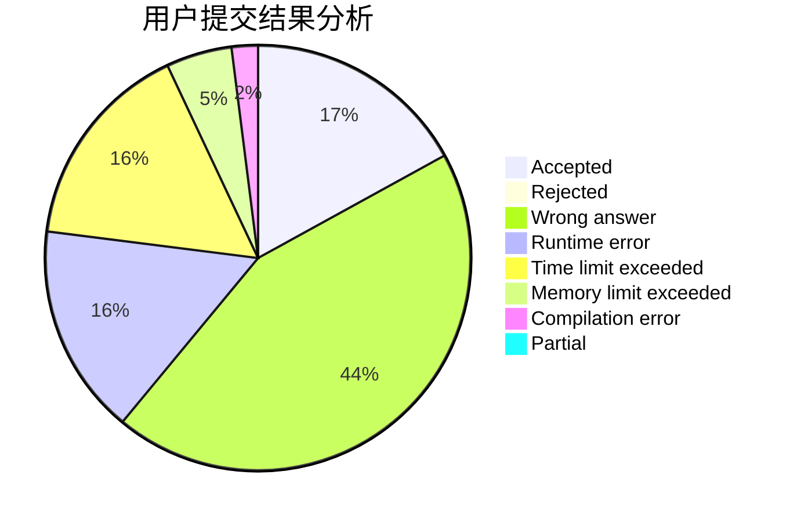
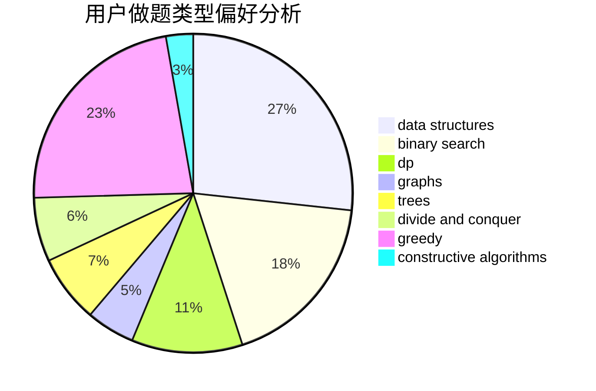

# Eclosion

<!-- tabs:start -->

#### **用户提交结果分析**

#### **用户做题类型偏好分析**

#### **用户错题知识点分析**

<!-- tabs:end -->
# 推荐题目
[281A](https://codeforces.com/contest/281/problem/A)		implementation,
                        strings		  
[1344A](https://codeforces.com/contest/1344/problem/A)		math,
                        number theory,
                        sortings		  
[827D](https://codeforces.com/contest/827/problem/D)		data structures,
                        dfs and similar,
                        graphs,
                        trees		  
[359C](https://codeforces.com/contest/359/problem/C)		math,
                        number theory		  
[1045C](https://codeforces.com/contest/1045/problem/C)		dfs and similar,
                        graphs,
                        trees		  
[827A](https://codeforces.com/contest/827/problem/A)		data structures,
                        greedy,
                        sortings,
                        strings		  
[1164I](https://codeforces.com/contest/1164/problem/I)		dsu,graphs,sortings,trees		  
[411A](https://codeforces.com/contest/411/problem/A)		*special problem,
                        implementation		  
[1129B](https://codeforces.com/contest/1129/problem/B)		constructive algorithms		  
[57D](https://codeforces.com/contest/57/problem/D)		dp,
                        math		  
