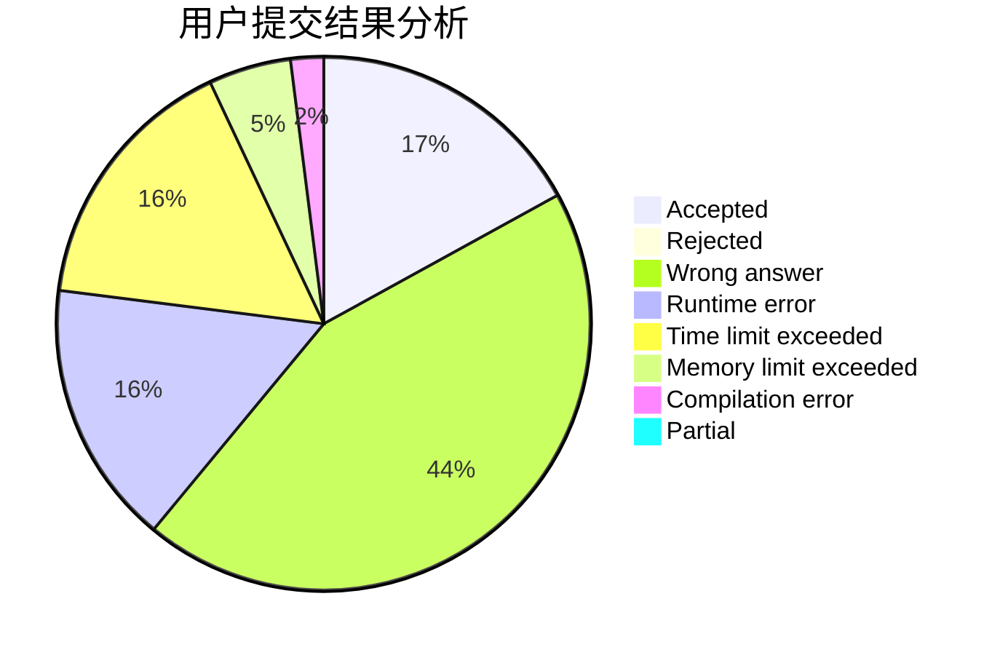
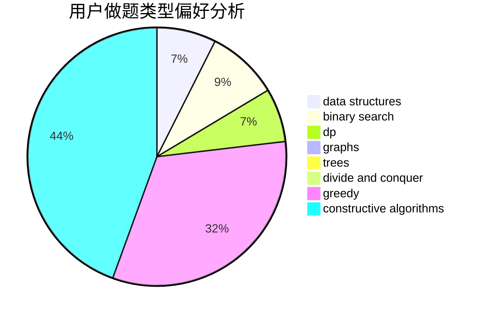

# Eclosion
<!-- tabs:start -->
#### **用户提交结果分析**

#### **用户做题类型偏好分析**

#### **用户错题知识点分析**

<!-- tabs:end -->
# 推荐题目
[Bitwise Queries (Easy Version)](http://codeforces.com/problemset/problem/1451/E1)		bitmasks,
                        constructive algorithms,
                        interactive,
                        math		  
[Intersecting Subtrees](http://codeforces.com/problemset/problem/1044/B)		dfs and similar,
                        interactive,
                        trees		  
[The Great Julya Calendar](http://codeforces.com/problemset/problem/331/C3)		dp		  
[Chiori and Doll Picking (hard version)](http://codeforces.com/problemset/problem/1336/E2)		bitmasks,
                        brute force,
                        combinatorics,
                        math		  
[Roads in Yusland](http://codeforces.com/problemset/problem/671/D)		data structures,
                        dp,
                        greedy		  
[Niyaz and Small Degrees](http://codeforces.com/problemset/problem/1119/F)		data structures,
                        dp,
                        trees		  
[Boring Card Game](http://codeforces.com/problemset/problem/1427/F)		data structures,
                        greedy,
                        trees		  
[Kyoya and Colored Balls](http://codeforces.com/problemset/problem/553/A)		combinatorics,
                        dp,
                        math		  
[Glad to see you!](http://codeforces.com/problemset/problem/809/B)		binary search,
                        interactive		  
[Aquarium decoration](http://codeforces.com/problemset/problem/799/E)		data structures,
                        greedy,
                        two pointers		  
<!-- tabs:start -->
#### **data structures**
[Bitwise Queries (Easy Version)](http://codeforces.com/problemset/problem/671/D)		data structures,
                        dp,
                        greedy		  
[Intersecting Subtrees](http://codeforces.com/problemset/problem/1119/F)		data structures,
                        dp,
                        trees		  
[The Great Julya Calendar](http://codeforces.com/problemset/problem/1427/F)		data structures,
                        greedy,
                        trees		  
[Chiori and Doll Picking (hard version)](http://codeforces.com/problemset/problem/799/E)		data structures,
                        greedy,
                        two pointers		  
[Roads in Yusland](http://codeforces.com/problemset/problem/555/C)		data structures		  
[Niyaz and Small Degrees](http://codeforces.com/problemset/problem/341/D)		data structures		  
[Boring Card Game](https://codeforces.com/contest/1298/problem/E)		binary search,
                        data structures,
                        implementation		  
[Kyoya and Colored Balls](http://codeforces.com/problemset/problem/1446/D2)		data structures,
                        greedy,
                        two pointers		  
[Glad to see you!](http://codeforces.com/problemset/problem/380/C)		data structures,
                        schedules		  
[Aquarium decoration](http://codeforces.com/problemset/problem/809/D)		data structures,
                        dp		  
#### **binary search**
[Bitwise Queries (Easy Version)](http://codeforces.com/problemset/problem/809/B)		binary search,
                        interactive		  
[Intersecting Subtrees](http://codeforces.com/problemset/problem/416/C)		binary search,
                        dp,
                        greedy,
                        implementation		  
[The Great Julya Calendar](http://codeforces.com/problemset/problem/1165/F1)		binary search,
                        greedy		  
[Chiori and Doll Picking (hard version)](https://codeforces.com/contest/1298/problem/E)		binary search,
                        data structures,
                        implementation		  
[Roads in Yusland](https://codeforces.com/contest/1240/problem/E)		binary search,
                        math,
                        number theory		  
[Niyaz and Small Degrees](http://codeforces.com/problemset/problem/1344/D)		binary search,
                        greedy,
                        math		  
[Boring Card Game](http://codeforces.com/problemset/problem/1355/C)		binary search,
                        implementation,
                        math,
                        two pointers		  
[Kyoya and Colored Balls](http://codeforces.com/problemset/problem/1492/C)		binary search,
                        data structures,
                        dp,
                        greedy,
                        two pointers		  
[Glad to see you!](http://codeforces.com/problemset/problem/1463/D)		binary search,
                        constructive algorithms,
                        greedy,
                        two pointers		  
[Aquarium decoration](http://codeforces.com/problemset/problem/1490/G)		binary search,
                        data structures,
                        math		  
#### **dp**
[Bitwise Queries (Easy Version)](http://codeforces.com/problemset/problem/331/C3)		dp		  
[Intersecting Subtrees](http://codeforces.com/problemset/problem/671/D)		data structures,
                        dp,
                        greedy		  
[The Great Julya Calendar](http://codeforces.com/problemset/problem/1119/F)		data structures,
                        dp,
                        trees		  
[Chiori and Doll Picking (hard version)](http://codeforces.com/problemset/problem/553/A)		combinatorics,
                        dp,
                        math		  
[Roads in Yusland](http://codeforces.com/problemset/problem/416/C)		binary search,
                        dp,
                        greedy,
                        implementation		  
[Niyaz and Small Degrees](http://codeforces.com/problemset/problem/1140/E)		combinatorics,
                        divide and conquer,
                        dp		  
[Boring Card Game](https://codeforces.com/contest/265/problem/D)		dp,
                        number theory		  
[Kyoya and Colored Balls](http://codeforces.com/problemset/problem/785/D)		combinatorics,
                        dp,
                        math,
                        number theory		  
[Glad to see you!](http://codeforces.com/problemset/problem/809/C)		combinatorics,
                        divide and conquer,
                        dp		  
[Aquarium decoration](http://codeforces.com/problemset/problem/294/B)		dp,
                        greedy		  
#### **graph**
[Bitwise Queries (Easy Version)](http://codeforces.com/problemset/problem/1010/D)		dfs and similar,
                        graphs,
                        implementation,
                        trees		  
[Intersecting Subtrees](http://codeforces.com/problemset/problem/1142/E)		graphs,
                        interactive		  
[The Great Julya Calendar](http://codeforces.com/problemset/problem/1487/C)		brute force,
                        constructive algorithms,
                        dfs and similar,
                        graphs,
                        greedy,
                        implementation,
                        math		  
[Chiori and Doll Picking (hard version)](http://codeforces.com/problemset/problem/1437/C)		dp,
                        flows,
                        graph matchings,
                        greedy,
                        math,
                        sortings		  
[Roads in Yusland](http://codeforces.com/problemset/problem/1470/D)		constructive algorithms,
                        dfs and similar,
                        graph matchings,
                        graphs,
                        greedy		  
[Niyaz and Small Degrees](http://codeforces.com/problemset/problem/1476/C)		dp,
                        graphs,
                        greedy		  
[Boring Card Game](http://codeforces.com/problemset/problem/1304/D)		constructive algorithms,
                        graphs,
                        greedy,
                        two pointers		  
[Kyoya and Colored Balls](http://codeforces.com/problemset/problem/1475/C)		combinatorics,
                        graphs,
                        math		  
[Glad to see you!](http://codeforces.com/problemset/problem/553/E)		dp,
                        fft,
                        graphs,
                        math,
                        probabilities		  
[Aquarium decoration](http://codeforces.com/problemset/problem/1495/C)		constructive algorithms,
                        graphs		  
#### **trees**
[Bitwise Queries (Easy Version)](http://codeforces.com/problemset/problem/1044/B)		dfs and similar,
                        interactive,
                        trees		  
[Intersecting Subtrees](http://codeforces.com/problemset/problem/1119/F)		data structures,
                        dp,
                        trees		  
[The Great Julya Calendar](http://codeforces.com/problemset/problem/1427/F)		data structures,
                        greedy,
                        trees		  
[Chiori and Doll Picking (hard version)](http://codeforces.com/problemset/problem/1010/D)		dfs and similar,
                        graphs,
                        implementation,
                        trees		  
[Roads in Yusland](http://codeforces.com/problemset/problem/809/E)		divide and conquer,
                        math,
                        number theory,
                        trees		  
[Niyaz and Small Degrees](http://codeforces.com/problemset/problem/1479/D)		binary search,
                        bitmasks,
                        brute force,
                        data structures,
                        probabilities,
                        trees		  
[Boring Card Game](http://codeforces.com/problemset/problem/1511/C)		brute force,
                        data structures,
                        implementation,
                        trees		  
[Kyoya and Colored Balls](http://codeforces.com/problemset/problem/1499/F)		combinatorics,
                        dfs and similar,
                        dp,
                        trees		  
[Glad to see you!](http://codeforces.com/problemset/problem/1491/E)		brute force,
                        dfs and similar,
                        divide and conquer,
                        number theory,
                        trees		  
[Aquarium decoration](http://codeforces.com/problemset/problem/1466/D)		data structures,
                        greedy,
                        sortings,
                        trees		  
#### **divide and conquer**
[Bitwise Queries (Easy Version)](http://codeforces.com/problemset/problem/1140/E)		combinatorics,
                        divide and conquer,
                        dp		  
[Intersecting Subtrees](http://codeforces.com/problemset/problem/809/C)		combinatorics,
                        divide and conquer,
                        dp		  
[The Great Julya Calendar](http://codeforces.com/problemset/problem/809/E)		divide and conquer,
                        math,
                        number theory,
                        trees		  
[Chiori and Doll Picking (hard version)](http://codeforces.com/problemset/problem/1461/D)		binary search,
                        brute force,
                        data structures,
                        divide and conquer,
                        implementation,
                        sortings		  
[Roads in Yusland](http://codeforces.com/problemset/problem/1466/G)		combinatorics,
                        divide and conquer,
                        hashing,
                        math,
                        string suffix structures,
                        strings		  
[Niyaz and Small Degrees](http://codeforces.com/problemset/problem/1490/D)		dfs and similar,
                        divide and conquer,
                        implementation		  
[Boring Card Game](https://codeforces.com/contest/1483/problem/C)		data structures,
                        divide and conquer,
                        dp		  
[Kyoya and Colored Balls](http://codeforces.com/problemset/problem/1491/E)		brute force,
                        dfs and similar,
                        divide and conquer,
                        number theory,
                        trees		  
[Glad to see you!](http://codeforces.com/problemset/problem/1303/G)		data structures,
                        divide and conquer,
                        geometry,
                        trees		  
[Aquarium decoration](http://codeforces.com/problemset/problem/1494/D)		constructive algorithms,
                        data structures,
                        dfs and similar,
                        divide and conquer,
                        dsu,
                        greedy,
                        sortings,
                        trees		  
#### **greedy**
[Bitwise Queries (Easy Version)](http://codeforces.com/problemset/problem/671/D)		data structures,
                        dp,
                        greedy		  
[Intersecting Subtrees](http://codeforces.com/problemset/problem/1427/F)		data structures,
                        greedy,
                        trees		  
[The Great Julya Calendar](http://codeforces.com/problemset/problem/799/E)		data structures,
                        greedy,
                        two pointers		  
[Chiori and Doll Picking (hard version)](http://codeforces.com/problemset/problem/1162/B)		brute force,
                        greedy		  
[Roads in Yusland](http://codeforces.com/problemset/problem/416/C)		binary search,
                        dp,
                        greedy,
                        implementation		  
[Niyaz and Small Degrees](http://codeforces.com/problemset/problem/1165/F1)		binary search,
                        greedy		  
[Boring Card Game](http://codeforces.com/problemset/problem/294/B)		dp,
                        greedy		  
[Kyoya and Colored Balls](http://codeforces.com/problemset/problem/1163/A)		greedy,
                        math		  
[Glad to see you!](http://codeforces.com/problemset/problem/1446/D2)		data structures,
                        greedy,
                        two pointers		  
[Aquarium decoration](https://codeforces.com/contest/418/problem/B)		bitmasks,
                        dp,
                        greedy,
                        sortings		  
#### **constructive algorithms**
[Bitwise Queries (Easy Version)](http://codeforces.com/problemset/problem/1451/E1)		bitmasks,
                        constructive algorithms,
                        interactive,
                        math		  
[Intersecting Subtrees](http://codeforces.com/problemset/problem/1375/D)		brute force,
                        constructive algorithms,
                        sortings		  
[The Great Julya Calendar](http://codeforces.com/problemset/problem/1325/D)		bitmasks,
                        constructive algorithms,
                        greedy,
                        number theory		  
[Chiori and Doll Picking (hard version)](http://codeforces.com/problemset/problem/1493/A)		constructive algorithms,
                        greedy		  
[Roads in Yusland](http://codeforces.com/problemset/problem/1463/D)		binary search,
                        constructive algorithms,
                        greedy,
                        two pointers		  
[Niyaz and Small Degrees](https://codeforces.com/contest/1456/problem/B)		bitmasks,
                        brute force,
                        constructive algorithms		  
[Boring Card Game](http://codeforces.com/problemset/problem/1492/D)		bitmasks,
                        constructive algorithms,
                        greedy,
                        math		  
[Kyoya and Colored Balls](https://codeforces.com/contest/1504/problem/D)		constructive algorithms,
                        games,
                        interactive		  
[Glad to see you!](https://codeforces.com/contest/1483/problem/A)		brute force,
                        constructive algorithms,
                        greedy,
                        implementation		  
[Aquarium decoration](https://codeforces.com/contest/1457/problem/D)		bitmasks,
                        brute force,
                        constructive algorithms		  
#### **sortings**
[Bitwise Queries (Easy Version)](https://codeforces.com/contest/418/problem/B)		bitmasks,
                        dp,
                        greedy,
                        sortings		  
[Intersecting Subtrees](http://codeforces.com/problemset/problem/1375/D)		brute force,
                        constructive algorithms,
                        sortings		  
[The Great Julya Calendar](http://codeforces.com/problemset/problem/1495/A)		geometry,
                        greedy,
                        math,
                        sortings		  
[Chiori and Doll Picking (hard version)](https://codeforces.com/contest/1496/problem/C)		geometry,
                        greedy,
                        math,
                        sortings		  
[Roads in Yusland](http://codeforces.com/problemset/problem/1495/A)		geometry,
                        greedy,
                        math,
                        sortings		  
[Niyaz and Small Degrees](http://codeforces.com/problemset/problem/1497/A)		brute force,
                        data structures,
                        greedy,
                        sortings		  
[Boring Card Game](http://codeforces.com/problemset/problem/1427/A)		math,
                        sortings		  
[Kyoya and Colored Balls](http://codeforces.com/problemset/problem/1461/D)		binary search,
                        brute force,
                        data structures,
                        divide and conquer,
                        implementation,
                        sortings		  
[Glad to see you!](http://codeforces.com/problemset/problem/1437/C)		dp,
                        flows,
                        graph matchings,
                        greedy,
                        math,
                        sortings		  
[Aquarium decoration](http://codeforces.com/problemset/problem/1473/A)		greedy,
                        implementation,
                        math,
                        sortings		  
<!-- tabs:end -->
