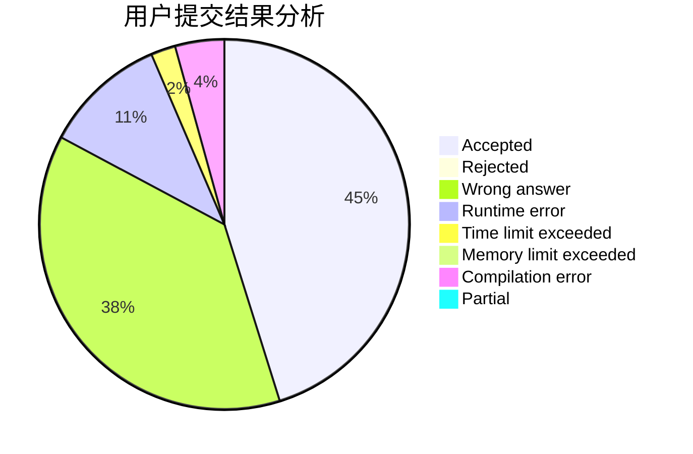
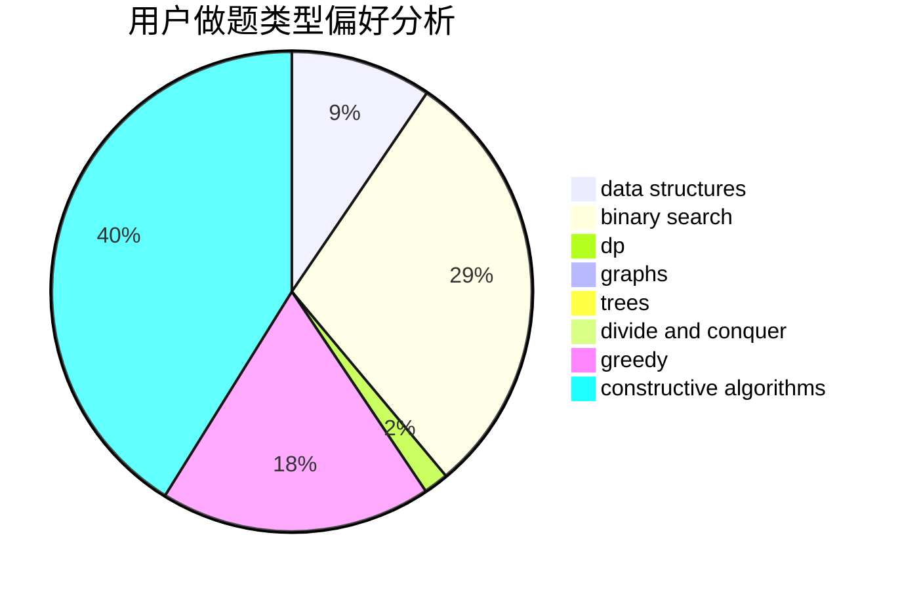

# EdChu
<!-- tabs:start -->
#### **用户提交结果分析**

#### **用户做题类型偏好分析**

#### **用户错题知识点分析**

<!-- tabs:end -->
# 推荐题目
[Big Maximum Sum](http://codeforces.com/problemset/problem/75/D)		data structures,
                        dp,
                        greedy,
                        implementation,
                        math,
                        trees		  
[Do you want a date?](https://codeforces.com/contest/810/problem/C)		implementation,
                        math,
                        sortings		  
[Straight <<A>>](http://codeforces.com/problemset/problem/810/A)		implementation,
                        math		  
[Hongcow Learns the Cyclic Shift](http://codeforces.com/problemset/problem/745/A)		implementation,
                        strings		  
[Duff in Love](http://codeforces.com/problemset/problem/588/B)		math		  
[Nick and Array](http://codeforces.com/problemset/problem/1180/B)		greedy,
                        implementation		  
[New Year Snowmen](http://codeforces.com/problemset/problem/140/C)		binary search,
                        data structures,
                        greedy		  
[Strange Addition](http://codeforces.com/problemset/problem/305/A)		brute force,
                        constructive algorithms,
                        implementation		  
[Depression](http://codeforces.com/problemset/problem/80/B)		geometry,
                        math		  
[Saving the City](http://codeforces.com/problemset/problem/1443/B)		dp,
                        greedy,
                        math,
                        sortings		  
<!-- tabs:start -->
#### **data structures**
[Big Maximum Sum](http://codeforces.com/problemset/problem/75/D)		data structures,
                        dp,
                        greedy,
                        implementation,
                        math,
                        trees		  
[New Year Snowmen](http://codeforces.com/problemset/problem/140/C)		binary search,
                        data structures,
                        greedy		  
[T-Shirts](http://codeforces.com/problemset/problem/702/F)		data structures		  
[Bear and Bad Powers of 42](http://codeforces.com/problemset/problem/679/E)		data structures		  
[Maximum width](http://codeforces.com/problemset/problem/1492/C)		binary search,
                        data structures,
                        dp,
                        greedy,
                        two pointers		  
[Old Floppy Drive](http://codeforces.com/problemset/problem/1490/G)		binary search,
                        data structures,
                        math		  
[Odd Mineral Resource](http://codeforces.com/problemset/problem/1479/D)		binary search,
                        bitmasks,
                        brute force,
                        data structures,
                        probabilities,
                        trees		  
[Meximization](http://codeforces.com/problemset/problem/1497/A)		brute force,
                        data structures,
                        greedy,
                        sortings		  
[Pekora and Trampoline](http://codeforces.com/problemset/problem/1491/C)		brute force,
                        data structures,
                        dp,
                        greedy,
                        implementation		  
[Card Deck](http://codeforces.com/problemset/problem/1492/B)		data structures,
                        greedy,
                        math		  
#### **binary search**
[New Year Snowmen](http://codeforces.com/problemset/problem/140/C)		binary search,
                        data structures,
                        greedy		  
[The Party and Sweets](https://codeforces.com/contest/1159/problem/C)		binary search,
                        constructive algorithms,
                        greedy,
                        implementation,
                        math,
                        sortings,
                        two pointers		  
[Glad to see you!](https://codeforces.com/contest/810/problem/D)		binary search,
                        interactive		  
[Maximum width](http://codeforces.com/problemset/problem/1492/C)		binary search,
                        data structures,
                        dp,
                        greedy,
                        two pointers		  
[Pairs](http://codeforces.com/problemset/problem/1463/D)		binary search,
                        constructive algorithms,
                        greedy,
                        two pointers		  
[Old Floppy Drive](http://codeforces.com/problemset/problem/1490/G)		binary search,
                        data structures,
                        math		  
[Odd Mineral Resource](http://codeforces.com/problemset/problem/1479/D)		binary search,
                        bitmasks,
                        brute force,
                        data structures,
                        probabilities,
                        trees		  
[Complicated Computations](http://codeforces.com/problemset/problem/1436/E)		binary search,
                        data structures,
                        two pointers		  
[Divide and Summarize](http://codeforces.com/problemset/problem/1461/D)		binary search,
                        brute force,
                        data structures,
                        divide and conquer,
                        implementation,
                        sortings		  
[K-beautiful Strings](http://codeforces.com/problemset/problem/1493/C)		binary search,
                        brute force,
                        constructive algorithms,
                        greedy,
                        strings		  
#### **dp**
[Big Maximum Sum](http://codeforces.com/problemset/problem/75/D)		data structures,
                        dp,
                        greedy,
                        implementation,
                        math,
                        trees		  
[Saving the City](http://codeforces.com/problemset/problem/1443/B)		dp,
                        greedy,
                        math,
                        sortings		  
[Mysterious Present](http://codeforces.com/problemset/problem/4/D)		dp,
                        sortings		  
[Maximum width](http://codeforces.com/problemset/problem/1492/C)		binary search,
                        data structures,
                        dp,
                        greedy,
                        two pointers		  
[Bouncing Ball](https://codeforces.com/contest/1457/problem/C)		brute force,
                        dp,
                        implementation		  
[Pekora and Trampoline](http://codeforces.com/problemset/problem/1491/C)		brute force,
                        data structures,
                        dp,
                        greedy,
                        implementation		  
[Chef Monocarp](http://codeforces.com/problemset/problem/1437/C)		dp,
                        flows,
                        graph matchings,
                        greedy,
                        math,
                        sortings		  
[Binary Removals](http://codeforces.com/problemset/problem/1499/B)		brute force,
                        dp,
                        greedy,
                        implementation		  
[Zookeeper and The Infinite Zoo](http://codeforces.com/problemset/problem/1491/D)		bitmasks,
                        constructive algorithms,
                        dp,
                        greedy,
                        math		  
[Square-free division (easy version)](http://codeforces.com/problemset/problem/1497/E1)		data structures,
                        dp,
                        greedy,
                        math,
                        number theory,
                        two pointers		  
#### **graph**
[Minimum Ties](http://codeforces.com/problemset/problem/1487/C)		brute force,
                        constructive algorithms,
                        dfs and similar,
                        graphs,
                        greedy,
                        implementation,
                        math		  
[Chef Monocarp](http://codeforces.com/problemset/problem/1437/C)		dp,
                        flows,
                        graph matchings,
                        greedy,
                        math,
                        sortings		  
[Strange Housing](http://codeforces.com/problemset/problem/1470/D)		constructive algorithms,
                        dfs and similar,
                        graph matchings,
                        graphs,
                        greedy		  
[Longest Simple Cycle](http://codeforces.com/problemset/problem/1476/C)		dp,
                        graphs,
                        greedy		  
[Shortest and Longest LIS](http://codeforces.com/problemset/problem/1304/D)		constructive algorithms,
                        graphs,
                        greedy,
                        two pointers		  
[Ball in Berland](http://codeforces.com/problemset/problem/1475/C)		combinatorics,
                        graphs,
                        math		  
[Kyoya and Train](http://codeforces.com/problemset/problem/553/E)		dp,
                        fft,
                        graphs,
                        math,
                        probabilities		  
[Garden of the Sun](http://codeforces.com/problemset/problem/1495/C)		constructive algorithms,
                        graphs		  
[King's Task](http://codeforces.com/problemset/problem/1510/K)		brute force,
                        graphs,
                        implementation		  
[Min Cost String](http://codeforces.com/problemset/problem/1511/D)		brute force,
                        constructive algorithms,
                        graphs,
                        greedy,
                        strings		  
#### **trees**
[Big Maximum Sum](http://codeforces.com/problemset/problem/75/D)		data structures,
                        dp,
                        greedy,
                        implementation,
                        math,
                        trees		  
[Odd Mineral Resource](http://codeforces.com/problemset/problem/1479/D)		binary search,
                        bitmasks,
                        brute force,
                        data structures,
                        probabilities,
                        trees		  
[Yet Another Card Deck](http://codeforces.com/problemset/problem/1511/C)		brute force,
                        data structures,
                        implementation,
                        trees		  
[Diameter Cuts](http://codeforces.com/problemset/problem/1499/F)		combinatorics,
                        dfs and similar,
                        dp,
                        trees		  
[Fib-tree](http://codeforces.com/problemset/problem/1491/E)		brute force,
                        dfs and similar,
                        divide and conquer,
                        number theory,
                        trees		  
[13th Labour of Heracles](http://codeforces.com/problemset/problem/1466/D)		data structures,
                        greedy,
                        sortings,
                        trees		  
[BFS Trees](http://codeforces.com/problemset/problem/1495/D)		combinatorics,
                        dfs and similar,
                        graphs,
                        math,
                        shortest paths,
                        trees		  
[Sum of Prefix Sums](http://codeforces.com/problemset/problem/1303/G)		data structures,
                        divide and conquer,
                        geometry,
                        trees		  
[Number of Simple Paths](http://codeforces.com/problemset/problem/1454/E)		combinatorics,
                        dfs and similar,
                        graphs,
                        trees		  
[Dogeforces](http://codeforces.com/problemset/problem/1494/D)		constructive algorithms,
                        data structures,
                        dfs and similar,
                        divide and conquer,
                        dsu,
                        greedy,
                        sortings,
                        trees		  
#### **divide and conquer**
[Divide and Summarize](http://codeforces.com/problemset/problem/1461/D)		binary search,
                        brute force,
                        data structures,
                        divide and conquer,
                        implementation,
                        sortings		  
[Song of the Sirens](http://codeforces.com/problemset/problem/1466/G)		combinatorics,
                        divide and conquer,
                        hashing,
                        math,
                        string suffix structures,
                        strings		  
[Permutation Transformation](http://codeforces.com/problemset/problem/1490/D)		dfs and similar,
                        divide and conquer,
                        implementation		  
[Skyline Photo](https://codeforces.com/contest/1483/problem/C)		data structures,
                        divide and conquer,
                        dp		  
[Fib-tree](http://codeforces.com/problemset/problem/1491/E)		brute force,
                        dfs and similar,
                        divide and conquer,
                        number theory,
                        trees		  
[Sum of Prefix Sums](http://codeforces.com/problemset/problem/1303/G)		data structures,
                        divide and conquer,
                        geometry,
                        trees		  
[Dogeforces](http://codeforces.com/problemset/problem/1494/D)		constructive algorithms,
                        data structures,
                        dfs and similar,
                        divide and conquer,
                        dsu,
                        greedy,
                        sortings,
                        trees		  
[Skyline Photo](http://codeforces.com/problemset/problem/1482/E)		data structures,
                        divide and conquer,
                        dp		  
[Logistical Questions](http://codeforces.com/problemset/problem/566/C)		dfs and similar,
                        divide and conquer,
                        trees		  
[Fruit Sequences](http://codeforces.com/problemset/problem/1428/F)		binary search,
                        data structures,
                        divide and conquer,
                        dp,
                        two pointers		  
#### **greedy**
[Big Maximum Sum](http://codeforces.com/problemset/problem/75/D)		data structures,
                        dp,
                        greedy,
                        implementation,
                        math,
                        trees		  
[Nick and Array](http://codeforces.com/problemset/problem/1180/B)		greedy,
                        implementation		  
[New Year Snowmen](http://codeforces.com/problemset/problem/140/C)		binary search,
                        data structures,
                        greedy		  
[Saving the City](http://codeforces.com/problemset/problem/1443/B)		dp,
                        greedy,
                        math,
                        sortings		  
[Magic, Wizardry and Wonders](http://codeforces.com/problemset/problem/231/B)		constructive algorithms,
                        greedy		  
[Summer sell-off](http://codeforces.com/problemset/problem/810/B)		greedy,
                        sortings		  
[Strange List](http://codeforces.com/problemset/problem/1471/B)		brute force,
                        greedy,
                        implementation,
                        math		  
[Tiles](http://codeforces.com/problemset/problem/1178/C)		combinatorics,
                        greedy,
                        math		  
[The Party and Sweets](https://codeforces.com/contest/1159/problem/C)		binary search,
                        constructive algorithms,
                        greedy,
                        implementation,
                        math,
                        sortings,
                        two pointers		  
[Binary Literature](http://codeforces.com/problemset/problem/1508/A)		constructive algorithms,
                        greedy,
                        implementation,
                        math,
                        strings,
                        two pointers		  
#### **constructive algorithms**
[Strange Addition](http://codeforces.com/problemset/problem/305/A)		brute force,
                        constructive algorithms,
                        implementation		  
[Magic, Wizardry and Wonders](http://codeforces.com/problemset/problem/231/B)		constructive algorithms,
                        greedy		  
[Guess the Array](http://codeforces.com/problemset/problem/727/C)		constructive algorithms,
                        interactive,
                        math		  
[The Party and Sweets](https://codeforces.com/contest/1159/problem/C)		binary search,
                        constructive algorithms,
                        greedy,
                        implementation,
                        math,
                        sortings,
                        two pointers		  
[Binary Literature](http://codeforces.com/problemset/problem/1508/A)		constructive algorithms,
                        greedy,
                        implementation,
                        math,
                        strings,
                        two pointers		  
[Anti-knapsack](http://codeforces.com/problemset/problem/1493/A)		constructive algorithms,
                        greedy		  
[Pairs](http://codeforces.com/problemset/problem/1463/D)		binary search,
                        constructive algorithms,
                        greedy,
                        two pointers		  
[XOR-gun](https://codeforces.com/contest/1456/problem/B)		bitmasks,
                        brute force,
                        constructive algorithms		  
[Genius's Gambit](http://codeforces.com/problemset/problem/1492/D)		bitmasks,
                        constructive algorithms,
                        greedy,
                        math		  
[3-Coloring](https://codeforces.com/contest/1504/problem/D)		constructive algorithms,
                        games,
                        interactive		  
#### **sortings**
[Do you want a date?](https://codeforces.com/contest/810/problem/C)		implementation,
                        math,
                        sortings		  
[Saving the City](http://codeforces.com/problemset/problem/1443/B)		dp,
                        greedy,
                        math,
                        sortings		  
[Summer sell-off](http://codeforces.com/problemset/problem/810/B)		greedy,
                        sortings		  
[The Party and Sweets](https://codeforces.com/contest/1159/problem/C)		binary search,
                        constructive algorithms,
                        greedy,
                        implementation,
                        math,
                        sortings,
                        two pointers		  
[Mysterious Present](http://codeforces.com/problemset/problem/4/D)		dp,
                        sortings		  
[Diamond Miner](https://codeforces.com/contest/1496/problem/C)		geometry,
                        greedy,
                        math,
                        sortings		  
[Diamond Miner](http://codeforces.com/problemset/problem/1495/A)		geometry,
                        greedy,
                        math,
                        sortings		  
[Meximization](http://codeforces.com/problemset/problem/1497/A)		brute force,
                        data structures,
                        greedy,
                        sortings		  
[Avoiding Zero](http://codeforces.com/problemset/problem/1427/A)		math,
                        sortings		  
[Divide and Summarize](http://codeforces.com/problemset/problem/1461/D)		binary search,
                        brute force,
                        data structures,
                        divide and conquer,
                        implementation,
                        sortings		  
<!-- tabs:end -->
