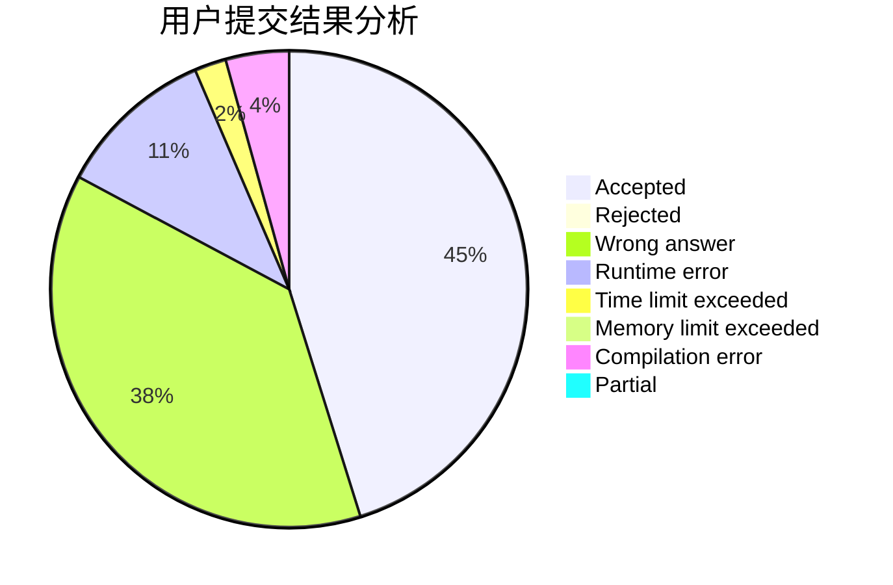
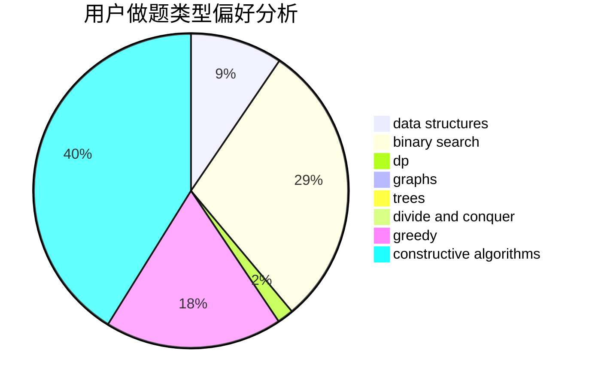

# EdChu

<!-- tabs:start -->

#### **用户提交结果分析**

#### **用户做题类型偏好分析**

#### **用户错题知识点分析**

<!-- tabs:end -->
# 推荐题目
[1180B](https://codeforces.com/contest/1180/problem/B)		greedy,
                        implementation		  
[75D](https://codeforces.com/contest/75/problem/D)		data structures,
                        dp,
                        greedy,
                        implementation,
                        math,
                        trees		  
[810C](https://codeforces.com/contest/810/problem/C)		dsu,graphs,sortings,trees		  
[1006D](https://codeforces.com/contest/1006/problem/D)		implementation		  
[810A](https://codeforces.com/contest/810/problem/A)		implementation,
                        math		  
[702F](https://codeforces.com/contest/702/problem/F)		data structures		  
[588B](https://codeforces.com/contest/588/problem/B)		math		  
[1508A](https://codeforces.com/contest/1508/problem/A)		constructive algorithms,
                        greedy,
                        implementation,
                        math,
                        strings,
                        two pointers		  
[231B](https://codeforces.com/contest/231/problem/B)		constructive algorithms,
                        greedy		  
[810D](https://codeforces.com/contest/810/problem/D)		dsu,graphs,sortings,trees		  
