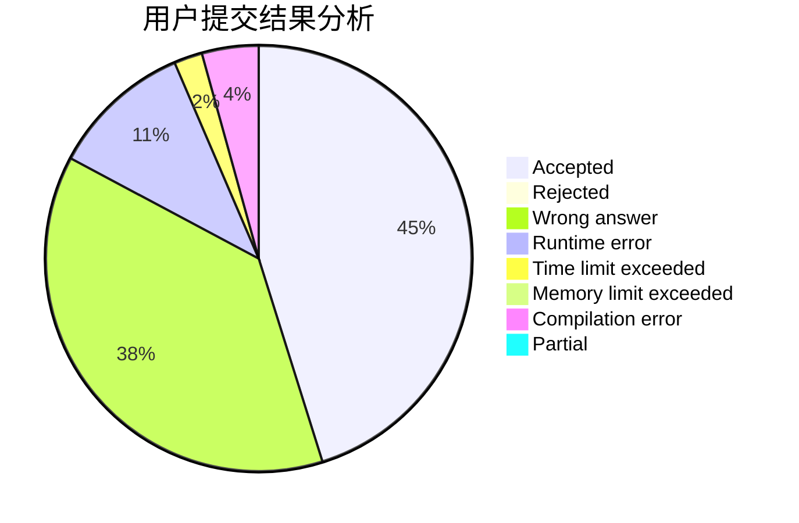
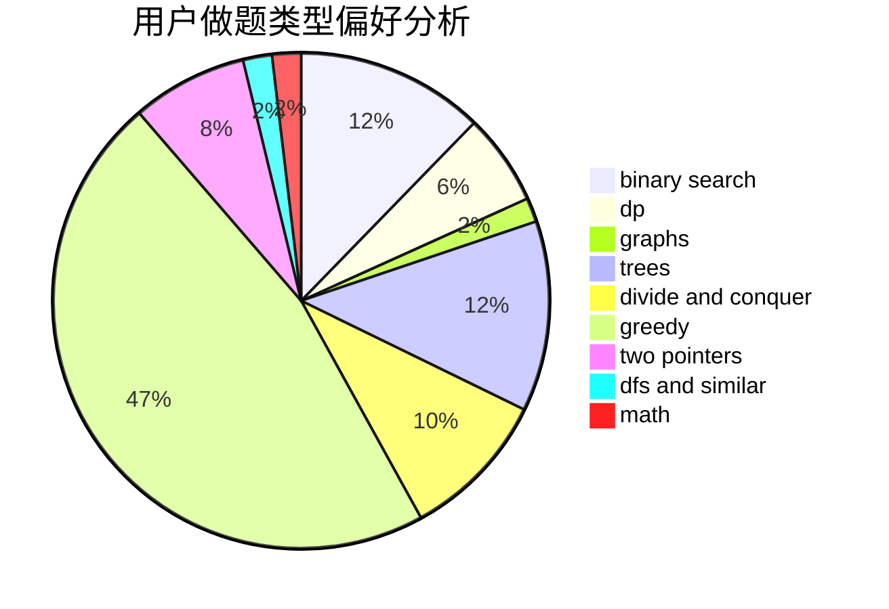

# EdChu

<!-- tabs:start -->

#### **用户提交结果分析**

#### **用户做题类型偏好分析**

<!-- tabs:end -->
# 推荐题目
[1183C](https://codeforces.com/contest/1183/problem/C)
[77B](https://codeforces.com/contest/77/problem/B)
[828C](https://codeforces.com/contest/828/problem/C)
[1007A](https://codeforces.com/contest/1007/problem/A)
[828A](https://codeforces.com/contest/828/problem/A)
[721D](https://codeforces.com/contest/721/problem/D)
[608D](https://codeforces.com/contest/608/problem/D)
[158E](https://codeforces.com/contest/158/problem/E)
[252A](https://codeforces.com/contest/252/problem/A)
[828D](https://codeforces.com/contest/828/problem/D)
