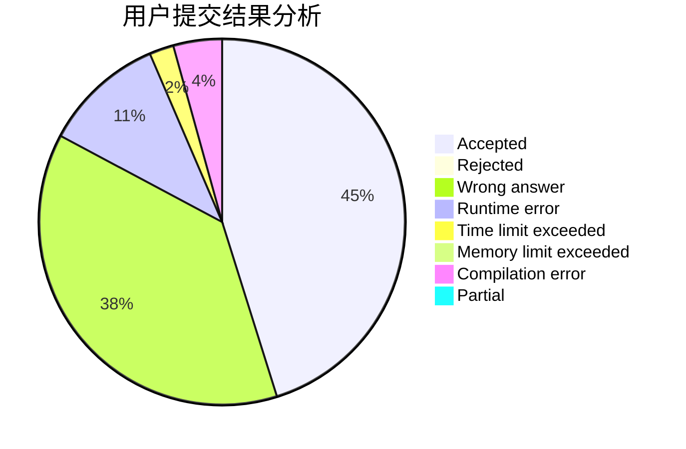
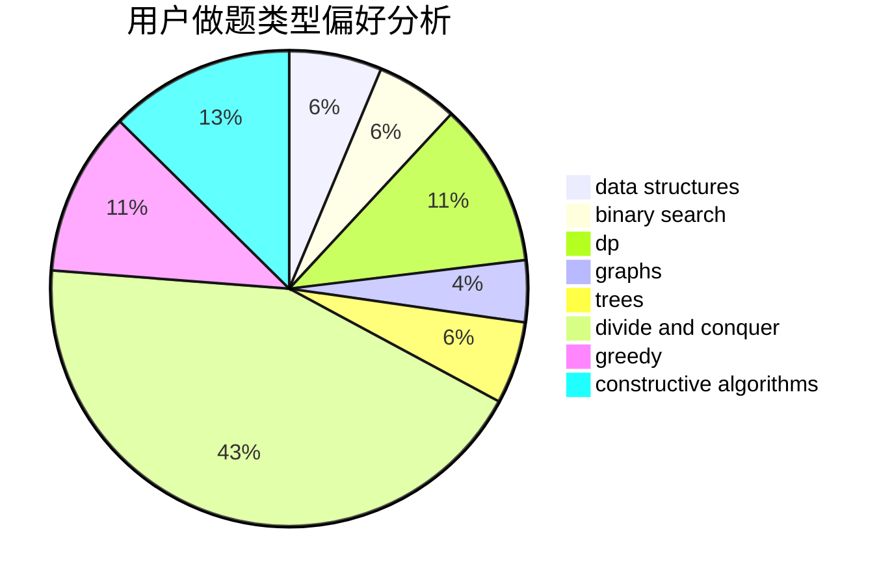

# EdChu

<!-- tabs:start -->

#### **用户提交结果分析**

#### **用户做题类型偏好分析**

#### **用户错题知识点分析**

<!-- tabs:end -->
# 推荐题目
[1183C](https://codeforces.com/contest/1183/problem/C)		binary search,
                        math		  
[77B](https://codeforces.com/contest/77/problem/B)		math,
                        probabilities		  
[828C](https://codeforces.com/contest/828/problem/C)		dsu,graphs,sortings,trees		  
[1007A](https://codeforces.com/contest/1007/problem/A)		combinatorics,
                        data structures,
                        math,
                        sortings,
                        two pointers		  
[828A](https://codeforces.com/contest/828/problem/A)		implementation		  
[721D](https://codeforces.com/contest/721/problem/D)		constructive algorithms,
                        data structures,
                        greedy,
                        math		  
[608D](https://codeforces.com/contest/608/problem/D)		dsu,graphs,sortings,trees		  
[158E](https://codeforces.com/contest/158/problem/E)		*special problem,
                        dp,
                        sortings		  
[252A](https://codeforces.com/contest/252/problem/A)		brute force,
                        implementation		  
[828D](https://codeforces.com/contest/828/problem/D)		dsu,graphs,sortings,trees		  
