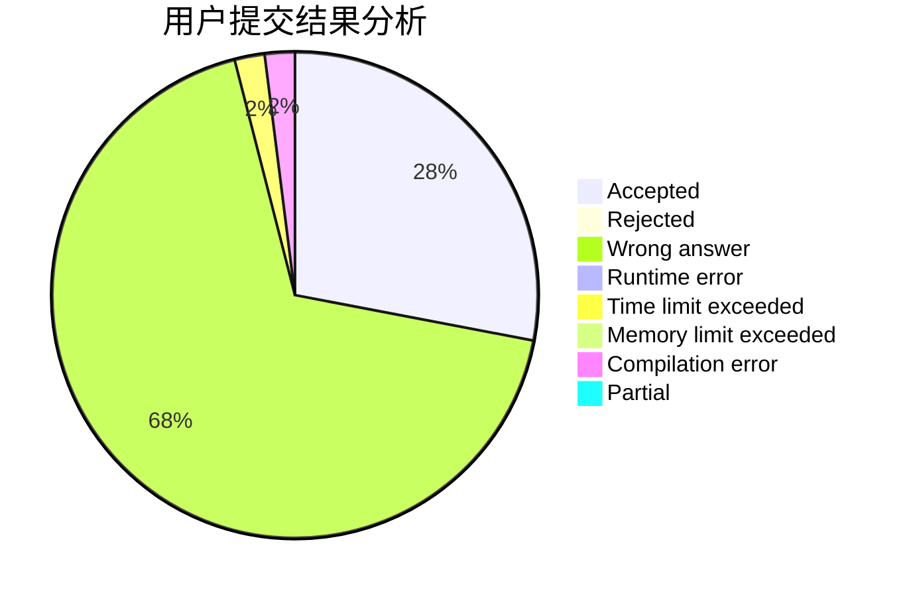
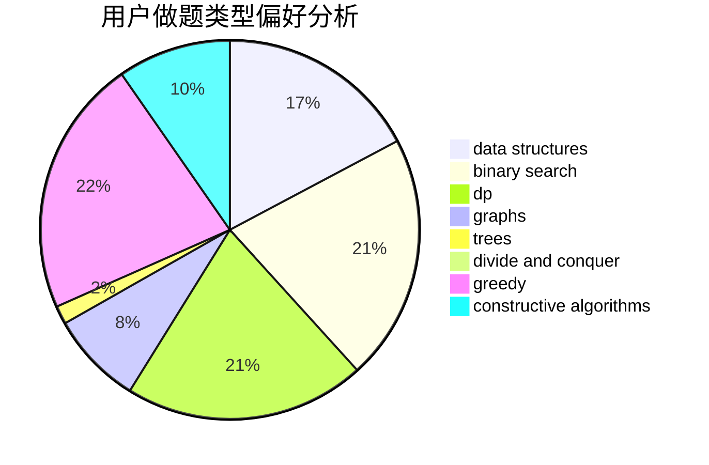
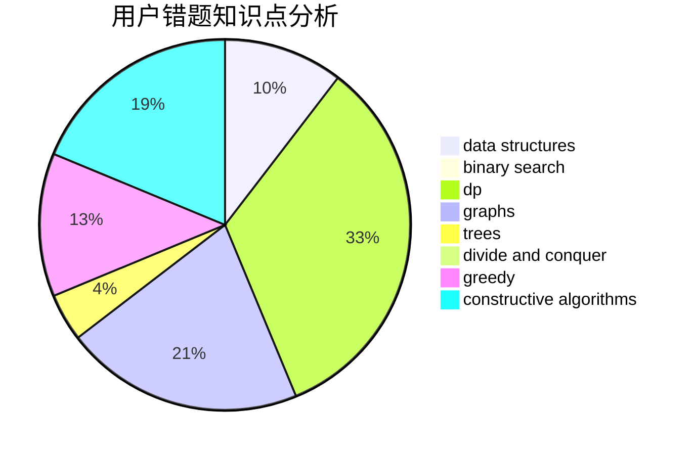

# EdmundMC
<!-- tabs:start -->
#### **用户提交结果分析**

#### **用户做题类型偏好分析**

#### **用户错题知识点分析**

<!-- tabs:end -->
# 推荐题目
[One-Dimensional Battle Ships](http://codeforces.com/problemset/problem/567/D)		binary search,
                        data structures,
                        greedy,
                        sortings		  
[Minimum Array](http://codeforces.com/problemset/problem/1157/E)		binary search,
                        data structures,
                        greedy		  
[Showing Off](http://codeforces.com/problemset/problem/1416/F)		flows,
                        graph matchings,
                        greedy,
                        implementation		  
[Walking Robot](http://codeforces.com/problemset/problem/1154/D)		greedy		  
[Alice and the Doll](http://codeforces.com/problemset/problem/1236/D)		brute force,
                        data structures,
                        greedy,
                        implementation		  
[Array](http://codeforces.com/problemset/problem/57/C)		combinatorics,
                        math		  
[Bracket Subsequence](http://codeforces.com/problemset/problem/1023/C)		greedy		  
[Taxes](http://codeforces.com/problemset/problem/735/D)		math,
                        number theory		  
[Doors Breaking and Repairing](http://codeforces.com/problemset/problem/1102/C)		games		  
[Find a car](https://codeforces.com/contest/810/problem/E)		combinatorics,
                        divide and conquer,
                        dp		  
<!-- tabs:start -->
#### **data structures**
[One-Dimensional Battle Ships](http://codeforces.com/problemset/problem/567/D)		binary search,
                        data structures,
                        greedy,
                        sortings		  
[Minimum Array](http://codeforces.com/problemset/problem/1157/E)		binary search,
                        data structures,
                        greedy		  
[Alice and the Doll](http://codeforces.com/problemset/problem/1236/D)		brute force,
                        data structures,
                        greedy,
                        implementation		  
[Camping Groups](http://codeforces.com/problemset/problem/173/E)		data structures,
                        sortings		  
[Design Tutorial: Increase the Constraints](http://codeforces.com/problemset/problem/472/G)		bitmasks,
                        data structures,
                        fft		  
[Restore the Permutation by Sorted Segments](http://codeforces.com/problemset/problem/1343/F)		brute force,
                        constructive algorithms,
                        data structures,
                        greedy,
                        implementation		  
[MEX maximizing](http://codeforces.com/problemset/problem/1294/D)		data structures,
                        greedy,
                        implementation,
                        math		  
[Maximum width](http://codeforces.com/problemset/problem/1492/C)		binary search,
                        data structures,
                        dp,
                        greedy,
                        two pointers		  
[Old Floppy Drive](http://codeforces.com/problemset/problem/1490/G)		binary search,
                        data structures,
                        math		  
[Odd Mineral Resource](http://codeforces.com/problemset/problem/1479/D)		binary search,
                        bitmasks,
                        brute force,
                        data structures,
                        probabilities,
                        trees		  
#### **binary search**
[One-Dimensional Battle Ships](http://codeforces.com/problemset/problem/567/D)		binary search,
                        data structures,
                        greedy,
                        sortings		  
[Minimum Array](http://codeforces.com/problemset/problem/1157/E)		binary search,
                        data structures,
                        greedy		  
[Almost Sorted](https://codeforces.com/contest/1509/problem/E)		binary search,
                        bitmasks,
                        combinatorics,
                        constructive algorithms,
                        implementation,
                        math		  
[Discrete Acceleration](http://codeforces.com/problemset/problem/1408/C)		binary search,
                        dp,
                        implementation,
                        math,
                        two pointers		  
[Restorer Distance](http://codeforces.com/problemset/problem/1355/E)		binary search,
                        greedy,
                        math,
                        sortings,
                        ternary search		  
[Prairie Partition](https://codeforces.com/contest/807/problem/E)		binary search,
                        constructive algorithms,
                        greedy,
                        math		  
[Maximum width](http://codeforces.com/problemset/problem/1492/C)		binary search,
                        data structures,
                        dp,
                        greedy,
                        two pointers		  
[Pairs](http://codeforces.com/problemset/problem/1463/D)		binary search,
                        constructive algorithms,
                        greedy,
                        two pointers		  
[Old Floppy Drive](http://codeforces.com/problemset/problem/1490/G)		binary search,
                        data structures,
                        math		  
[Odd Mineral Resource](http://codeforces.com/problemset/problem/1479/D)		binary search,
                        bitmasks,
                        brute force,
                        data structures,
                        probabilities,
                        trees		  
#### **dp**
[Find a car](https://codeforces.com/contest/810/problem/E)		combinatorics,
                        divide and conquer,
                        dp		  
[Monster Invaders](https://codeforces.com/contest/1397/problem/E)		dp,
                        greedy,
                        implementation		  
[Discrete Acceleration](http://codeforces.com/problemset/problem/1408/C)		binary search,
                        dp,
                        implementation,
                        math,
                        two pointers		  
[Kaavi and Magic Spell](https://codeforces.com/contest/1337/problem/E)		dp,
                        strings		  
[Boolean Function](http://codeforces.com/problemset/problem/582/E)		bitmasks,
                        dp,
                        expression parsing		  
[PE Lesson](http://codeforces.com/problemset/problem/316/D3)		dp,
                        math		  
[Maximum width](http://codeforces.com/problemset/problem/1492/C)		binary search,
                        data structures,
                        dp,
                        greedy,
                        two pointers		  
[Bouncing Ball](https://codeforces.com/contest/1457/problem/C)		brute force,
                        dp,
                        implementation		  
[Pekora and Trampoline](http://codeforces.com/problemset/problem/1491/C)		brute force,
                        data structures,
                        dp,
                        greedy,
                        implementation		  
[Chef Monocarp](http://codeforces.com/problemset/problem/1437/C)		dp,
                        flows,
                        graph matchings,
                        greedy,
                        math,
                        sortings		  
#### **graph**
[Showing Off](http://codeforces.com/problemset/problem/1416/F)		flows,
                        graph matchings,
                        greedy,
                        implementation		  
[The Meeting Place Cannot Be Changed](https://codeforces.com/contest/782/problem/B)		dfs and similar,
                        graphs		  
[King Escape](http://codeforces.com/problemset/problem/1033/A)		dfs and similar,
                        graphs,
                        implementation		  
[Data Center Drama](https://codeforces.com/contest/528/problem/C)		dfs and similar,
                        graphs		  
[Underground Lab](http://codeforces.com/problemset/problem/780/E)		constructive algorithms,
                        dfs and similar,
                        graphs		  
[BFS Trees](https://codeforces.com/contest/1496/problem/F)		combinatorics,
                        dfs and similar,
                        graphs,
                        math,
                        shortest paths,
                        trees		  
[Minimum Ties](http://codeforces.com/problemset/problem/1487/C)		brute force,
                        constructive algorithms,
                        dfs and similar,
                        graphs,
                        greedy,
                        implementation,
                        math		  
[Chef Monocarp](http://codeforces.com/problemset/problem/1437/C)		dp,
                        flows,
                        graph matchings,
                        greedy,
                        math,
                        sortings		  
[Strange Housing](http://codeforces.com/problemset/problem/1470/D)		constructive algorithms,
                        dfs and similar,
                        graph matchings,
                        graphs,
                        greedy		  
[Longest Simple Cycle](http://codeforces.com/problemset/problem/1476/C)		dp,
                        graphs,
                        greedy		  
#### **trees**
[BFS Trees](https://codeforces.com/contest/1496/problem/F)		combinatorics,
                        dfs and similar,
                        graphs,
                        math,
                        shortest paths,
                        trees		  
[Odd Mineral Resource](http://codeforces.com/problemset/problem/1479/D)		binary search,
                        bitmasks,
                        brute force,
                        data structures,
                        probabilities,
                        trees		  
[Yet Another Card Deck](http://codeforces.com/problemset/problem/1511/C)		brute force,
                        data structures,
                        implementation,
                        trees		  
[Diameter Cuts](http://codeforces.com/problemset/problem/1499/F)		combinatorics,
                        dfs and similar,
                        dp,
                        trees		  
[Fib-tree](http://codeforces.com/problemset/problem/1491/E)		brute force,
                        dfs and similar,
                        divide and conquer,
                        number theory,
                        trees		  
[13th Labour of Heracles](http://codeforces.com/problemset/problem/1466/D)		data structures,
                        greedy,
                        sortings,
                        trees		  
[BFS Trees](http://codeforces.com/problemset/problem/1495/D)		combinatorics,
                        dfs and similar,
                        graphs,
                        math,
                        shortest paths,
                        trees		  
[Sum of Prefix Sums](http://codeforces.com/problemset/problem/1303/G)		data structures,
                        divide and conquer,
                        geometry,
                        trees		  
[Number of Simple Paths](http://codeforces.com/problemset/problem/1454/E)		combinatorics,
                        dfs and similar,
                        graphs,
                        trees		  
[Dogeforces](http://codeforces.com/problemset/problem/1494/D)		constructive algorithms,
                        data structures,
                        dfs and similar,
                        divide and conquer,
                        dsu,
                        greedy,
                        sortings,
                        trees		  
#### **divide and conquer**
[Find a car](https://codeforces.com/contest/810/problem/E)		combinatorics,
                        divide and conquer,
                        dp		  
[Divide and Summarize](http://codeforces.com/problemset/problem/1461/D)		binary search,
                        brute force,
                        data structures,
                        divide and conquer,
                        implementation,
                        sortings		  
[Song of the Sirens](http://codeforces.com/problemset/problem/1466/G)		combinatorics,
                        divide and conquer,
                        hashing,
                        math,
                        string suffix structures,
                        strings		  
[Permutation Transformation](http://codeforces.com/problemset/problem/1490/D)		dfs and similar,
                        divide and conquer,
                        implementation		  
[Skyline Photo](https://codeforces.com/contest/1483/problem/C)		data structures,
                        divide and conquer,
                        dp		  
[Fib-tree](http://codeforces.com/problemset/problem/1491/E)		brute force,
                        dfs and similar,
                        divide and conquer,
                        number theory,
                        trees		  
[Sum of Prefix Sums](http://codeforces.com/problemset/problem/1303/G)		data structures,
                        divide and conquer,
                        geometry,
                        trees		  
[Dogeforces](http://codeforces.com/problemset/problem/1494/D)		constructive algorithms,
                        data structures,
                        dfs and similar,
                        divide and conquer,
                        dsu,
                        greedy,
                        sortings,
                        trees		  
[Skyline Photo](http://codeforces.com/problemset/problem/1482/E)		data structures,
                        divide and conquer,
                        dp		  
[Logistical Questions](http://codeforces.com/problemset/problem/566/C)		dfs and similar,
                        divide and conquer,
                        trees		  
#### **greedy**
[One-Dimensional Battle Ships](http://codeforces.com/problemset/problem/567/D)		binary search,
                        data structures,
                        greedy,
                        sortings		  
[Minimum Array](http://codeforces.com/problemset/problem/1157/E)		binary search,
                        data structures,
                        greedy		  
[Showing Off](http://codeforces.com/problemset/problem/1416/F)		flows,
                        graph matchings,
                        greedy,
                        implementation		  
[Walking Robot](http://codeforces.com/problemset/problem/1154/D)		greedy		  
[Alice and the Doll](http://codeforces.com/problemset/problem/1236/D)		brute force,
                        data structures,
                        greedy,
                        implementation		  
[Bracket Subsequence](http://codeforces.com/problemset/problem/1023/C)		greedy		  
[Monster Invaders](https://codeforces.com/contest/1397/problem/E)		dp,
                        greedy,
                        implementation		  
[Restorer Distance](http://codeforces.com/problemset/problem/1355/E)		binary search,
                        greedy,
                        math,
                        sortings,
                        ternary search		  
[Prairie Partition](https://codeforces.com/contest/807/problem/E)		binary search,
                        constructive algorithms,
                        greedy,
                        math		  
[Restore the Permutation by Sorted Segments](http://codeforces.com/problemset/problem/1343/F)		brute force,
                        constructive algorithms,
                        data structures,
                        greedy,
                        implementation		  
#### **constructive algorithms**
[Almost Sorted](https://codeforces.com/contest/1509/problem/E)		binary search,
                        bitmasks,
                        combinatorics,
                        constructive algorithms,
                        implementation,
                        math		  
[Pashmak and Buses](http://codeforces.com/problemset/problem/459/C)		combinatorics,
                        constructive algorithms,
                        math		  
[Points and Segments (easy)](http://codeforces.com/problemset/problem/430/A)		constructive algorithms,
                        sortings		  
[Prairie Partition](https://codeforces.com/contest/807/problem/E)		binary search,
                        constructive algorithms,
                        greedy,
                        math		  
[Restore the Permutation by Sorted Segments](http://codeforces.com/problemset/problem/1343/F)		brute force,
                        constructive algorithms,
                        data structures,
                        greedy,
                        implementation		  
[Hidden Word](http://codeforces.com/problemset/problem/725/C)		brute force,
                        constructive algorithms,
                        implementation,
                        strings		  
[Underground Lab](http://codeforces.com/problemset/problem/780/E)		constructive algorithms,
                        dfs and similar,
                        graphs		  
[Yet Another Array Partitioning Task](http://codeforces.com/problemset/problem/1114/B)		constructive algorithms,
                        greedy,
                        sortings		  
[Ehab Fails to Be Thanos](http://codeforces.com/problemset/problem/1174/A)		constructive algorithms,
                        greedy,
                        sortings		  
[Omkar and Baseball](http://codeforces.com/problemset/problem/1372/C)		constructive algorithms,
                        math		  
#### **sortings**
[One-Dimensional Battle Ships](http://codeforces.com/problemset/problem/567/D)		binary search,
                        data structures,
                        greedy,
                        sortings		  
[Camping Groups](http://codeforces.com/problemset/problem/173/E)		data structures,
                        sortings		  
[Hilbert's Hotel](http://codeforces.com/problemset/problem/1344/A)		math,
                        number theory,
                        sortings		  
[Restorer Distance](http://codeforces.com/problemset/problem/1355/E)		binary search,
                        greedy,
                        math,
                        sortings,
                        ternary search		  
[Points and Segments (easy)](http://codeforces.com/problemset/problem/430/A)		constructive algorithms,
                        sortings		  
[Yet Another Array Partitioning Task](http://codeforces.com/problemset/problem/1114/B)		constructive algorithms,
                        greedy,
                        sortings		  
[Ehab Fails to Be Thanos](http://codeforces.com/problemset/problem/1174/A)		constructive algorithms,
                        greedy,
                        sortings		  
[Diamond Miner](https://codeforces.com/contest/1496/problem/C)		geometry,
                        greedy,
                        math,
                        sortings		  
[Diamond Miner](http://codeforces.com/problemset/problem/1495/A)		geometry,
                        greedy,
                        math,
                        sortings		  
[Meximization](http://codeforces.com/problemset/problem/1497/A)		brute force,
                        data structures,
                        greedy,
                        sortings		  
<!-- tabs:end -->
