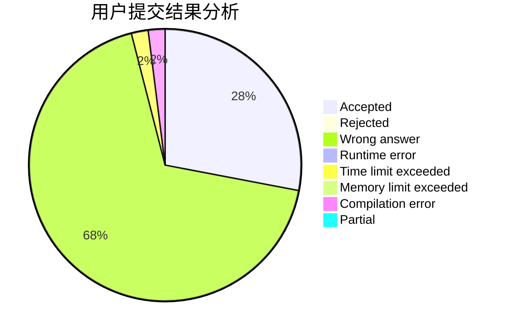
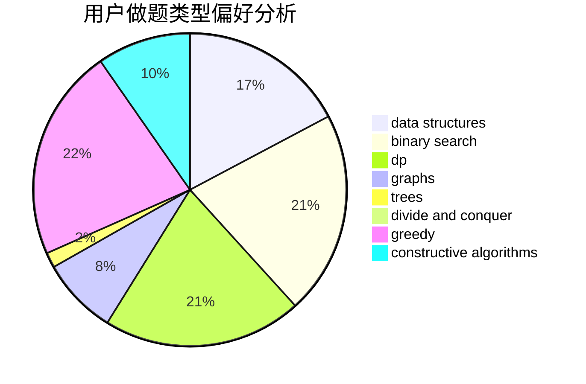
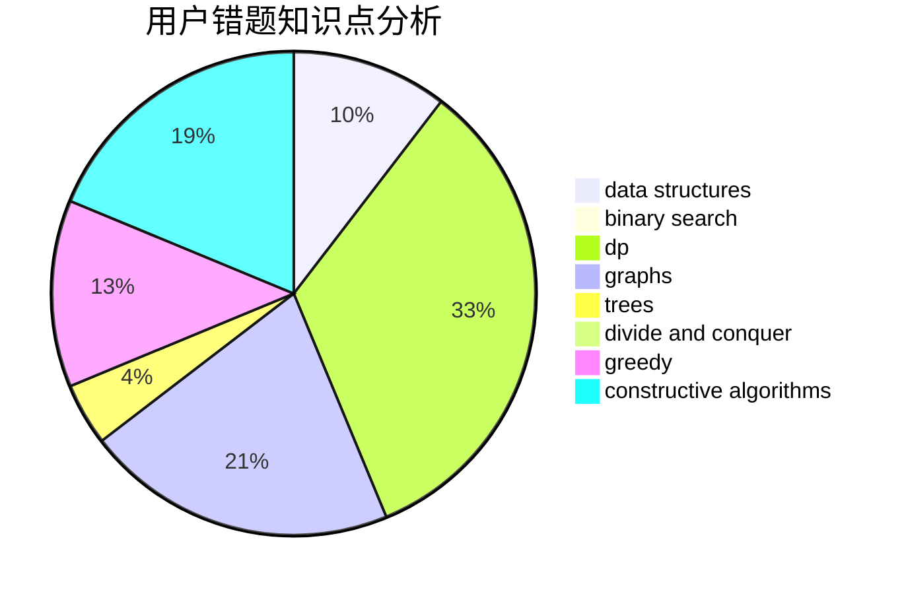

# EdmundMC

<!-- tabs:start -->

#### **用户提交结果分析**

#### **用户做题类型偏好分析**

#### **用户错题知识点分析**

<!-- tabs:end -->
# 推荐题目
[1416F](https://codeforces.com/contest/1416/problem/F)		flows,
                        graph matchings,
                        greedy,
                        implementation		  
[1343F](https://codeforces.com/contest/1343/problem/F)		brute force,
                        constructive algorithms,
                        data structures,
                        greedy,
                        implementation		  
[1154D](https://codeforces.com/contest/1154/problem/D)		greedy		  
[1344A](https://codeforces.com/contest/1344/problem/A)		math,
                        number theory,
                        sortings		  
[430A](https://codeforces.com/contest/430/problem/A)		constructive algorithms,
                        sortings		  
[780E](https://codeforces.com/contest/780/problem/E)		constructive algorithms,
                        dfs and similar,
                        graphs		  
[741A](https://codeforces.com/contest/741/problem/A)		dfs and similar,
                        math		  
[717E](https://codeforces.com/contest/717/problem/E)		dfs and similar		  
[782B](https://codeforces.com/contest/782/problem/B)		dsu,graphs,sortings,trees		  
[588B](https://codeforces.com/contest/588/problem/B)		math		  
