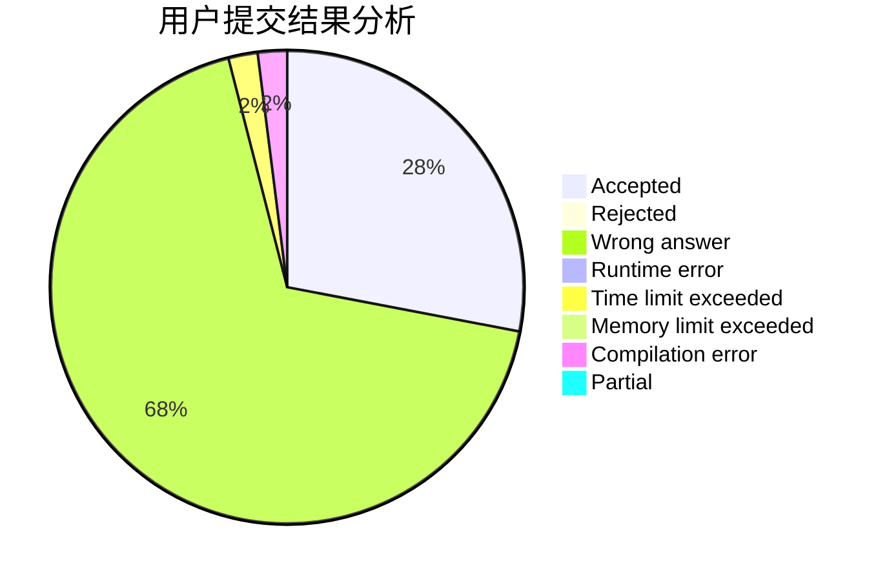
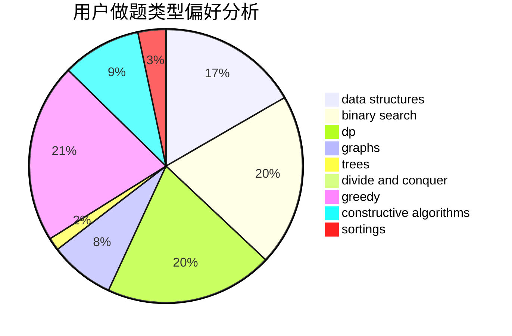
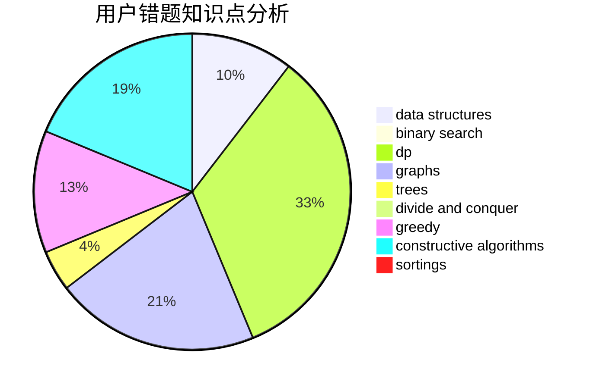

# EdmundMC
<!-- tabs:start -->
#### **用户提交结果分析**

#### **用户做题类型偏好分析**

#### **用户错题知识点分析**

<!-- tabs:end -->
# 推荐题目
[567D](http://codeforces.com/problemset/problem/567/D)		binary search,
                        data structures,
                        greedy,
                        sortings		  
[1157E](http://codeforces.com/problemset/problem/1157/E)		binary search,
                        data structures,
                        greedy		  
[1416F](http://codeforces.com/problemset/problem/1416/F)		flows,
                        graph matchings,
                        greedy,
                        implementation		  
[1154D](http://codeforces.com/problemset/problem/1154/D)		greedy		  
[1236D](http://codeforces.com/problemset/problem/1236/D)		brute force,
                        data structures,
                        greedy,
                        implementation		  
[57C](http://codeforces.com/problemset/problem/57/C)		combinatorics,
                        math		  
[1023C](http://codeforces.com/problemset/problem/1023/C)		greedy		  
[735D](http://codeforces.com/problemset/problem/735/D)		math,
                        number theory		  
[1102C](http://codeforces.com/problemset/problem/1102/C)		games		  
[810E](https://codeforces.com/contest/810/problem/E)		combinatorics,
                        divide and conquer,
                        dp		  
<!-- tabs:start -->
#### **data structures**
[567D](http://codeforces.com/problemset/problem/567/D)		binary search,
                        data structures,
                        greedy,
                        sortings		  
[1157E](http://codeforces.com/problemset/problem/1157/E)		binary search,
                        data structures,
                        greedy		  
[1236D](http://codeforces.com/problemset/problem/1236/D)		brute force,
                        data structures,
                        greedy,
                        implementation		  
[173E](http://codeforces.com/problemset/problem/173/E)		data structures,
                        sortings		  
[472G](http://codeforces.com/problemset/problem/472/G)		bitmasks,
                        data structures,
                        fft		  
[1343F](http://codeforces.com/problemset/problem/1343/F)		brute force,
                        constructive algorithms,
                        data structures,
                        greedy,
                        implementation		  
[1294D](http://codeforces.com/problemset/problem/1294/D)		data structures,
                        greedy,
                        implementation,
                        math		  
[1492C](http://codeforces.com/problemset/problem/1492/C)		binary search,
                        data structures,
                        dp,
                        greedy,
                        two pointers		  
[1490G](http://codeforces.com/problemset/problem/1490/G)		binary search,
                        data structures,
                        math		  
[1479D](http://codeforces.com/problemset/problem/1479/D)		binary search,
                        bitmasks,
                        brute force,
                        data structures,
                        probabilities,
                        trees		  
#### **binary search**
[567D](http://codeforces.com/problemset/problem/567/D)		binary search,
                        data structures,
                        greedy,
                        sortings		  
[1157E](http://codeforces.com/problemset/problem/1157/E)		binary search,
                        data structures,
                        greedy		  
[1509E](https://codeforces.com/contest/1509/problem/E)		binary search,
                        bitmasks,
                        combinatorics,
                        constructive algorithms,
                        implementation,
                        math		  
[1408C](http://codeforces.com/problemset/problem/1408/C)		binary search,
                        dp,
                        implementation,
                        math,
                        two pointers		  
[1355E](http://codeforces.com/problemset/problem/1355/E)		binary search,
                        greedy,
                        math,
                        sortings,
                        ternary search		  
[807E](https://codeforces.com/contest/807/problem/E)		binary search,
                        constructive algorithms,
                        greedy,
                        math		  
[1492C](http://codeforces.com/problemset/problem/1492/C)		binary search,
                        data structures,
                        dp,
                        greedy,
                        two pointers		  
[1463D](http://codeforces.com/problemset/problem/1463/D)		binary search,
                        constructive algorithms,
                        greedy,
                        two pointers		  
[1490G](http://codeforces.com/problemset/problem/1490/G)		binary search,
                        data structures,
                        math		  
[1479D](http://codeforces.com/problemset/problem/1479/D)		binary search,
                        bitmasks,
                        brute force,
                        data structures,
                        probabilities,
                        trees		  
#### **dp**
[810E](https://codeforces.com/contest/810/problem/E)		combinatorics,
                        divide and conquer,
                        dp		  
[1397E](https://codeforces.com/contest/1397/problem/E)		dp,
                        greedy,
                        implementation		  
[1408C](http://codeforces.com/problemset/problem/1408/C)		binary search,
                        dp,
                        implementation,
                        math,
                        two pointers		  
[1337E](https://codeforces.com/contest/1337/problem/E)		dp,
                        strings		  
[582E](http://codeforces.com/problemset/problem/582/E)		bitmasks,
                        dp,
                        expression parsing		  
[316D3](http://codeforces.com/problemset/problem/316/D3)		dp,
                        math		  
[1492C](http://codeforces.com/problemset/problem/1492/C)		binary search,
                        data structures,
                        dp,
                        greedy,
                        two pointers		  
[1457C](https://codeforces.com/contest/1457/problem/C)		brute force,
                        dp,
                        implementation		  
[1491C](http://codeforces.com/problemset/problem/1491/C)		brute force,
                        data structures,
                        dp,
                        greedy,
                        implementation		  
[1437C](http://codeforces.com/problemset/problem/1437/C)		dp,
                        flows,
                        graph matchings,
                        greedy,
                        math,
                        sortings		  
#### **graph**
[1416F](http://codeforces.com/problemset/problem/1416/F)		flows,
                        graph matchings,
                        greedy,
                        implementation		  
[782B](https://codeforces.com/contest/782/problem/B)		dfs and similar,
                        graphs		  
[1033A](http://codeforces.com/problemset/problem/1033/A)		dfs and similar,
                        graphs,
                        implementation		  
[528C](https://codeforces.com/contest/528/problem/C)		dfs and similar,
                        graphs		  
[780E](http://codeforces.com/problemset/problem/780/E)		constructive algorithms,
                        dfs and similar,
                        graphs		  
[1496F](https://codeforces.com/contest/1496/problem/F)		combinatorics,
                        dfs and similar,
                        graphs,
                        math,
                        shortest paths,
                        trees		  
[1487C](http://codeforces.com/problemset/problem/1487/C)		brute force,
                        constructive algorithms,
                        dfs and similar,
                        graphs,
                        greedy,
                        implementation,
                        math		  
[1437C](http://codeforces.com/problemset/problem/1437/C)		dp,
                        flows,
                        graph matchings,
                        greedy,
                        math,
                        sortings		  
[1470D](http://codeforces.com/problemset/problem/1470/D)		constructive algorithms,
                        dfs and similar,
                        graph matchings,
                        graphs,
                        greedy		  
[1476C](http://codeforces.com/problemset/problem/1476/C)		dp,
                        graphs,
                        greedy		  
#### **trees**
[1496F](https://codeforces.com/contest/1496/problem/F)		combinatorics,
                        dfs and similar,
                        graphs,
                        math,
                        shortest paths,
                        trees		  
[1479D](http://codeforces.com/problemset/problem/1479/D)		binary search,
                        bitmasks,
                        brute force,
                        data structures,
                        probabilities,
                        trees		  
[1511C](http://codeforces.com/problemset/problem/1511/C)		brute force,
                        data structures,
                        implementation,
                        trees		  
[1499F](http://codeforces.com/problemset/problem/1499/F)		combinatorics,
                        dfs and similar,
                        dp,
                        trees		  
[1491E](http://codeforces.com/problemset/problem/1491/E)		brute force,
                        dfs and similar,
                        divide and conquer,
                        number theory,
                        trees		  
[1466D](http://codeforces.com/problemset/problem/1466/D)		data structures,
                        greedy,
                        sortings,
                        trees		  
[1495D](http://codeforces.com/problemset/problem/1495/D)		combinatorics,
                        dfs and similar,
                        graphs,
                        math,
                        shortest paths,
                        trees		  
[1303G](http://codeforces.com/problemset/problem/1303/G)		data structures,
                        divide and conquer,
                        geometry,
                        trees		  
[1454E](http://codeforces.com/problemset/problem/1454/E)		combinatorics,
                        dfs and similar,
                        graphs,
                        trees		  
[1494D](http://codeforces.com/problemset/problem/1494/D)		constructive algorithms,
                        data structures,
                        dfs and similar,
                        divide and conquer,
                        dsu,
                        greedy,
                        sortings,
                        trees		  
#### **divide and conquer**
[810E](https://codeforces.com/contest/810/problem/E)		combinatorics,
                        divide and conquer,
                        dp		  
[1461D](http://codeforces.com/problemset/problem/1461/D)		binary search,
                        brute force,
                        data structures,
                        divide and conquer,
                        implementation,
                        sortings		  
[1466G](http://codeforces.com/problemset/problem/1466/G)		combinatorics,
                        divide and conquer,
                        hashing,
                        math,
                        string suffix structures,
                        strings		  
[1490D](http://codeforces.com/problemset/problem/1490/D)		dfs and similar,
                        divide and conquer,
                        implementation		  
[1483C](https://codeforces.com/contest/1483/problem/C)		data structures,
                        divide and conquer,
                        dp		  
[1491E](http://codeforces.com/problemset/problem/1491/E)		brute force,
                        dfs and similar,
                        divide and conquer,
                        number theory,
                        trees		  
[1303G](http://codeforces.com/problemset/problem/1303/G)		data structures,
                        divide and conquer,
                        geometry,
                        trees		  
[1494D](http://codeforces.com/problemset/problem/1494/D)		constructive algorithms,
                        data structures,
                        dfs and similar,
                        divide and conquer,
                        dsu,
                        greedy,
                        sortings,
                        trees		  
[1482E](http://codeforces.com/problemset/problem/1482/E)		data structures,
                        divide and conquer,
                        dp		  
[566C](http://codeforces.com/problemset/problem/566/C)		dfs and similar,
                        divide and conquer,
                        trees		  
#### **greedy**
[567D](http://codeforces.com/problemset/problem/567/D)		binary search,
                        data structures,
                        greedy,
                        sortings		  
[1157E](http://codeforces.com/problemset/problem/1157/E)		binary search,
                        data structures,
                        greedy		  
[1416F](http://codeforces.com/problemset/problem/1416/F)		flows,
                        graph matchings,
                        greedy,
                        implementation		  
[1154D](http://codeforces.com/problemset/problem/1154/D)		greedy		  
[1236D](http://codeforces.com/problemset/problem/1236/D)		brute force,
                        data structures,
                        greedy,
                        implementation		  
[1023C](http://codeforces.com/problemset/problem/1023/C)		greedy		  
[1397E](https://codeforces.com/contest/1397/problem/E)		dp,
                        greedy,
                        implementation		  
[1355E](http://codeforces.com/problemset/problem/1355/E)		binary search,
                        greedy,
                        math,
                        sortings,
                        ternary search		  
[807E](https://codeforces.com/contest/807/problem/E)		binary search,
                        constructive algorithms,
                        greedy,
                        math		  
[1343F](http://codeforces.com/problemset/problem/1343/F)		brute force,
                        constructive algorithms,
                        data structures,
                        greedy,
                        implementation		  
#### **constructive algorithms**
[1509E](https://codeforces.com/contest/1509/problem/E)		binary search,
                        bitmasks,
                        combinatorics,
                        constructive algorithms,
                        implementation,
                        math		  
[459C](http://codeforces.com/problemset/problem/459/C)		combinatorics,
                        constructive algorithms,
                        math		  
[430A](http://codeforces.com/problemset/problem/430/A)		constructive algorithms,
                        sortings		  
[807E](https://codeforces.com/contest/807/problem/E)		binary search,
                        constructive algorithms,
                        greedy,
                        math		  
[1343F](http://codeforces.com/problemset/problem/1343/F)		brute force,
                        constructive algorithms,
                        data structures,
                        greedy,
                        implementation		  
[725C](http://codeforces.com/problemset/problem/725/C)		brute force,
                        constructive algorithms,
                        implementation,
                        strings		  
[780E](http://codeforces.com/problemset/problem/780/E)		constructive algorithms,
                        dfs and similar,
                        graphs		  
[1114B](http://codeforces.com/problemset/problem/1114/B)		constructive algorithms,
                        greedy,
                        sortings		  
[1174A](http://codeforces.com/problemset/problem/1174/A)		constructive algorithms,
                        greedy,
                        sortings		  
[1372C](http://codeforces.com/problemset/problem/1372/C)		constructive algorithms,
                        math		  
#### **sortings**
[567D](http://codeforces.com/problemset/problem/567/D)		binary search,
                        data structures,
                        greedy,
                        sortings		  
[173E](http://codeforces.com/problemset/problem/173/E)		data structures,
                        sortings		  
[1344A](http://codeforces.com/problemset/problem/1344/A)		math,
                        number theory,
                        sortings		  
[1355E](http://codeforces.com/problemset/problem/1355/E)		binary search,
                        greedy,
                        math,
                        sortings,
                        ternary search		  
[430A](http://codeforces.com/problemset/problem/430/A)		constructive algorithms,
                        sortings		  
[1114B](http://codeforces.com/problemset/problem/1114/B)		constructive algorithms,
                        greedy,
                        sortings		  
[1174A](http://codeforces.com/problemset/problem/1174/A)		constructive algorithms,
                        greedy,
                        sortings		  
[1496C](https://codeforces.com/contest/1496/problem/C)		geometry,
                        greedy,
                        math,
                        sortings		  
[1495A](http://codeforces.com/problemset/problem/1495/A)		geometry,
                        greedy,
                        math,
                        sortings		  
[1497A](http://codeforces.com/problemset/problem/1497/A)		brute force,
                        data structures,
                        greedy,
                        sortings		  
<!-- tabs:end -->
