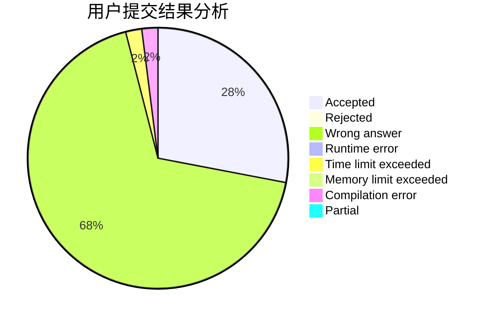
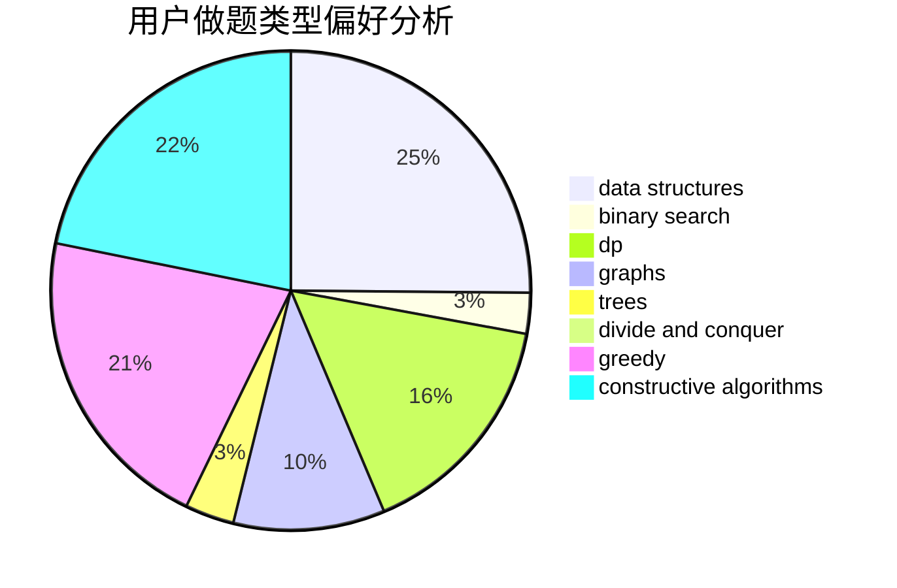
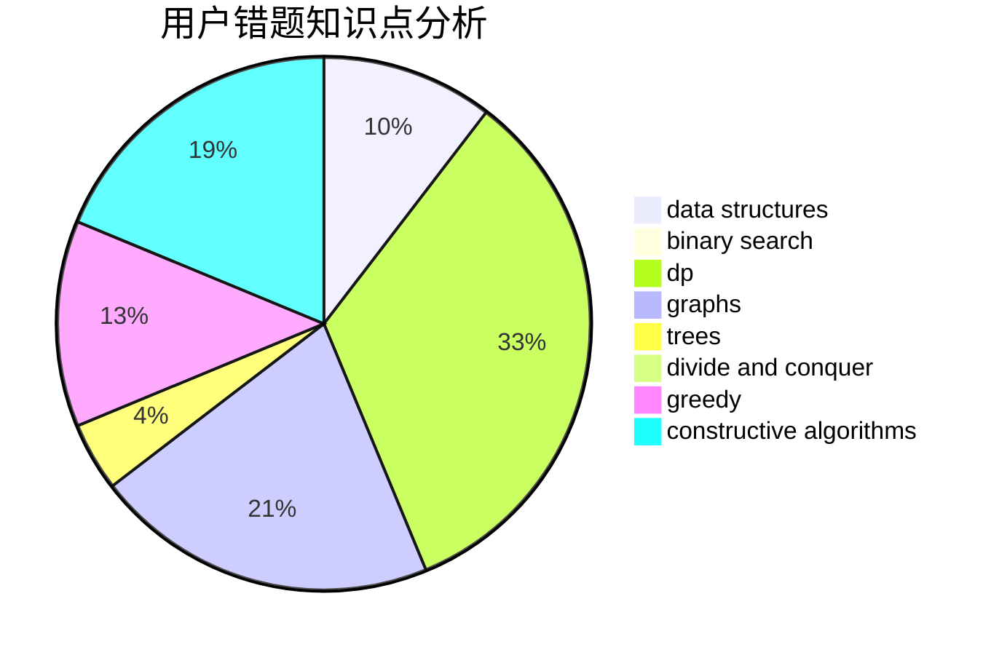

# EdmundMC

<!-- tabs:start -->

#### **用户提交结果分析**

#### **用户做题类型偏好分析**

#### **用户错题知识点分析**

<!-- tabs:end -->
# 推荐题目
[1424G](https://codeforces.com/contest/1424/problem/G)		data structures,
                        sortings		  
[1350D](https://codeforces.com/contest/1350/problem/D)		dsu,graphs,sortings,trees		  
[1156D](https://codeforces.com/contest/1156/problem/D)		dfs and similar,
                        divide and conquer,
                        dp,
                        dsu,
                        trees		  
[1350E](https://codeforces.com/contest/1350/problem/E)		dsu,graphs,sortings,trees		  
[452B](https://codeforces.com/contest/452/problem/B)		brute force,
                        constructive algorithms,
                        geometry,
                        trees		  
[799D](https://codeforces.com/contest/799/problem/D)		brute force,
                        dp,
                        meet-in-the-middle		  
[762A](https://codeforces.com/contest/762/problem/A)		math,
                        number theory		  
[735A](https://codeforces.com/contest/735/problem/A)		implementation,
                        strings		  
[800A](https://codeforces.com/contest/800/problem/A)		dsu,graphs,sortings,trees		  
[608D](https://codeforces.com/contest/608/problem/D)		dsu,graphs,sortings,trees		  
