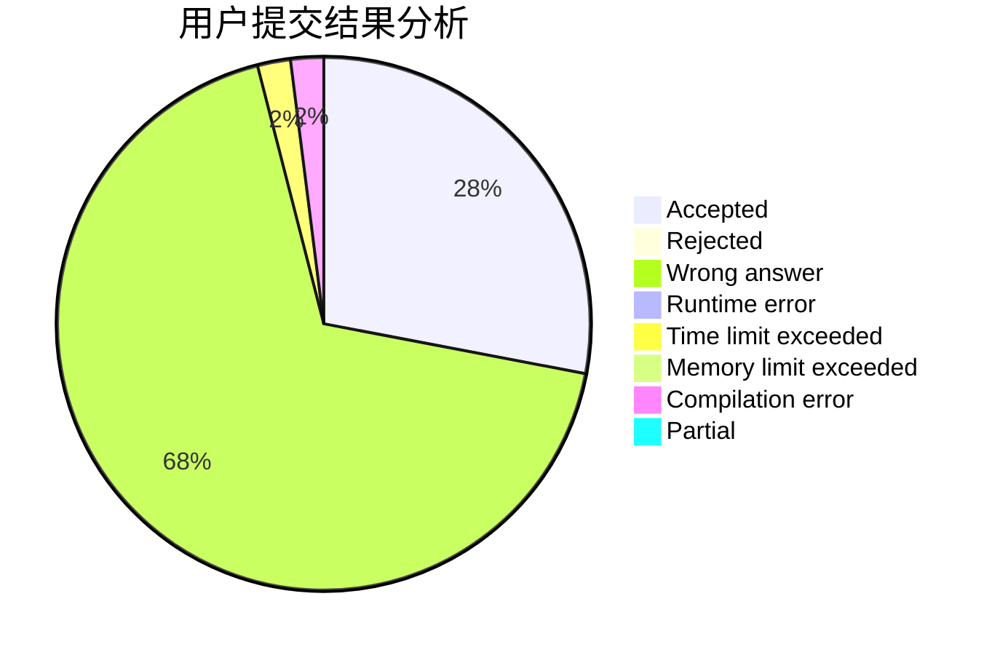
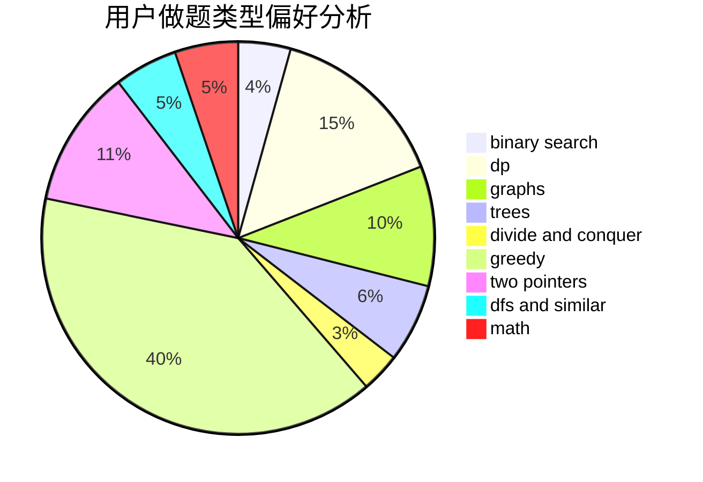

# EdmundMC

<!-- tabs:start -->

#### **用户提交结果分析**

#### **用户做题类型偏好分析**

<!-- tabs:end -->
# 推荐题目
[1424G](https://codeforces.com/contest/1424/problem/G)
[1350D](https://codeforces.com/contest/1350/problem/D)
[1156D](https://codeforces.com/contest/1156/problem/D)
[1350E](https://codeforces.com/contest/1350/problem/E)
[452B](https://codeforces.com/contest/452/problem/B)
[799D](https://codeforces.com/contest/799/problem/D)
[762A](https://codeforces.com/contest/762/problem/A)
[735A](https://codeforces.com/contest/735/problem/A)
[800A](https://codeforces.com/contest/800/problem/A)
[608D](https://codeforces.com/contest/608/problem/D)
